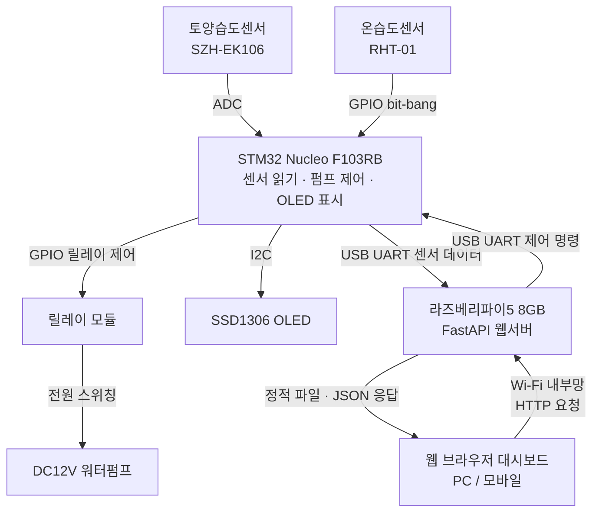
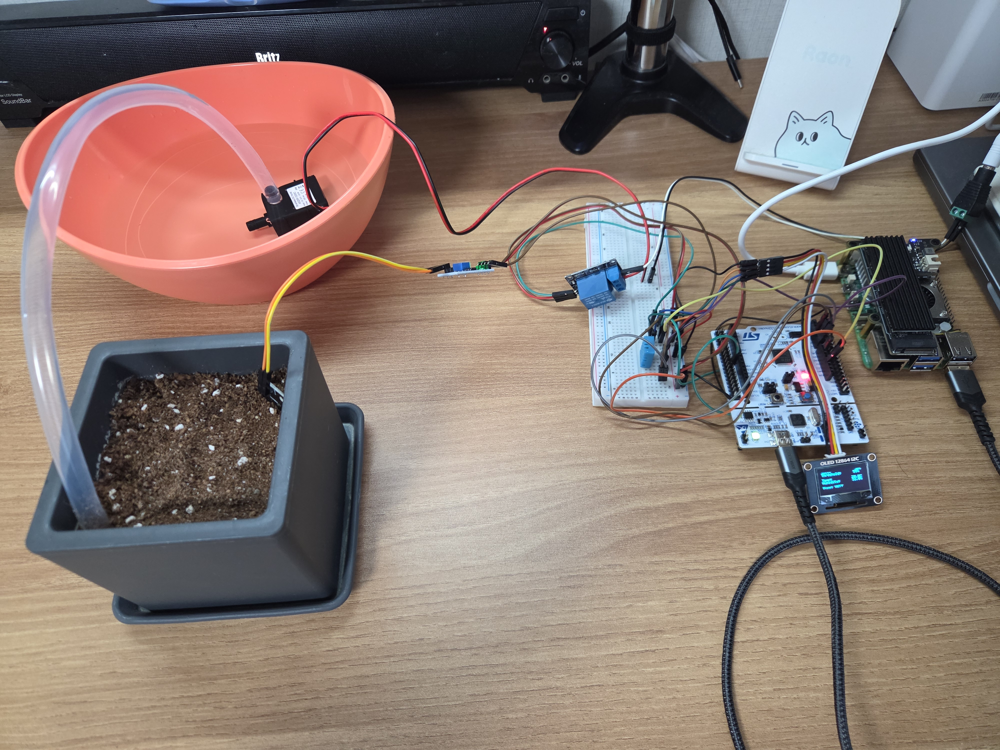
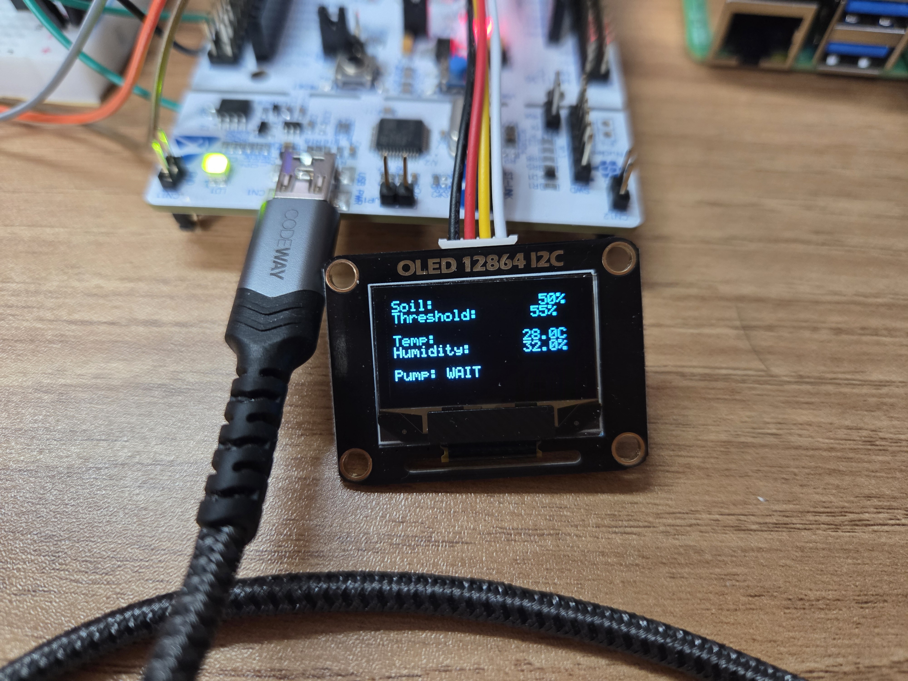
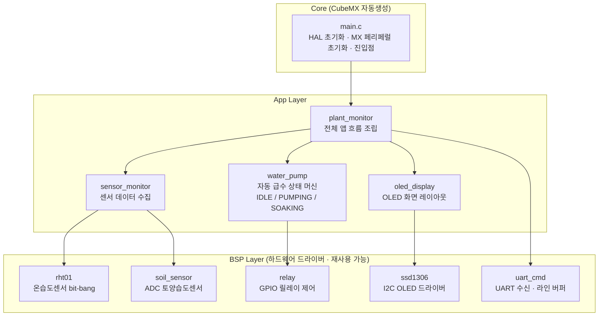
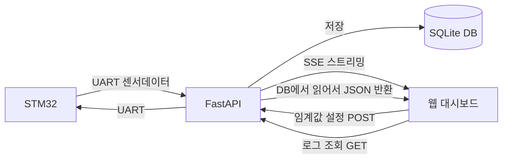

# 스마트 화분 모니터링 시스템

STM32 마이크로컨트롤러와 라즈베리파이5를 연동한 임베디드 풀스택 포트폴리오 프로젝트입니다.  
토양 수분과 온습도를 실시간으로 측정하고, 임계값 기반 자동 급수와 웹 대시보드 원격 모니터링을 구현합니다.

<!-- 시연 영상: YouTube 업로드 후 아래 ID 교체 -->
<!-- [](https://www.youtube.com/watch?v=<영상ID>) -->


---

## 주요 기능

- **실시간 센서 모니터링** — 토양 수분(ADC), 온도/습도(GPIO bit-bang)를 주기적으로 측정
- **자동 급수** — 토양 수분이 설정 임계값 이하이면 워터펌프를 자동 작동 (non-blocking 상태 머신)
- **OLED 현황 표시** — 토양 수분 / 임계값 / 온습도 / 펌프 상태를 현장에서 바로 확인
- **웹 대시보드** — 브라우저에서 실시간 센서 그래프, 펌프 이력 조회, 임계값 원격 설정
- **실시간 스트리밍** — SSE(Server-Sent Events)로 새 데이터를 브라우저에 즉시 반영
- **백그라운드 자동 실행** — systemd 데몬으로 등록하여 라즈베리파이5 부팅 시 서버 자동 실행

---

## 시스템 구성



---

## 기술 스택

| 레이어 | 기술 |
|--------|------|
| 펌웨어 | C, STM32 HAL, STM32CubeIDE for VSCode |
| 백엔드 | Python, FastAPI, SQLite, uvicorn |
| 프론트 | HTML / CSS / JavaScript, Chart.js |
| 통신 | UART (USB), SSE, REST API |

---

## 하드웨어 구성

| 부품 | 모델 | 통신 |
|------|------|------|
| MCU | STM32 Nucleo F103RB | — |
| 토양습도센서 | SZH-EK106 | ADC |
| 온습도센서 | RHT-01 | GPIO bit-bang |
| OLED | SSD1306 0.96인치 | I2C |
| 릴레이 | 5V 1채널 (JQC-3FF-S-Z 기반) | GPIO |
| 워터펌프 | DC 12V 수중펌프 | — (릴레이 스위칭) |
| 서버 | 라즈베리파이5 8GB | UART (USB) |

### 하드웨어 사진

<table>
  <tr>
    <td align="center"><br>전체 구성</td>
    <td align="center"><br>라즈베리파이5 + STM32</td>
  </tr>
  <tr>
    <td align="center"><br>OLED 표시</td>
    <td align="center"><br>워터펌프 + 화분</td>
  </tr>
</table>

---

## 소프트웨어 아키텍처

### STM32 펌웨어

CubeMX가 생성한 `Core` 위에 `BSP` 드라이버 계층과 `App` 서비스 계층을 올리는 구조입니다.



### 라즈베리파이5 백엔드

FastAPI 서버 하나가 UART 수신, DB 저장, API 서빙, HTML 서빙, SSE 스트리밍을 모두 담당합니다.



```
plant_monitor_rpi/
├── main.py                  # FastAPI 앱, lifespan (스레드 시작/정지)
├── models/                  # 내부 데이터 클래스 및 정규화 상수
├── uart/                    # 시리얼 포트 read/write, STM32 메시지 파싱
├── db/                      # SQLite 연결, CRUD
├── service/                 # UART 수신 스레드, STM32 초기 동기화 handshake
├── api/                     # REST API 엔드포인트, SSE 스트리밍
└── static/                  # 웹 대시보드 HTML/CSS/JS
```

---

## REST API

| Method | Endpoint | 설명 |
|--------|----------|------|
| GET | `/sensors/latest` | 최신 센서값 |
| GET | `/sensors/history` | 센서 이력 (최대 100건) |
| GET | `/stream` | 실시간 SSE 스트리밍 |
| GET | `/pump/logs` | 펌프 이력 |
| POST | `/settings/threshold` | 임계값 설정 |
| GET | `/settings` | 현재 설정값 조회 |

> 서버 실행 후 `http://<RPi-IP>:8000/docs` 에서 Swagger UI로 API를 바로 테스트할 수 있습니다.

---

## 연결 동기화 Handshake

STM32 재연결 시 임계값을 안정적으로 동기화하기 위한 ping/ready handshake를 구현합니다.  
서버 재시작 · STM32 리셋 · USB 재연결 세 케이스를 모두 처리합니다.

```
RPi 연결 후 1초 대기
  → RPi: ping 전송
  → STM32 ready 수신까지 3초마다 ping 재전송

STM32 부팅 완료
  → STM32: ready 전송
  → (ping 수신 시에도 ready 응답)

RPi: ready 수신 → 임계값 동기화 실행
```

