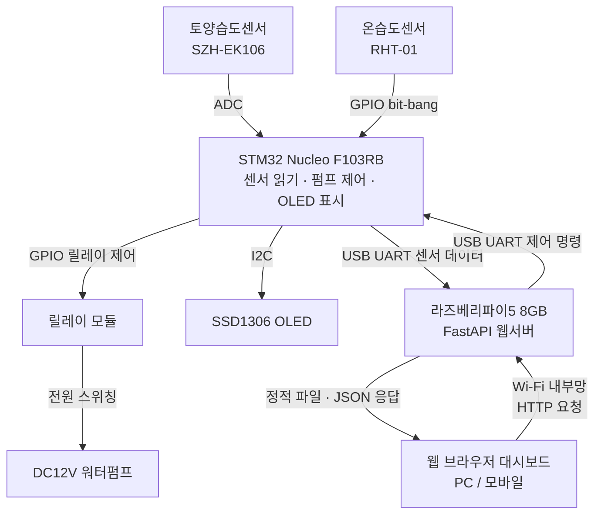
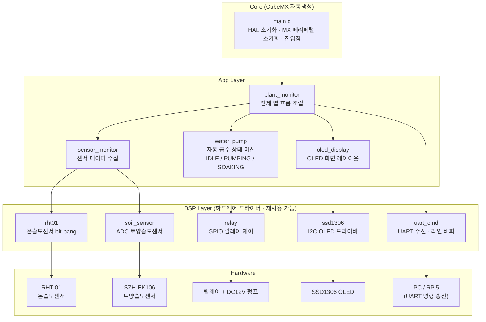

# 포트폴리오 프로젝트

> 스마트 화분 관리 시스템 (Smart Plant Monitoring System)

---

**스마트 화분 모니터링 시스템**

### 시스템 구성



### 레이어별 역할

| 레이어   | 담당          | 핵심 기능                                                                                   |
| -------- | ------------- | ------------------------------------------------------------------------------------------- |
| 펌웨어   | STM32         | 센서 읽기(ADC/RHT-01), 임계값 기반 펌프 자동 제어, OLED 상태 표시, UART 송수신 / C, CubeIDE |
| 백엔드   | 라즈베리파이5 | UART 수신, SQLite 저장, FastAPI REST API / Python                                           |
| 프론트   | 웹 대시보드   | 실시간 조회, 그래프, 펌프 이력, 임계값 원격 설정 / HTML+CSS+JS, Chart.js (FastAPI에서 서빙) |
| 네트워크 | Wi-Fi 내부망  | 같은 네트워크 내 웹 브라우저로 접속 (인증 없음)                                             |

### STM32 펌웨어 내부 구조

STM32 펌웨어는 CubeMX가 생성한 `Core` 코드 위에 `BSP` 드라이버 계층과 `App` 서비스 계층을 올리는 구조로 정리한다.



현재 설계 원칙:

| 계층                      | 역할                                               |
| ------------------------- | -------------------------------------------------- |
| `Core/main.c`             | CubeMX/HAL 초기화와 앱 진입점                      |
| `BSP/*`                   | 개별 하드웨어를 직접 다루는 재사용 가능한 드라이버 |
| `App/sensor_monitor`      | 센서 드라이버들을 묶어 최신 센서 데이터를 제공     |
| `App/plant_monitor`       | STM32 앱 전체 흐름을 조립                          |
| `App/oled_display`        | OLED 표시 레이아웃과 주기적 화면 업데이트 담당     |
| `App/water_pump`          | 자동 급수 정책과 non-blocking 상태 머신 담당 예정  |

자동 급수는 RTOS 없이 `HAL_GetTick()` 기반 non-blocking 상태 머신으로 구현한다. 펌프 ON 시간과 물 흡수 대기 시간 동안에도 센서 모니터링, OLED 표시, UART 처리 흐름이 멈추지 않도록 긴 `HAL_Delay()` 사용은 피한다.

### OLED 표시 항목 (STM32 — SSD1306 I2C)

현장에서 한눈에 파악할 수 있는 핵심 정보만 표시:

| 항목        | 설명                             |
| ----------- | -------------------------------- |
| 토양 수분   | 현재 측정값 (%)                  |
| 펌프 임계값 | 현재 설정된 작동 기준 수분값 (%) |
| 온도 / 습도 | RHT-01 측정값 (°C / %)           |
| 펌프 상태   | ON / OFF                         |

> 기록 로그, 그래프, 이력 등 상세 정보는 웹 대시보드에서 확인

### 임계값 설정 방법

| 방법        | 장치          | 설명                                                                                             |
| ----------- | ------------- | ------------------------------------------------------------------------------------------------ |
| 웹 대시보드 | 라즈베리파이5 | `/settings/threshold` API를 통해 임계값 설정 → UART로 STM32에 전달 → STM32가 적용 및 OLED에 반영 |

### REST API

| Method | Endpoint            | 설명                            |
| ------ | ------------------- | ------------------------------- |
| GET    | /sensor/current     | 현재 센서값                     |
| GET    | /sensor/logs        | 시간별 로그                     |
| GET    | /pump/logs          | 펌프 이력                       |
| POST   | /pump/control       | 펌프 수동 제어                  |
| POST   | /settings/threshold | 임계값 설정 (STM32에 UART 전달) |
| GET    | /settings/threshold | 임계값 조회                     |

### DB 설계

**sensor_logs**: id, timestamp, soil_humidity, air_humidity, temperature

**pump_logs**: id, timestamp, action(ON/OFF), trigger(AUTO/MANUAL)

**settings**: id, soil_humidity_min, updated_at

### FastAPI 역할 및 데이터 흐름

FastAPI 서버 하나가 UART 수신, DB 저장, API 서빙, HTML 서빙을 모두 담당한다.

```
STM32 (UART) ──센서데이터──▶ FastAPI ──▶ SQLite DB
                                │
웹 대시보드 ──임계값 설정──▶ FastAPI ──UART──▶ STM32
                                │
웹 대시보드 ◀──센서데이터 조회──────┘ (DB에서 읽어서 JSON 반환)
```

- **UART 수신**: FastAPI 내부 백그라운드 스레드가 시리얼 포트(`/dev/ttyACM0`)를 상시 읽고, 데이터 수신 시 SQLite에 저장
- **임계값 송신**: 웹 대시보드에서 `POST /settings/threshold` 호출 → FastAPI가 UART로 STM32에 전달
- **데이터 조회**: 대시보드 JS가 `GET /sensor/logs` 등 API를 주기적으로 fetch() → FastAPI가 DB에서 읽어 JSON 반환 → Chart.js로 그래프 렌더링
- **HTML 서빙**: FastAPI가 정적 파일(HTML/CSS/JS)도 직접 서빙 → Flask 불필요

> FastAPI와 Flask는 둘 다 HTML 서빙 + REST API가 가능한 Python 웹 프레임워크다.
> FastAPI 선택 이유: 자동 Swagger 문서(`/docs`), 타입 힌트 기반 자동 검증, 포트폴리오 완성도.

---

## UART 연결 방식

| 항목               | 내용                                              |
| ------------------ | ------------------------------------------------- |
| 연결 방법          | STM32 Nucleo USB → RPi5 USB 2.0 포트              |
| RPi5 디바이스      | `/dev/ttyACM0` (가상 COM 포트, ST-Link 내장 변환) |
| 전압 레벨          | USB 경유이므로 레벨 변환 불필요                   |
| 전원 겸용          | USB 한 줄로 전원 공급 + UART 통신 동시 처리       |
| RPi5 USB 공급 전류 | 포트당 600mA / STM32 소비 200~300mA → 여유 있음   |

---

## 부품 목록

| 부품                | 모델/규격                                             |
| ------------------- | ----------------------------------------------------- |
| MCU                 | STM32 Nucleo F103RB-C05                               |
| 토양습도센서        | SZH-EK106 (아날로그 ADC)                              |
| 온습도센서          | RHT-01 (디지털 GPIO 비트뱅)                           |
| 릴레이 모듈         | 5V 1채널 / 3.3V 제어 신호 지원 / HIGH 신호 ON (JQC-3FF-S-Z 기반, 실측 확인) |
| 워터펌프            | DC12V 수중펌프 (외경8mm 내경6mm)                      |
| 실리콘 호스         | 외경10mm 내경8mm                                      |
| OLED 디스플레이     | 0.96인치 I2C SSD1306 / **STM32에 연결**               |
| 라즈베리파이5       | 8GB                                                   |
| 라즈베리파이 어댑터 | 5V/5A USB-C 공식                                      |
| 12V DC 어댑터       | 5.5mm/2.1mm 센터플러스 2A / 펌프 전원용               |
| 브레드보드          | 830핀 MB-102                                          |
| SD카드              | 64GB                                                  |
| 점퍼 와이어         | 수-수, 수-암                                          |

---

## 전원 구성

| 기기           | 전원                                           |
| -------------- | ---------------------------------------------- |
| 라즈베리파이5  | 공식 어댑터 5V/5A USB-C                        |
| STM32 Nucleo   | 라즈베리파이5 USB 포트 연결 (전원 + UART 겸용) |
| 펌프           | 12V DC 어댑터 별도 공급                        |
| 릴레이 모듈     | 5V 1채널 모듈이지만 3.3V 동작/제어 신호 지원, STM32 3.3V GPIO로 HIGH-active 제어 |
| OLED (SSD1306) | STM32 3.3V 핀에서 공급                         |

---

## 개발 일정

| 기간    | 레이어       | 목표                                                                                    |
| ------- | ------------ | --------------------------------------------------------------------------------------- |
| 1~2주   | STM32        | CubeIDE 세팅, LED Blink, UART로 PC에 "Hello" 출력                                       |
| 3~4주   | STM32        | 토양센서 ADC 읽기, RHT-01 읽기, UART 송신                                               |
| 5~6주   | STM32        | OLED I2C 표시, 릴레이로 펌프 ON/OFF, 임계값 기반 자동 제어                             |
| 7주     | STM32        | UART 명령 수신(임계값 설정)                                                             |
| 8~9주   | 라즈베리파이 | OS 세팅, UART 수신, SQLite DB 저장, FastAPI REST API 구현                               |
| 10~11주 | 웹 대시보드  | HTML/JS 대시보드, Chart.js 그래프, 임계값 설정 폼, 펌프 이력                            |
| 12~13주 | 전체         | 통합 테스트, 버그 수정                                                                  |
| 14주    | 마무리       | README, GitHub, 시연 영상                                                               |

---

## 완성 이후 고도화 작업

### 부팅 시 부품 상태 체크

센서, OLED, 릴레이 상태를 부팅 시 확인하고 OLED에 결과를 표시한다.
상태 체크 결과 표시 후 약 10초 대기하고 메인 루프 동작을 시작한다.

이 작업은 기본 센서 읽기, OLED 표시, 릴레이 제어, 자동 급수 로직이 완성된 뒤 안정화 단계에서 추가한다.

### HAL_MAX_DELAY → 유한 타임아웃 + 에러 처리

현재 코드에서 `HAL_MAX_DELAY`(사실상 무한 대기)를 사용하는 곳을 유한 타임아웃과 예외 처리 로직으로 교체해야 한다.
I2C 노이즈, 센서 미연결 등 하드웨어 이상 시 MCU 전체가 해당 줄에서 멈추는 문제를 방지한다.

| 파일                    | 함수              | 현재                | 변경 방향                                                                   |
| ----------------------- | ----------------- | ------------------- | --------------------------------------------------------------------------- |
| `BSP/Src/ssd1306.c`     | `SSD1306_Init`    | `HAL_MAX_DELAY`     | I2C 전송 시간 기준 타임아웃 (예: 50ms) + `HAL_ERROR` 반환 시 UART 에러 로그 |
| `BSP/Src/ssd1306.c`     | `SSD1306_Update`  | `HAL_MAX_DELAY` × 2 | 프레임버퍼 전송 시간 기준 타임아웃 (예: 200ms) + 연속 실패 시 재초기화 시도 |
| `BSP/Src/soil_sensor.c` | `SoilSensor_Read` | `HAL_MAX_DELAY`     | ADC 변환 시간 기준 타임아웃 (예: 10ms) + `HAL_TIMEOUT` 반환 시 에러 카운트  |
| `Core/Src/main.c`       | `__io_putchar`    | `HAL_MAX_DELAY`     | UART 전송 시간 기준 타임아웃 (예: 10ms)                                     |

**타임아웃 값 산정 기준:**

- I2C 100kHz, 1바이트 ≈ 90μs → 1025바이트 ≈ 92ms → 200ms 설정 (2배 여유)
- ADC 변환 ≈ 수십 μs → 10ms 설정
- UART 115200bps, 1바이트 ≈ 87μs → 10ms 설정

---
