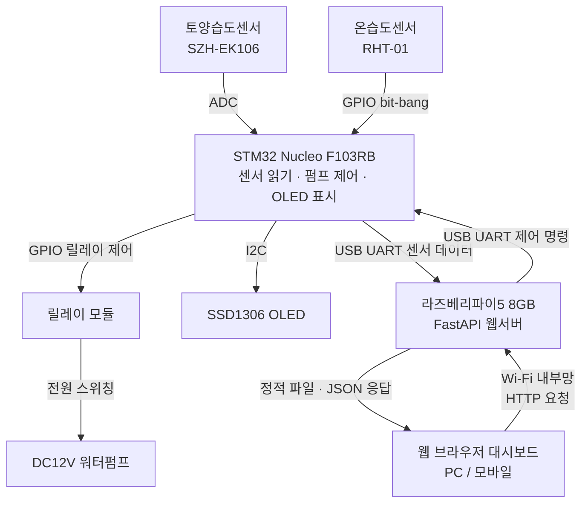
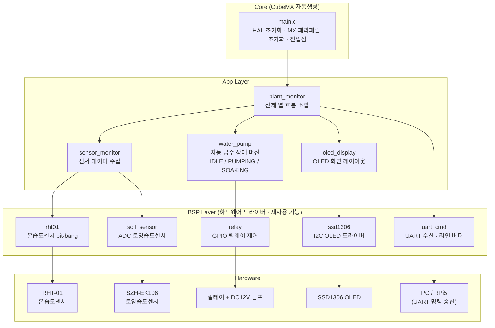
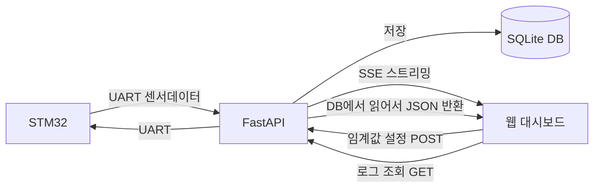

# 포트폴리오 프로젝트

> 스마트 화분 관리 시스템 (Smart Plant Monitoring System)

---

**스마트 화분 모니터링 시스템**

### 시스템 구성



### 레이어별 역할

| 레이어   | 담당          | 핵심 기능                                                                                   |
| -------- | ------------- | ------------------------------------------------------------------------------------------- |
| 펌웨어   | STM32         | 센서 읽기(ADC/RHT-01), 임계값 기반 펌프 자동 제어, OLED 상태 표시, UART 송수신 / C, CubeIDE |
| 백엔드   | 라즈베리파이5 | UART 수신, SQLite 저장, FastAPI REST API / Python                                           |
| 프론트   | 웹 대시보드   | 실시간 조회, 그래프, 펌프 이력, 임계값 원격 설정 / HTML+CSS+JS, Chart.js (FastAPI에서 서빙) |
| 네트워크 | Wi-Fi 내부망  | 같은 네트워크 내 웹 브라우저로 접속 (인증 없음)                                             |

### STM32 펌웨어 내부 구조

STM32 펌웨어는 CubeMX가 생성한 `Core` 코드 위에 `BSP` 드라이버 계층과 `App` 서비스 계층을 올리는 구조로 정리한다.



현재 설계 원칙:

| 계층                      | 역할                                               |
| ------------------------- | -------------------------------------------------- |
| `Core/main.c`             | CubeMX/HAL 초기화와 앱 진입점                      |
| `BSP/*`                   | 개별 하드웨어를 직접 다루는 재사용 가능한 드라이버 |
| `App/sensor_monitor`      | 센서 드라이버들을 묶어 최신 센서 데이터를 제공     |
| `App/plant_monitor`       | STM32 앱 전체 흐름을 조립                          |
| `App/oled_display`        | OLED 표시 레이아웃과 주기적 화면 업데이트 담당     |
| `App/water_pump`          | 자동 급수 정책과 non-blocking 상태 머신 담당 예정  |

자동 급수는 RTOS 없이 `HAL_GetTick()` 기반 non-blocking 상태 머신으로 구현한다. 펌프 ON 시간과 물 흡수 대기 시간 동안에도 센서 모니터링, OLED 표시, UART 처리 흐름이 멈추지 않도록 긴 `HAL_Delay()` 사용은 피한다.

### OLED 표시 항목 (STM32 — SSD1306 I2C)

현장에서 한눈에 파악할 수 있는 핵심 정보만 표시:

| 항목        | 설명                             |
| ----------- | -------------------------------- |
| 토양 수분   | 현재 측정값 (%)                  |
| 펌프 임계값 | 현재 설정된 작동 기준 수분값 (%) |
| 온도 / 습도 | RHT-01 측정값 (°C / %)           |
| 펌프 상태   | ON / OFF                         |

> 기록 로그, 그래프, 이력 등 상세 정보는 웹 대시보드에서 확인

### 임계값 설정 방법

| 방법        | 장치          | 설명                                                                                             |
| ----------- | ------------- | ------------------------------------------------------------------------------------------------ |
| 웹 대시보드 | 라즈베리파이5 | `/settings/threshold` API를 통해 임계값 설정 → UART로 STM32에 전달 → STM32가 적용 및 OLED에 반영 |

### REST API

| Method | Endpoint            | 설명                                        |
| ------ | ------------------- | ------------------------------------------- |
| GET    | /sensors/latest     | 최신 센서값                                 |
| GET    | /sensors/history    | 센서 이력 (최대 100건)                      |
| GET    | /stream             | 실시간 데이터 스트리밍 — SSE (연결 유지)    |
| GET    | /pump/logs          | 펌프 이력                                   |
| POST   | /settings/threshold | 임계값 설정 (DB 저장 + UART로 STM32 전달)   |
| GET    | /settings           | 현재 설정값 조회                            |

### RPi ↔ 웹 SSE 프로토콜

SSE 엔드포인트(`GET /stream`)가 브라우저로 전송하는 메시지 형식.

**센서 데이터** (STM32에서 수신할 때마다 전송)

```json
{"type": "sensor_data", "soil_moisture_pct": 42, "air_temperature": 25.3, "air_humidity": 60.2}
```

**펌프 상태** (상태 전환 시마다 전송)

```json
{"type": "water_pump", "state": "PUMPING"}
```

`state` 값: `IDLE` (대기 중) / `PUMPING` (급수 중) / `SOAKING` (흡수 대기) / `UNKNOWN`

> STM32가 보내는 raw 상태값(`WATER_PUMP_IDLE` 등)은 `uart/protocol.py`에서 위 값으로 정규화된다.

### DB 설계

**sensor_logs**: id, timestamp, soil_moisture_pct, air_humidity, air_temperature

**pump_logs**: id, timestamp, action (IDLE / PUMPING / SOAKING)

**settings**: id, threshold, updated_at

### FastAPI 역할 및 데이터 흐름

FastAPI 서버 하나가 UART 수신, DB 저장, API 서빙, HTML 서빙, SSE 스트리밍을 모두 담당한다.



- **UART 수신**: `service/uart_listener` 백그라운드 스레드가 `/dev/ttyACM0`를 상시 읽고, 수신 시 SQLite 저장과 동시에 `asyncio.Queue`에 발행
- **실시간 스트리밍**: `GET /stream` SSE 엔드포인트가 Queue를 구독 → 새 데이터 즉시 브라우저로 전송 → 브라우저 `EventSource`가 수신 즉시 화면 갱신
- **임계값 송신**: 웹 대시보드에서 `POST /settings/threshold` 호출 → FastAPI가 UART로 STM32에 전달
- **로그 조회**: 대시보드 JS가 `GET /pump/logs` 등 API를 fetch() → FastAPI가 DB에서 읽어 JSON 반환
- **HTML 서빙**: FastAPI가 정적 파일(HTML/CSS/JS)도 직접 서빙 → Flask 불필요

> FastAPI와 Flask는 둘 다 HTML 서빙 + REST API가 가능한 Python 웹 프레임워크다.
> FastAPI 선택 이유: 자동 Swagger 문서(`/docs`), 타입 힌트 기반 자동 검증, 포트폴리오 완성도.

### RPi5 소프트웨어 내부 구조

```
plant_monitor_rpi/
├── main.py                  # FastAPI 앱, lifespan (스레드 시작/정지)
├── models/
│   ├── settings.py          # Settings dataclass
│   ├── sensor_data.py       # SensorData dataclass
│   └── pump_state.py        # PumpState dataclass, 정규화 상태 상수 (IDLE/PUMPING/SOAKING)
├── uart/
│   ├── serial_port.py       # 시리얼 포트 열기/읽기/쓰기, port_name 프로퍼티
│   └── protocol.py          # STM32 msg= 파싱 → 내부 모델 변환, create_setting_message
├── db/
│   ├── database.py          # SQLite 연결, 테이블 생성
│   └── repository.py        # sensor_logs / pump_logs / settings CRUD
├── service/
│   ├── uart_listener.py     # 백그라운드 스레드: UART 읽기 → 파싱 → DB 저장 + Queue 발행
│   └── uart_setup.py        # 서버 시작 시 STM32 초기 임계값 동기화
├── api/
│   ├── constants.py         # RPi ↔ 웹 SSE 프로토콜 상수 (타입 키)
│   ├── sensor.py            # GET /sensors/latest, /sensors/history
│   ├── pump.py              # GET /pump/logs
│   ├── settings.py          # GET /settings, POST /settings/threshold
│   └── stream.py            # GET /stream (SSE 엔드포인트, 내부 모델 → SSE 직렬화)
└── static/
    ├── index.html           # 대시보드 HTML
    ├── style.css            # 스타일
    ├── constants.js         # 웹 클라이언트 상수 (api/constants.py 대응)
    └── app.js               # SSE 수신, REST fetch, DOM 업데이트
```

| 계층 | 파일 | 역할 |
| ---- | ---- | ---- |
| Model | `models/` | 내부 데이터 클래스 및 정규화 상수 |
| Transport | `uart/serial_port.py` | 시리얼 포트 하드웨어만 담당, 파싱 없음 |
| Protocol | `uart/protocol.py` | STM32 raw 메시지 → 내부 모델 변환 |
| Persistence | `db/repository.py` | DB CRUD, SQL 쿼리를 여기서만 씀 |
| Service | `service/uart_listener.py` | Transport + Protocol + Persistence 조립, Queue 발행 |
| Service | `service/uart_setup.py` | 서버 시작 시 threading.Event로 STM32 연결 대기 후 초기값 전송 |
| API | `api/*.py` | HTTP 요청 처리, 내부 모델 → 웹 프로토콜 직렬화 |

---

## UART 연결 방식

| 항목               | 내용                                              |
| ------------------ | ------------------------------------------------- |
| 연결 방법          | STM32 Nucleo USB → RPi5 USB 2.0 포트              |
| RPi5 디바이스      | `/dev/ttyACM0` (가상 COM 포트, ST-Link 내장 변환) |
| 전압 레벨          | USB 경유이므로 레벨 변환 불필요                   |
| 전원 겸용          | USB 한 줄로 전원 공급 + UART 통신 동시 처리       |
| RPi5 USB 공급 전류 | 포트당 600mA / STM32 소비 200~300mA → 여유 있음   |

---

## UART 통신 프로토콜

### 공통 설정

| 항목      | 값                    |
| --------- | --------------------- |
| Baud Rate | 115200                |
| 줄끝      | `\n` (LF)             |

### STM32 → RPi5

디버그 printf와 구분하기 위해 데이터 메시지 앞에 `msg=`를 붙인다. RPi5는 `msg=`로 시작하는 줄만 파싱한다.

**센서 데이터** — 센서 측정 직후 즉시 전송 (`sensor_monitor`에서 printf):

```
msg={"type":"sensor_data","data":{"soil_moisture_pct":55,"air_temperature":22.5,"air_humidity":60.0}}
```

**펌프 상태** — 상태 전환 즉시 전송 (`water_pump`에서 printf):

```
msg={"type":"water_pump","data":{"state":"WATER_PUMP_PUMPING"}}
```

| 필드 | 타입 | 설명 |
| ---- | ---- | ---- |
| `type` | 문자열 | 메시지 종류 (`"sensor_data"` / `"water_pump"`) |
| `data.soil_moisture_pct` | 정수 또는 `null` | 토양 수분 (%) — 센서 읽기 실패 시 `null` |
| `data.air_temperature` | 소수점 1자리 또는 `null` | 온도 (°C) — 센서 읽기 실패 시 `null` |
| `data.air_humidity` | 소수점 1자리 또는 `null` | 공기 습도 (%) — 센서 읽기 실패 시 `null` |
| `data.state` | 문자열 | `WaterPump_State` 열거형 이름 (`WATER_PUMP_IDLE` / `WATER_PUMP_PUMPING` / `WATER_PUMP_SOAKING` / `UNKNOWN`) |

### RPi5 → STM32

```
msg={"threshold":30}
```

| 필드 | 타입 | 설명 |
| ---- | ---- | ---- |
| `threshold` | 정수 (0~100) | 토양 수분 임계값 (%) |

---

## 부품 목록

| 부품                | 모델/규격                                             |
| ------------------- | ----------------------------------------------------- |
| MCU                 | STM32 Nucleo F103RB-C05                               |
| 토양습도센서        | SZH-EK106 (아날로그 ADC)                              |
| 온습도센서          | RHT-01 (디지털 GPIO 비트뱅)                           |
| 릴레이 모듈         | 5V 1채널 / 3.3V 제어 신호 지원 / HIGH 신호 ON (JQC-3FF-S-Z 기반, 실측 확인) |
| 워터펌프            | DC12V 수중펌프 (외경8mm 내경6mm)                      |
| 실리콘 호스         | 외경10mm 내경8mm                                      |
| OLED 디스플레이     | 0.96인치 I2C SSD1306 / **STM32에 연결**               |
| 라즈베리파이5       | 8GB                                                   |
| 라즈베리파이 어댑터 | 5V/5A USB-C 공식                                      |
| 12V DC 어댑터       | 5.5mm/2.1mm 센터플러스 2A / 펌프 전원용               |
| 브레드보드          | 830핀 MB-102                                          |
| SD카드              | 64GB                                                  |
| 점퍼 와이어         | 수-수, 수-암                                          |

---

## 전원 구성

| 기기           | 전원                                           |
| -------------- | ---------------------------------------------- |
| 라즈베리파이5  | 공식 어댑터 5V/5A USB-C                        |
| STM32 Nucleo   | 라즈베리파이5 USB 포트 연결 (전원 + UART 겸용) |
| 펌프           | 12V DC 어댑터 별도 공급                        |
| 릴레이 모듈     | 5V 1채널 모듈이지만 3.3V 동작/제어 신호 지원, STM32 3.3V GPIO로 HIGH-active 제어 |
| OLED (SSD1306) | STM32 3.3V 핀에서 공급                         |

---

## 완성 이후 고도화 작업

## 펌프 동작 시간, 펌프 대기 시간 설정
펌프 동작 시간, 펌프 대기 시간도 db Settings에 추가하고 웹 대시보드에서 설정할 수 있게 한다.
디폴트 값들을 모아 놓는 파일을 생성하여 Settings의 디폴트 값들을 하드코딩이 아니라 디폴트 값에서 불러온다.

### 부팅 시 부품 상태 체크

센서, OLED, 릴레이 상태를 부팅 시 확인하고 OLED에 결과를 표시한다.
상태 체크 결과 표시 후 약 10초 대기하고 메인 루프 동작을 시작한다.

이 작업은 기본 센서 읽기, OLED 표시, 릴레이 제어, 자동 급수 로직이 완성된 뒤 안정화 단계에서 추가한다.

### HAL_MAX_DELAY → 유한 타임아웃 + 에러 처리

현재 코드에서 `HAL_MAX_DELAY`(사실상 무한 대기)를 사용하는 곳을 유한 타임아웃과 예외 처리 로직으로 교체해야 한다.
I2C 노이즈, 센서 미연결 등 하드웨어 이상 시 MCU 전체가 해당 줄에서 멈추는 문제를 방지한다.

| 파일                    | 함수              | 현재                | 변경 방향                                                                   |
| ----------------------- | ----------------- | ------------------- | --------------------------------------------------------------------------- |
| `BSP/Src/ssd1306.c`     | `SSD1306_Init`    | `HAL_MAX_DELAY`     | I2C 전송 시간 기준 타임아웃 (예: 50ms) + `HAL_ERROR` 반환 시 UART 에러 로그 |
| `BSP/Src/ssd1306.c`     | `SSD1306_Update`  | `HAL_MAX_DELAY` × 2 | 프레임버퍼 전송 시간 기준 타임아웃 (예: 200ms) + 연속 실패 시 재초기화 시도 |
| `BSP/Src/soil_sensor.c` | `SoilSensor_Read` | `HAL_MAX_DELAY`     | ADC 변환 시간 기준 타임아웃 (예: 10ms) + `HAL_TIMEOUT` 반환 시 에러 카운트  |
| `Core/Src/main.c`       | `__io_putchar`    | `HAL_MAX_DELAY`     | UART 전송 시간 기준 타임아웃 (예: 10ms)                                     |

**타임아웃 값 산정 기준:**

- I2C 100kHz, 1바이트 ≈ 90μs → 1025바이트 ≈ 92ms → 200ms 설정 (2배 여유)
- ADC 변환 ≈ 수십 μs → 10ms 설정
- UART 115200bps, 1바이트 ≈ 87μs → 10ms 설정

### React로 웹 대시보드 재구성

HTML+JS+Chart.js로 구현된 대시보드를 React로 재구성한다. 컴포넌트 기반 구조로 상태 관리가 명확해지고, SSE 수신 데이터를 `useState`로 관리하면 영향받는 컴포넌트만 자동 재렌더링된다. Kotlin Compose의 `mutableStateOf`와 같은 개념이다.

### Docker로 서비스 배포

파이썬 가상환경 대신 Docker 컨테이너로 FastAPI 서버를 실행한다. 컨테이너가 격리된 실행 환경을 제공하므로 시스템 Python과 충돌 없이 의존성을 관리할 수 있고, 재배포가 단순해진다.

UART 디바이스(`/dev/ttyACM0`)는 컨테이너 실행 시 `--device` 옵션으로 전달한다:

```bash
docker run --device /dev/ttyACM0 -p 8000:8000 plant-monitor
```
