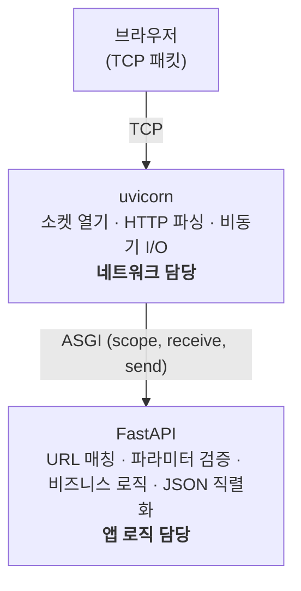
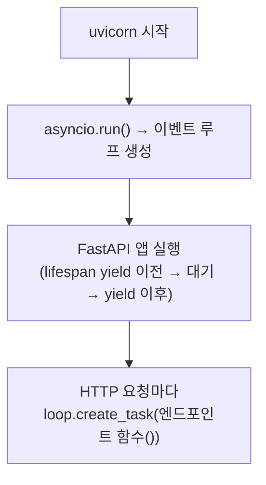
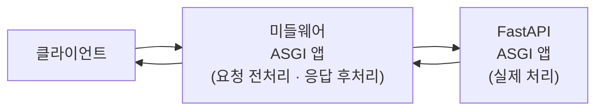
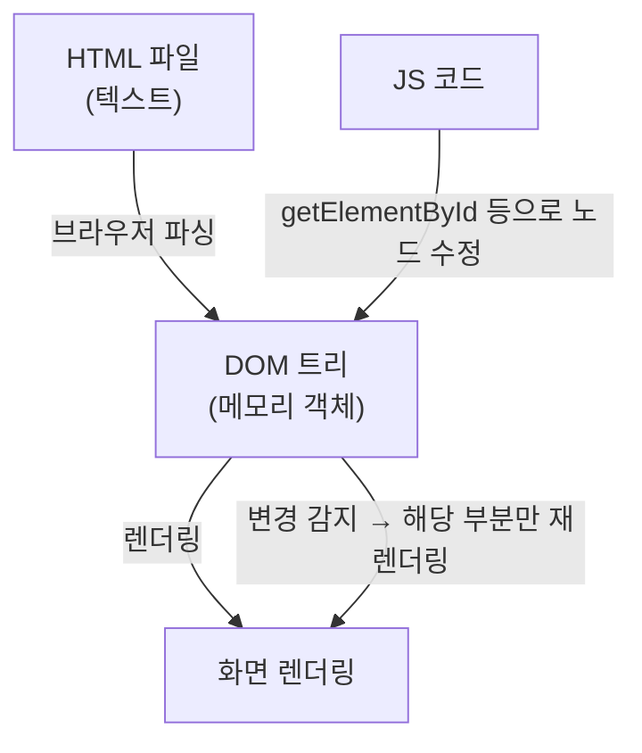
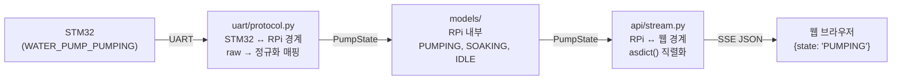

# 10주차 맥락 — 웹 대시보드 기초: HTML/CSS/JS 구현 및 프로토콜 계층 분리

## 현재 진행 상황

- FastAPI 정적 파일 서빙 설정 (`StaticFiles` 마운트, `GET /` 루트 엔드포인트) ✅
- `static/index.html` 생성 및 브라우저 접속 확인 ✅
- 메인 대시보드 HTML 구조 (`static/index.html`) ✅
- 기본 CSS 스타일 (`static/style.css`) ✅
- SSE 연결 JS (`static/app.js`, `static/constants.js`) ✅
- `threshold` 네이밍 통일 (`soil_moisture_min` → `threshold`) ✅
- 모델 계층 분리 (`models/sensor_data.py`, `models/pump_state.py` 신규 생성) ✅
- 프로토콜 계층 분리 (STM32 ↔ RPi ↔ 웹 3단계 구조화) ✅
- 아키텍처 문서 업데이트 (SSE 프로토콜 섹션 추가) ✅
- **10주차 완료** ✅

---

## 구현된 파일 구조

```
plant_monitor_rpi/
├── main.py                  # FastAPI 앱, lifespan, 라우터 등록, 정적 파일 서빙
├── models/
│   ├── settings.py          # Settings dataclass
│   ├── sensor_data.py       # SensorData dataclass (10주차 신규)
│   └── pump_state.py        # PumpState dataclass, 정규화 상수 (10주차 신규)
├── uart/
│   ├── serial_port.py
│   └── protocol.py          # STM32 raw 파싱 → 내부 모델 변환 (10주차 리팩토링)
├── db/
│   ├── database.py
│   └── repository.py
├── service/
│   ├── uart_listener.py
│   └── uart_setup.py
├── api/
│   ├── constants.py         # RPi ↔ 웹 SSE 타입 상수만 (10주차 정리)
│   ├── stream.py            # SSE 엔드포인트 (10주차 리팩토링)
│   ├── sensor.py
│   ├── pump.py
│   └── settings.py
└── static/                  # 10주차 신규
    ├── index.html
    ├── style.css
    ├── constants.js
    └── app.js
```

---

## 10주차 구현 코드

### `uart/protocol.py` (리팩토링 후)

```python
# STM32 UART 메시지 필드명 (private — 이 파일 안에서만)
_TYPE_SENSOR_DATA       = "sensor_data"
_TYPE_WATERPUMP         = "water_pump"
_DATA_SOIL_MOISTURE_PCT = "soil_moisture_pct"
_DATA_AIR_TEMPERATURE   = "air_temperature"
_DATA_AIR_HUMIDITY      = "air_humidity"
_DATA_WATERPUMP_STATE   = "state"

# STM32 raw 펌프 상태값 → 내부 정규화 매핑
_PUMP_RAW_IDLE    = "WATER_PUMP_IDLE"
_PUMP_RAW_PUMPING = "WATER_PUMP_PUMPING"
_PUMP_RAW_SOAKING = "WATER_PUMP_SOAKING"

_PUMP_STATE_MAP = {
    _PUMP_RAW_IDLE:    PUMP_IDLE,
    _PUMP_RAW_PUMPING: PUMP_PUMPING,
    _PUMP_RAW_SOAKING: PUMP_SOAKING,
}

def parse_line(line: str) -> Optional[Union[SensorData, PumpState]]:
    ...
    if msg_type == _TYPE_WATERPUMP:
        raw = data.get(_DATA_WATERPUMP_STATE, PUMP_UNKNOWN)
        return PumpState(state=_PUMP_STATE_MAP.get(raw, PUMP_UNKNOWN))
```

### `api/constants.py`

```python
TYPE_KEY         = "type"
SENSOR_DATA_TYPE = "sensor_data"
PUMP_STATE_TYPE  = "water_pump"
```

### `api/stream.py` (리팩토링 후)

```python
if isinstance(parsed, SensorData):
    payload = {TYPE_KEY: SENSOR_DATA_TYPE, **asdict(parsed)}
elif isinstance(parsed, PumpState):
    payload = {TYPE_KEY: PUMP_STATE_TYPE, **asdict(parsed)}
```

### `static/constants.js`

```js
const TYPE_SENSOR_DATA = "sensor_data";
const TYPE_PUMP_STATE  = "water_pump";

const PUMP_IDLE    = "IDLE";
const PUMP_PUMPING = "PUMPING";
const PUMP_SOAKING = "SOAKING";
```

### `static/app.js` 핵심 구조

```js
// DOM 요소 참조 (최상위에 모아서 한 번만 탐색)
const elStatus      = document.getElementById("connection-status");
const elSoil        = document.getElementById("soil-moisture");
// ...

const PUMP_LABEL = {
    [PUMP_IDLE]:    "대기 중",
    [PUMP_PUMPING]: "급수 중",
    [PUMP_SOAKING]: "흡수 대기",
};

const PUMP_CLASS_MAP = {
    [PUMP_IDLE]:    "idle",
    [PUMP_PUMPING]: "pumping",
    [PUMP_SOAKING]: "soaking",
};

async function loadSettings() { ... }   // GET /settings → threshold 입력창 채우기
async function loadPumpLogs() { ... }   // GET /pump/logs → <li> 목록 채우기

function connectSSE() {
    const es = new EventSource("/stream");
    es.onopen    = () => { ... };       // connection-status 업데이트
    es.onmessage = (event) => { ... };  // 타입 분기 → DOM 업데이트
    es.onerror   = () => { ... };
}

loadSettings();
loadPumpLogs();
connectSSE();
```

---

## RPi ↔ 웹 SSE 프로토콜

SSE `GET /stream` 엔드포인트가 브라우저로 전송하는 메시지 형식.

**센서 데이터** (STM32에서 수신할 때마다 전송)
```json
{"type": "sensor_data", "soil_moisture_pct": 42, "air_temperature": 25.3, "air_humidity": 60.2}
```

**펌프 상태** (상태 전환 시마다 전송)
```json
{"type": "water_pump", "state": "PUMPING"}
```

`state` 값: `IDLE` (대기 중) / `PUMPING` (급수 중) / `SOAKING` (흡수 대기) / `UNKNOWN`

---

## 이번 주 배운 것들

---

### 1. 정적 파일 서빙 vs 동적 응답

FastAPI가 처리하는 요청에는 두 종류가 있다.

**동적 응답**: `/sensors/latest`처럼 요청 시점에 DB를 읽어 JSON을 만들어 반환하는 방식. 매 요청마다 내용이 달라진다.

**정적 파일 서빙**: `index.html`, `style.css`, `app.js`처럼 내용이 바뀌지 않는 파일을 그대로 내려주는 방식. FastAPI가 파일을 읽어 그대로 전달할 뿐이다.

FastAPI는 `StaticFiles`라는 클래스로 정적 파일 서빙을 지원한다. `app.mount()`로 특정 URL 접두어와 폴더를 연결하면, 그 접두어로 들어오는 요청은 FastAPI 라우터를 거치지 않고 폴더에서 파일을 찾아 바로 반환한다.

---

### 2. Jinja2 — Python 템플릿 엔진

Jinja2는 HTML 파일 안에 Python 변수나 로직을 삽입할 수 있는 **템플릿 엔진**이다. Django, Flask의 기본 템플릿 엔진이며 FastAPI도 공식 지원한다.

```html
<h1>토양 수분: {{ soil_moisture }}%</h1>

  <p>물이 부족합니다</p>

```

`{{ }}` 안에 변수, `` 안에 if/for 같은 제어문을 쓴다. 서버가 이 파일을 읽어 변수를 실제 값으로 교체한 완성된 HTML을 브라우저에 내려준다.

---

### 3. Jinja2Templates vs HTMLResponse — 두 가지 HTML 반환 방식

**방식 ①: Jinja2Templates — SSR (Server-Side Rendering)**

서버가 DB를 조회해서 HTML에 값을 끼워넣은 뒤 완성된 HTML을 반환한다.

```python
templates = Jinja2Templates(directory="templates")

@app.get("/", response_class=HTMLResponse)
async def root(request: Request):
    moisture = repository.get_latest().soil_moisture_pct
    return templates.TemplateResponse(
        "index.html",
        {"request": request, "soil_moisture": moisture}
    )
```

단점: 데이터가 바뀔 때마다 페이지 전체를 새로고침해야 한다.

**방식 ②: HTMLResponse (파일 그대로 반환) — CSR (Client-Side Rendering)**

서버는 HTML 껍데기만 내려준다. 데이터는 브라우저 JS가 SSE나 fetch()로 별도로 가져온다.

```python
@app.get("/", response_class=HTMLResponse)
async def root():
    with open("static/index.html", encoding="utf-8") as f:
        return f.read()
```

이번 프로젝트는 SSE로 실시간 데이터를 수신하고 JS가 DOM을 직접 바꾸는 구조이므로 Jinja2가 필요 없다. HTML은 고정된 껍데기, 데이터는 JS가 실시간으로 채운다.

---

### 4. app.mount() — ASGI 앱 위임

FastAPI의 `@app.get()`은 URL을 **하나씩** 등록한다. `app.mount()`는 URL **경로 접두어** 전체를 다른 ASGI 앱에 위임한다.

```python
app.mount("/static", StaticFiles(directory="static"), name="static")
```

`GET /static/style.css` 요청이 들어오면 FastAPI는 `/static` 접두어를 보고 `StaticFiles` 앱에 통째로 넘긴다. `StaticFiles`는 `directory="static"` 폴더에서 `style.css`를 찾아 반환한다. FastAPI 라우터는 관여하지 않는다.

`directory="static"`은 `uvicorn`을 실행하는 위치(`plant_monitor_rpi/`) 기준 상대경로다.

Kotlin NavGraph에서 특정 딥링크를 다른 Activity에 위임하는 것과 같다. NavGraph(FastAPI)가 경로를 보고 "이건 내가 처리할 게 아니다, 저쪽으로 보내라"고 판단한다.

---

### 5. WSGI — ASGI의 전신

ASGI를 이해하려면 WSGI(Web Server Gateway Interface)가 왜 한계에 부딪혔는지부터 봐야 한다.

WSGI는 Python 웹 생태계의 초기 표준으로, 웹 서버와 Python 앱이 대화하는 규약이다.

```python
def app(environ, start_response):
    start_response("200 OK", [("Content-Type", "text/plain")])
    return [b"Hello"]
```

**일반 함수**다. 호출되면 즉시 응답을 반환해야 하고, 중간에 멈출 방법이 없다.

이 구조의 한계:
- **SSE, WebSocket 불가**: 함수가 `return`하는 순간 연결이 끊긴다. 연결을 유지하면서 데이터를 조금씩 흘려보내는 기능을 구현할 수 없다.
- **동시성 한계**: 동기 방식이라 한 요청이 DB 응답을 기다리는 동안 다른 요청을 처리하지 못한다. 요청마다 스레드를 배정하는 방식으로 우회했지만 수천 개의 동시 연결은 감당하기 어렵다.

---

### 6. ASGI — 서버 게이트웨이 인터페이스

**ASGI (Asynchronous Server Gateway Interface)**: "Python 비동기 웹 서버와 앱이 대화하는 방법을 정의한 표준 인터페이스". WSGI를 비동기로 재설계한 표준으로 2019년 Django 팀이 주도해서 만들었다.

#### 서버 게이트웨이란

"게이트웨이"는 서로 다른 두 시스템 사이에서 통신을 중계하는 연결 지점이다. 브라우저가 보내는 것은 TCP 패킷 덩어리다. FastAPI는 이 TCP 바이트 스트림을 직접 다루지 못한다. 서버 게이트웨이(uvicorn)가 TCP 소켓을 열고, 바이트를 읽고, HTTP 스펙대로 파싱하는 저수준 작업을 담당한다. FastAPI는 파싱된 결과만 받아서 처리한다.

```
브라우저 (TCP 패킷)
  │
  ▼
[서버 게이트웨이] — TCP 소켓, HTTP 파싱 담당
  │  ASGI 인터페이스
  ▼
[Python 앱] — 라우팅, 비즈니스 로직 담당
```

#### ASGI 앱의 정체

ASGI 앱은 특별한 무언가가 아니다. 아래 시그니처를 가진 **callable 하나**다.

```python
async def app(scope, receive, send):
    ...
```

`async def`이기 때문에 `await`로 중간에 멈출 수 있고, 멈춘 동안 이벤트 루프가 다른 코루틴을 처리한다. WSGI의 두 가지 한계가 모두 해결된다.

세 파라미터:

| 파라미터 | 타입 | 역할 |
|---|---|---|
| `scope` | dict | 요청 메타정보. `type`, `method`, `path`, `headers` 등 |
| `receive` | async 함수 | 클라이언트가 보낸 바디를 읽음 |
| `send` | async 함수 | 클라이언트에게 응답을 보냄 |

가장 단순한 ASGI 앱:

```python
async def app(scope, receive, send):
    await send({
        "type": "http.response.start",
        "status": 200,
        "headers": [[b"content-type", b"text/plain"]],
    })
    await send({
        "type": "http.response.body",
        "body": b"Hello",
    })
```

FastAPI는 이 저수준 작업을 대신 해주면서 라우팅, 검증, 직렬화를 얹은 것이다.

#### ASGI가 표준이어야 하는 이유

ASGI 표준이 없다면 uvicorn은 FastAPI에 직접 의존해야 한다. ASGI라는 공통 규약이 있기 때문에 uvicorn은 FastAPI를 전혀 모른다. `(scope, receive, send)`를 받는 `async def __call__`만 있으면 무엇이든 실행할 수 있다.

```
uvicorn → ASGI 표준 → FastAPI
uvicorn → ASGI 표준 → Starlette
uvicorn → ASGI 표준 → Django (4.0부터 ASGI 지원)
uvicorn → ASGI 표준 → StaticFiles
```

Kotlin 인터페이스와 완전히 같은 개념이다. OkHttp가 `Call` 인터페이스를 호출할 뿐이고 실제 구현이 뭔지 알 필요가 없는 것처럼.

---

### 7. uvicorn과 FastAPI의 관계



**uvicorn**: TCP 소켓을 열고 HTTP 요청을 파싱하는 서버. 네트워크 담당. FastAPI가 뭔지 모른다. ASGI 인터페이스를 구현한 객체라면 무엇이든 실행할 수 있다.

**FastAPI**: URL 라우팅, 요청 검증, 응답 직렬화를 하는 프레임워크. 앱 로직 담당. TCP 소켓이 뭔지 모른다. uvicorn이 파싱해서 넘겨준 `scope, receive, send`만 받아서 처리한다.

`uvicorn main:app`에서:
- `main` → `main.py` 파일
- `app` → 그 파일 안의 `app = FastAPI(...)` 객체

uvicorn이 `main.py`를 import해서 `app` 객체를 꺼낸 뒤, 요청이 올 때마다 `await app(scope, receive, send)`를 호출한다.

**FastAPI만으로는 실행이 안 되는 이유**: FastAPI 자체는 TCP 소켓을 열지 않는다. `app = FastAPI()`로 객체를 만들어도 아무 포트도 열리지 않는다. 주방(FastAPI)만 있고 홀 직원(uvicorn)이 없으면 손님이 들어올 문이 없는 것과 같다. 그래서 `pip install fastapi uvicorn`을 항상 같이 설치한다.

---

### 8. FastAPI는 ASGI 앱이다 — 개발자의 역할

FastAPI 내부를 의사코드로 표현하면:

```python
class FastAPI:
    async def __call__(self, scope, receive, send):
        path = scope["path"]

        # mount된 ASGI 앱 먼저 확인
        for prefix, asgi_app in self._mounted_apps:
            if path.startswith(prefix):
                await asgi_app(scope, receive, send)
                return

        # 라우터 테이블에서 매칭
        for route_path, handler in self._routes:
            if path == route_path:
                response = await handler(...)
                await send(response)
                return
```

개발자가 하는 일:

- `@app.get("/")` → `_routes` 테이블에 함수 추가
- `app.include_router(sensor.router)` → `_routes` 테이블에 라우터의 함수들 일괄 추가
- `app.mount("/static", StaticFiles(...))` → `_mounted_apps` 목록에 다른 ASGI 앱 추가

요청이 오면 FastAPI가 `scope`에서 `path`를 꺼내 테이블을 뒤지고 알아서 맞는 쪽으로 위임한다. `StaticFiles`도 ASGI 앱이기 때문에 위임이 가능하다. 같은 인터페이스(`(scope, receive, send)`)를 구현하고 있으니까.

---

### 9. async def 함수와 이벤트 루프 자동 연결

FastAPI에 등록된 `async def` 함수는 별도 연결 없이 자동으로 FastAPI의 이벤트 루프에서 실행된다.

uvicorn이 실행될 때 내부적으로 `asyncio.run(app(...))`을 호출한다. 이 시점에 **이벤트 루프가 하나 생성**되고, 이 루프가 uvicorn과 FastAPI 앱의 수명 전체를 관장한다.



`@app.get("/")`, `@app.get("/sensors/latest")` 같은 데코레이터로 등록된 함수들은 FastAPI 내부 라우팅 테이블에 저장된다. 요청이 들어올 때마다 FastAPI가 URL을 보고 해당 함수를 꺼내 `loop.create_task()`로 이벤트 루프에 던진다.

`uart_setup.sync_setting()`이 `run_in_executor`가 필요했던 이유가 바로 이 대비다. 그 함수는 `async def`가 아닌 일반 `def`인 데다 `threading.Event.wait()`으로 블로킹하기 때문에, FastAPI가 자동으로 이벤트 루프에 올릴 수 없어서 직접 스레드풀에 던져야 했다.

---

### 10. 미들웨어도 같은 ASGI 원리

인증, 로깅, CORS 같은 미들웨어도 ASGI 앱이다. ASGI 앱이 ASGI 앱을 감싸는 구조로 기능을 쌓는다.



러시아 마트료시카 인형처럼 ASGI 앱이 ASGI 앱을 감싸는 구조다.

---

### 11. HTML 기본 구조

HTML 문서는 두 덩어리로 나뉜다.

```
<html>
├── <head>  — 브라우저에게 전달하는 메타 정보 (화면에 안 보임)
└── <body>  — 실제 화면에 렌더링되는 내용
```

**`<head>` 안의 주요 태그**

```html
<meta charset="UTF-8">                            <!-- 한글 인코딩 선언 -->
<meta name="viewport" content="width=device-width, initial-scale=1.0">  <!-- 모바일 대응 -->
<link rel="stylesheet" href="/static/style.css">  <!-- CSS 파일 연결 -->
```

`viewport` 메타 태그가 없으면 스마트폰 브라우저가 페이지 전체를 축소해서 보여준다.

**시맨틱 태그 (`<header>`, `<main>`, `<section>`)**

`<div>`와 기능은 동일하지만 의미가 있는 이름이 붙어 있다. 브라우저 렌더링에는 영향 없고, 코드 가독성과 접근성(스크린 리더 등)을 위한 관례다.

**`class` vs `id`**

| | `class` | `id` |
|---|---|---|
| 목적 | CSS 스타일 그룹화 | JS에서 개별 요소 접근 |
| 중복 | 여러 요소에 사용 가능 | 페이지 내 유일 |
| CSS | `.card { }` | `#sensor-card { }` |
| JS | — | `document.getElementById("sensor-card")` |

**`<label>` vs `<span class="label">`**

`<label>`은 HTML 기본 태그로, `for` 속성으로 `<input>`과 연결된다. 레이블 텍스트를 클릭하면 연결된 입력 요소가 포커스된다. `<span class="label">`은 CSS 스타일을 입히기 위한 이름이 붙은 인라인 박스일 뿐이며, 입력 요소가 없는 곳에서 사용한다.

**`<script>`를 `</body>` 직전에 두는 이유**

브라우저는 HTML을 위에서 아래로 파싱한다. `<head>`에 `<script>`를 두면 DOM 요소가 만들어지기 전에 JS가 실행되어 `getElementById`가 `null`을 반환한다. `</body>` 직전에 두면 모든 DOM이 준비된 뒤 JS가 실행된다.

여러 JS 파일을 순서대로 로드해야 할 때는 의존 관계를 고려해야 한다. `app.js`가 `constants.js`의 상수를 사용하므로 `constants.js`가 먼저여야 한다.

```html
<script src="/static/constants.js"></script>
<script src="/static/app.js"></script>
```

---

### 12. CSS 기본 개념

CSS는 `선택자 { 속성: 값; }` 형태다.

```css
/* 태그 선택자 */
body { background-color: #f0f4f0; }

/* class 선택자 */
.card { border-radius: 12px; }

/* id 선택자 */
#sensor-card { ... }

/* id + class 복합 선택자 — id가 pump-state이고 class가 pumping인 요소 */
#pump-state.pumping { color: #2e7d32; }
```

**`box-sizing: border-box`**

기본값(`content-box`)은 `width`에 `padding`이 포함되지 않아 레이아웃이 의도와 다르게 튀어나오는 경우가 잦다. `border-box`로 바꾸면 `width`가 padding까지 포함한 전체 크기가 된다. 현대 CSS의 모든 파일 첫 줄에 쓰는 관례다.

```css
* {
    box-sizing: border-box;
    margin: 0;
    padding: 0;
}
```

`*`는 모든 요소에 적용하는 선택자다.

**Flexbox**

자식 요소들을 가로 또는 세로로 정렬하는 레이아웃 모드다.

```css
.sensor-grid {
    display: flex;       /* flex 컨테이너 선언 */
    gap: 16px;           /* 자식 요소 사이 간격 */
}

.sensor-item {
    flex: 1;             /* 남은 공간을 균등하게 나눠 가짐 */
    text-align: center;
}
```

`flex-direction: column`(기본 `row`)으로 세로 배치, `justify-content`로 주축 정렬, `align-items`로 교차축 정렬을 제어한다.

**`align-items` vs `align-content`**

`align-items`는 한 줄 flex에서 교차축 방향(세로) 정렬에 사용한다. `align-content`는 여러 줄짜리 flex에서 행 간 간격을 조정한다. 한 줄 flex 컨테이너에서 `align-content`는 동작하지 않는다.

**동적 class 기반 색상 변경**

CSS에서 class 조합으로 상태별 스타일을 정의하고, JS에서 class를 추가/제거하는 패턴이 일반적이다.

```css
#pump-state.pumping { color: #2e7d32; font-weight: bold; }
#pump-state.soaking { color: #f57c00; }
#pump-state.idle    { color: #888; }
```

```js
elPumpState.className = "pumping";   // CSS의 #pump-state.pumping이 적용됨
```

---

### 13. DOM과 JS의 관계

DOM(Document Object Model)은 브라우저가 HTML을 파싱한 뒤 메모리에 만드는 트리 구조의 객체다.



**JS에서 DOM 조작 방법**

```js
// 요소 참조
const el = document.getElementById("soil-moisture");

// 텍스트 변경
el.textContent = "42";

// class 변경
el.className = "pumping";

// 새 요소 추가
const li = document.createElement("li");
li.textContent = "2026-04-28 — PUMPING";
document.getElementById("pump-log-list").appendChild(li);
```

Compose로 치면 `remember { mutableStateOf(...) }`로 상태를 바꾸면 recomposition이 일어나는 것처럼, DOM 노드의 값을 바꾸면 브라우저가 해당 부분만 다시 렌더링한다.

**DOM 요소 참조를 최상위에 모아두는 이유**

`document.getElementById`는 호출할 때마다 DOM 트리를 탐색한다. 변수에 저장해두면 한 번만 탐색하고 재사용할 수 있다. 또한 관리가 한 곳에 집중되어 id 이름이 바뀔 때 수정 위치가 명확하다.

---

### 14. JS 변수와 함수

**변수 선언 키워드**

| 키워드 | 의미 | Kotlin 대응 |
|---|---|---|
| `const` | 재할당 불가 | `val` |
| `let` | 재할당 가능 | `var` |
| `var` | 구형 방식, 스코프 규칙이 이상해서 현대 JS에서는 쓰지 않음 | — |

JS는 동적 타입 언어라 타입 선언 없이 변수를 선언한다. 런타임에 타입이 결정된다.

**화살표 함수 (람다)**

```js
// 인자 없음
() => { ... }

// 인자 있음
(event) => { ... }

// 본문이 한 줄이면 중괄호와 return 생략 가능
(x) => x * 2
```

Kotlin의 `{ }` 람다와 동일한 개념이다. `addEventListener`처럼 콜백으로 넘기는 경우 반환값은 보통 무시된다 (Kotlin의 `Unit`에 해당하는 `undefined`가 반환됨).

**객체 리터럴과 computed property key**

```js
const PUMP_LABEL = {
    [PUMP_IDLE]:    "대기 중",    // [변수]로 감싸면 변수 값을 키로 사용
    [PUMP_PUMPING]: "급수 중",
    [PUMP_SOAKING]: "흡수 대기",
};

PUMP_LABEL["PUMPING"]   // "급수 중"
PUMP_LABEL[PUMP_PUMPING] // 동일 — "급수 중"
```

Kotlin의 `mapOf(PUMP_PUMPING to "급수 중")`과 동일한 개념이다.

**nullish 병합 연산자 `??`**

```js
data.soil_moisture_pct ?? "--"
```

왼쪽이 `null` 또는 `undefined`일 때만 오른쪽을 반환한다. `||`와 달리 `0`이나 `false`는 통과시킨다. 센서 값이 `0`일 때도 정상 표시되어야 하므로 `??`가 올바른 선택이다.

**template literal**

```js
`${log.timestamp} - ${log.action}`
```

백틱(`` ` ``)으로 감싼 문자열 안에서 `${}` 보간이 동작한다. 홑따옴표(`'`)나 쌍따옴표(`"`)에서는 `${}` 보간이 동작하지 않아 그대로 문자열로 출력된다.

---

### 15. fetch와 async/await

`fetch()`는 HTTP 요청을 보내는 브라우저 내장 함수다. 네트워크 요청은 응답이 올 때까지 기다려야 하기 때문에 비동기 함수다.

```js
async function loadSettings() {
    const res  = await fetch("/settings");   // 응답 헤더가 올 때까지 대기
    const data = await res.json();           // 바디를 읽고 파싱할 때까지 대기
    elThreshold.value = data.threshold;
}
```

`await`가 없으면 응답을 기다리지 않고 다음 줄로 넘어가 `res`가 `Promise` 객체(미래에 올 값의 자리표시자)가 된다. Kotlin의 `suspend` 함수에 `await()`을 붙이지 않은 것과 같다.

`.json()`도 비동기다. 응답 바디를 스트림으로 읽어 파싱하는 작업이기 때문에 완료될 때까지 기다려야 한다.

`async function` 선언이 없으면 함수 안에서 `await`를 쓸 수 없다.

**POST 요청**

```js
await fetch("/settings/threshold", {
    method: "POST",
    headers: { "Content-Type": "application/json" },
    body: JSON.stringify({ threshold: value })
});
```

`JSON.stringify()`는 JS 객체를 JSON 문자열로 변환한다. FastAPI가 `Content-Type: application/json` 헤더를 보고 바디를 파싱한다.

---

### 16. EventSource — SSE 클라이언트

`EventSource`는 SSE 전용 브라우저 내장 객체다. 연결을 열고 서버가 `data: ...\n\n`을 보낼 때마다 `onmessage`가 자동으로 호출된다.

```js
const es = new EventSource("/stream");

es.onopen = () => {
    elStatus.textContent = "SSE 연결됨";
    elStatus.className = "connected";
};

es.onmessage = (event) => {
    const data = JSON.parse(event.data);
    // data.type으로 분기
};

es.onerror = () => {
    elStatus.textContent = "SSE 연결 끊김";
    elStatus.className = "disconnected";
};
```

`fetch()`처럼 한 번 요청하고 끝나는 게 아니라 연결을 계속 유지하며 서버에서 밀어주는 데이터를 계속 수신한다. 브라우저가 연결이 끊기면 자동으로 재연결을 시도한다.

---

### 17. 프로토콜 계층 분리 아키텍처

이번 주에 세 개의 경계를 명확히 분리했다.



**STM32 ↔ RPi (`uart/protocol.py`)**

STM32가 보내는 raw 문자열(`WATER_PUMP_IDLE` 등)을 알고 있다. 이 상수들은 모두 `_` 접두어를 붙여 파일 내부 전용으로 표시한다. 파싱 후 내부 모델로 변환해서 내보낸다.

Python에서 `_` 접두어는 "이 파일 내부에서만 쓴다"는 관례다. 강제 제한은 아니지만, 다른 파일에서 import할 때 경고를 주는 역할을 한다.

**RPi 내부 (`models/`)**

정규화된 상태값을 정의한다. `models/pump_state.py`가 `PUMP_IDLE = "IDLE"` 등을 선언하고, `PumpState` 데이터클래스도 여기에 있다. 내부 어디서든 import해서 쓴다.

**RPi ↔ 웹 (`api/constants.py`, `api/stream.py`)**

`api/constants.py`는 SSE 메시지의 `type` 필드값만 정의한다. `stream.py`는 `asdict(parsed)`로 내부 모델을 그대로 직렬화해서 SSE로 내보낸다. 내부값과 웹값이 동일하므로 별도 매핑 없이 `asdict()`를 직접 쓰는 것이 더 단순하다.

**SensorData에 같은 구조화가 필요 없는 이유**

`water_pump`에서 구조화가 의미 있었던 이유는 STM32의 raw 문자열(`WATER_PUMP_IDLE`)이 장황해서 정규화가 실질적으로 필요했기 때문이다. SensorData의 필드(`soil_moisture_pct` 등)는 STM32 프로토콜, 내부 모델, 웹 API 모두 이름이 동일하고 값도 숫자 그대로 흘러가서 변환할 것이 없다. 억지로 매핑을 만들면 코드만 늘어난다.

**`_PUMP_STATE_WEB_MAP` 제거 과정**

초기에는 RPi 내부 상태와 웹 상태를 명시적으로 분리해서 `stream.py`에 매핑 딕셔너리를 뒀다. 그러나 두 값이 동일하고 STM32 raw 정규화는 이미 `protocol.py`에서 끝났기 때문에, `asdict()`로 직렬화하는 것이 더 단순하고 SensorData와 일관된 패턴이다.
