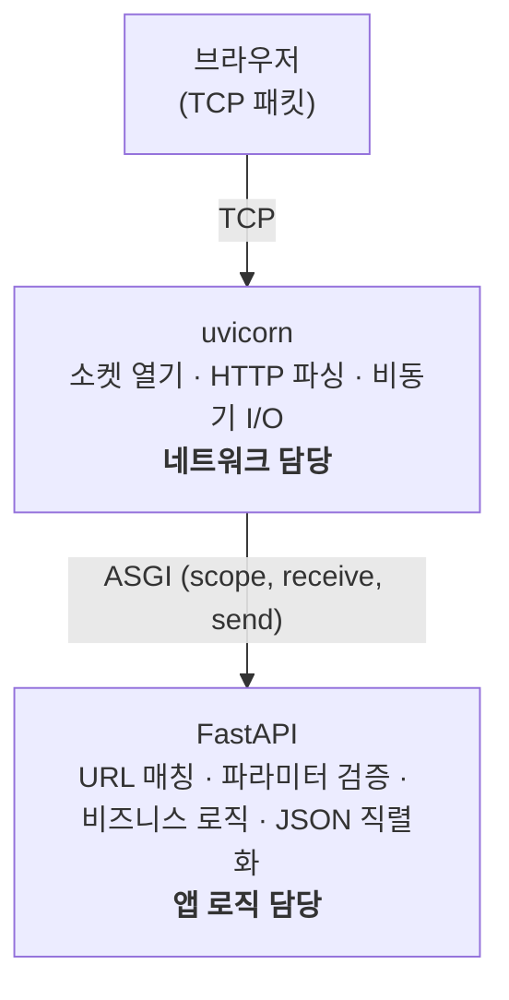
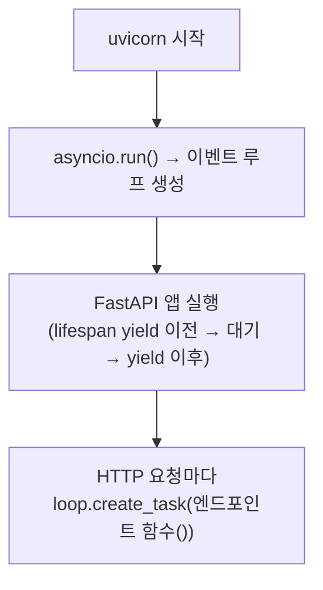
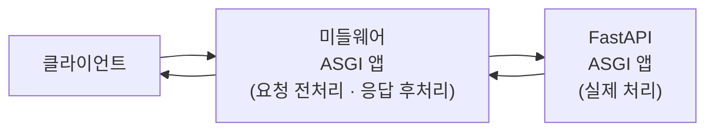

# 10주차 맥락 — 웹 대시보드 기초: FastAPI 정적 파일 서빙

## 현재 진행 상황

- FastAPI 정적 파일 서빙 설정 (`StaticFiles` 마운트, `GET /` 루트 엔드포인트) ✅
- `static/index.html` 생성 및 브라우저 접속 확인 ✅
- **10주차 진행 중** (2단계 이후 예정)

### 10주차 남은 작업

- [ ] 메인 대시보드 HTML 구조 (`static/index.html`)
- [ ] 기본 CSS 스타일 (`static/style.css`)
- [ ] SSE 연결 JS (`static/app.js`) — `EventSource("/stream")` 실시간 수신

---

## 구현된 파일 구조

```
plant_monitor_rpi/
├── main.py                    # FastAPI 앱, lifespan, 라우터 등록, 정적 파일 서빙
├── models/
│   └── settings.py
├── uart/
│   ├── serial_port.py
│   └── protocol.py
├── db/
│   ├── database.py
│   └── repository.py
├── service/
│   ├── uart_listener.py
│   └── uart_setup.py
├── api/
│   ├── constants.py
│   ├── stream.py
│   ├── sensor.py
│   ├── pump.py
│   └── settings.py
└── static/
    └── index.html             # 10주차 신규 — 현재 빈 껍데기, 이후 대시보드로 채울 예정
```

---

## 10주차 구현 코드

### `main.py` (10주차 추가분)

```python
from fastapi.staticfiles import StaticFiles
from fastapi.responses import HTMLResponse

# app 선언 이후에 추가
app.mount("/static", StaticFiles(directory="static"), name="static")

@app.get("/", response_class=HTMLResponse)
async def root():
    with open("static/index.html", encoding="utf-8") as f:
        return f.read()
```

### `static/index.html` (현재 임시 버전)

```html
<!DOCTYPE html>
<html>
    <body>
        <h1>Plant Monitor</h1>
    </body>
</html>
```

---

## 이번 주 배운 것들

---

### 1. 정적 파일 서빙 vs 동적 응답

FastAPI가 처리하는 요청에는 두 종류가 있다.

**동적 응답**: `/sensors/latest`처럼 요청 시점에 DB를 읽어 JSON을 만들어 반환하는 방식. 매 요청마다 내용이 달라진다.

**정적 파일 서빙**: `index.html`, `style.css`, `app.js`처럼 내용이 바뀌지 않는 파일을 그대로 내려주는 방식. FastAPI가 파일을 읽어 그대로 전달할 뿐이다.

FastAPI는 `StaticFiles`라는 클래스로 정적 파일 서빙을 지원한다. `app.mount()`로 특정 URL 접두어와 폴더를 연결하면, 그 접두어로 들어오는 요청은 FastAPI 라우터를 거치지 않고 폴더에서 파일을 찾아 바로 반환한다.

---

### 2. Jinja2 — Python 템플릿 엔진

Jinja2는 HTML 파일 안에 Python 변수나 로직을 삽입할 수 있는 **템플릿 엔진**이다. Django, Flask의 기본 템플릿 엔진이며 FastAPI도 공식 지원한다.

```html
<h1>토양 수분: {{ soil_moisture }}%</h1>

  <p>물이 부족합니다</p>

```

`{{ }}` 안에 변수, `` 안에 if/for 같은 제어문을 쓴다. 서버가 이 파일을 읽어 변수를 실제 값으로 교체한 완성된 HTML을 브라우저에 내려준다.

---

### 3. Jinja2Templates vs HTMLResponse — 두 가지 HTML 반환 방식

**방식 ①: Jinja2Templates — SSR (Server-Side Rendering)**

서버가 DB를 조회해서 HTML에 값을 끼워넣은 뒤 완성된 HTML을 반환한다.

```python
templates = Jinja2Templates(directory="templates")

@app.get("/", response_class=HTMLResponse)
async def root(request: Request):
    moisture = repository.get_latest().soil_moisture_pct
    return templates.TemplateResponse(
        "index.html",
        {"request": request, "soil_moisture": moisture}
    )
```

단점: 데이터가 바뀔 때마다 페이지 전체를 새로고침해야 한다.

**방식 ②: HTMLResponse (파일 그대로 반환) — CSR (Client-Side Rendering)**

서버는 HTML 껍데기만 내려준다. 데이터는 브라우저 JS가 SSE나 fetch()로 별도로 가져온다.

```python
@app.get("/", response_class=HTMLResponse)
async def root():
    with open("static/index.html", encoding="utf-8") as f:
        return f.read()
```

이번 프로젝트는 SSE로 실시간 데이터를 수신하고 JS가 DOM을 직접 바꾸는 구조이므로 Jinja2가 필요 없다. HTML은 고정된 껍데기, 데이터는 JS가 실시간으로 채운다.

---

### 4. app.mount() — ASGI 앱 위임

FastAPI의 `@app.get()`은 URL을 **하나씩** 등록한다. `app.mount()`는 URL **경로 접두어** 전체를 다른 ASGI 앱에 위임한다.

```python
app.mount("/static", StaticFiles(directory="static"), name="static")
```

`GET /static/style.css` 요청이 들어오면 FastAPI는 `/static` 접두어를 보고 `StaticFiles` 앱에 통째로 넘긴다. `StaticFiles`는 `directory="static"` 폴더에서 `style.css`를 찾아 반환한다. FastAPI 라우터는 관여하지 않는다.

`directory="static"`은 `uvicorn`을 실행하는 위치(`plant_monitor_rpi/`) 기준 상대경로다.

Kotlin NavGraph에서 특정 딥링크를 다른 Activity에 위임하는 것과 같다. NavGraph(FastAPI)가 경로를 보고 "이건 내가 처리할 게 아니다, 저쪽으로 보내라"고 판단한다.

---

### 5. WSGI — ASGI의 전신

ASGI를 이해하려면 WSGI(Web Server Gateway Interface)가 왜 한계에 부딪혔는지부터 봐야 한다.

WSGI는 Python 웹 생태계의 초기 표준으로, 웹 서버와 Python 앱이 대화하는 규약이다.

```python
def app(environ, start_response):
    start_response("200 OK", [("Content-Type", "text/plain")])
    return [b"Hello"]
```

**일반 함수**다. 호출되면 즉시 응답을 반환해야 하고, 중간에 멈출 방법이 없다.

이 구조의 한계:
- **SSE, WebSocket 불가**: 함수가 `return`하는 순간 연결이 끊긴다. 연결을 유지하면서 데이터를 조금씩 흘려보내는 기능을 구현할 수 없다.
- **동시성 한계**: 동기 방식이라 한 요청이 DB 응답을 기다리는 동안 다른 요청을 처리하지 못한다. 요청마다 스레드를 배정하는 방식으로 우회했지만 수천 개의 동시 연결은 감당하기 어렵다.

---

### 6. ASGI — 서버 게이트웨이 인터페이스

**ASGI (Asynchronous Server Gateway Interface)**: "Python 비동기 웹 서버와 앱이 대화하는 방법을 정의한 표준 인터페이스". WSGI를 비동기로 재설계한 표준으로 2019년 Django 팀이 주도해서 만들었다.

#### 서버 게이트웨이란

"게이트웨이"는 서로 다른 두 시스템 사이에서 통신을 중계하는 연결 지점이다. 브라우저가 보내는 것은 TCP 패킷 덩어리다. FastAPI는 이 TCP 바이트 스트림을 직접 다루지 못한다. 서버 게이트웨이(uvicorn)가 TCP 소켓을 열고, 바이트를 읽고, HTTP 스펙대로 파싱하는 저수준 작업을 담당한다. FastAPI는 파싱된 결과만 받아서 처리한다.

```
브라우저 (TCP 패킷)
  │
  ▼
[서버 게이트웨이] — TCP 소켓, HTTP 파싱 담당
  │  ASGI 인터페이스
  ▼
[Python 앱] — 라우팅, 비즈니스 로직 담당
```

#### ASGI 앱의 정체

ASGI 앱은 특별한 무언가가 아니다. 아래 시그니처를 가진 **callable 하나**다.

```python
async def app(scope, receive, send):
    ...
```

`async def`이기 때문에 `await`로 중간에 멈출 수 있고, 멈춘 동안 이벤트 루프가 다른 코루틴을 처리한다. WSGI의 두 가지 한계가 모두 해결된다.

세 파라미터:

| 파라미터 | 타입 | 역할 |
|---|---|---|
| `scope` | dict | 요청 메타정보. `type`, `method`, `path`, `headers` 등 |
| `receive` | async 함수 | 클라이언트가 보낸 바디를 읽음 |
| `send` | async 함수 | 클라이언트에게 응답을 보냄 |

가장 단순한 ASGI 앱:

```python
async def app(scope, receive, send):
    await send({
        "type": "http.response.start",
        "status": 200,
        "headers": [[b"content-type", b"text/plain"]],
    })
    await send({
        "type": "http.response.body",
        "body": b"Hello",
    })
```

FastAPI는 이 저수준 작업을 대신 해주면서 라우팅, 검증, 직렬화를 얹은 것이다.

#### ASGI가 표준이어야 하는 이유

ASGI 표준이 없다면 uvicorn은 FastAPI에 직접 의존해야 한다. ASGI라는 공통 규약이 있기 때문에 uvicorn은 FastAPI를 전혀 모른다. `(scope, receive, send)`를 받는 `async def __call__`만 있으면 무엇이든 실행할 수 있다.

```
uvicorn → ASGI 표준 → FastAPI
uvicorn → ASGI 표준 → Starlette
uvicorn → ASGI 표준 → Django (4.0부터 ASGI 지원)
uvicorn → ASGI 표준 → StaticFiles
```

Kotlin 인터페이스와 완전히 같은 개념이다. OkHttp가 `Call` 인터페이스를 호출할 뿐이고 실제 구현이 뭔지 알 필요가 없는 것처럼.

---

### 7. uvicorn과 FastAPI의 관계



**uvicorn**: TCP 소켓을 열고 HTTP 요청을 파싱하는 서버. 네트워크 담당. FastAPI가 뭔지 모른다. ASGI 인터페이스를 구현한 객체라면 무엇이든 실행할 수 있다.

**FastAPI**: URL 라우팅, 요청 검증, 응답 직렬화를 하는 프레임워크. 앱 로직 담당. TCP 소켓이 뭔지 모른다. uvicorn이 파싱해서 넘겨준 `scope, receive, send`만 받아서 처리한다.

`uvicorn main:app`에서:
- `main` → `main.py` 파일
- `app` → 그 파일 안의 `app = FastAPI(...)` 객체

uvicorn이 `main.py`를 import해서 `app` 객체를 꺼낸 뒤, 요청이 올 때마다 `await app(scope, receive, send)`를 호출한다.

**FastAPI만으로는 실행이 안 되는 이유**: FastAPI 자체는 TCP 소켓을 열지 않는다. `app = FastAPI()`로 객체를 만들어도 아무 포트도 열리지 않는다. 주방(FastAPI)만 있고 홀 직원(uvicorn)이 없으면 손님이 들어올 문이 없는 것과 같다. 그래서 `pip install fastapi uvicorn`을 항상 같이 설치한다.

---

### 8. FastAPI는 ASGI 앱이다 — 개발자의 역할

FastAPI 내부를 의사코드로 표현하면:

```python
class FastAPI:
    async def __call__(self, scope, receive, send):
        path = scope["path"]

        # mount된 ASGI 앱 먼저 확인
        for prefix, asgi_app in self._mounted_apps:
            if path.startswith(prefix):
                await asgi_app(scope, receive, send)
                return

        # 라우터 테이블에서 매칭
        for route_path, handler in self._routes:
            if path == route_path:
                response = await handler(...)
                await send(response)
                return
```

개발자가 하는 일:

- `@app.get("/")` → `_routes` 테이블에 함수 추가
- `app.include_router(sensor.router)` → `_routes` 테이블에 라우터의 함수들 일괄 추가
- `app.mount("/static", StaticFiles(...))` → `_mounted_apps` 목록에 다른 ASGI 앱 추가

요청이 오면 FastAPI가 `scope`에서 `path`를 꺼내 테이블을 뒤지고 알아서 맞는 쪽으로 위임한다. `StaticFiles`도 ASGI 앱이기 때문에 위임이 가능하다. 같은 인터페이스(`(scope, receive, send)`)를 구현하고 있으니까.

---

### 9. async def 함수와 이벤트 루프 자동 연결

FastAPI에 등록된 `async def` 함수는 별도 연결 없이 자동으로 FastAPI의 이벤트 루프에서 실행된다.

uvicorn이 실행될 때 내부적으로 `asyncio.run(app(...))`을 호출한다. 이 시점에 **이벤트 루프가 하나 생성**되고, 이 루프가 uvicorn과 FastAPI 앱의 수명 전체를 관장한다.



`@app.get("/")`, `@app.get("/sensors/latest")` 같은 데코레이터로 등록된 함수들은 FastAPI 내부 라우팅 테이블에 저장된다. 요청이 들어올 때마다 FastAPI가 URL을 보고 해당 함수를 꺼내 `loop.create_task()`로 이벤트 루프에 던진다.

`uart_setup.sync_setting()`이 `run_in_executor`가 필요했던 이유가 바로 이 대비다. 그 함수는 `async def`가 아닌 일반 `def`인 데다 `threading.Event.wait()`으로 블로킹하기 때문에, FastAPI가 자동으로 이벤트 루프에 올릴 수 없어서 직접 스레드풀에 던져야 했다.

---

### 10. 미들웨어도 같은 ASGI 원리

인증, 로깅, CORS 같은 미들웨어도 ASGI 앱이다. ASGI 앱이 ASGI 앱을 감싸는 구조로 기능을 쌓는다.



러시아 마트료시카 인형처럼 ASGI 앱이 ASGI 앱을 감싸는 구조다.
