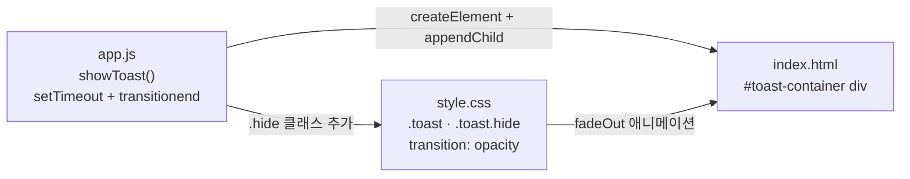
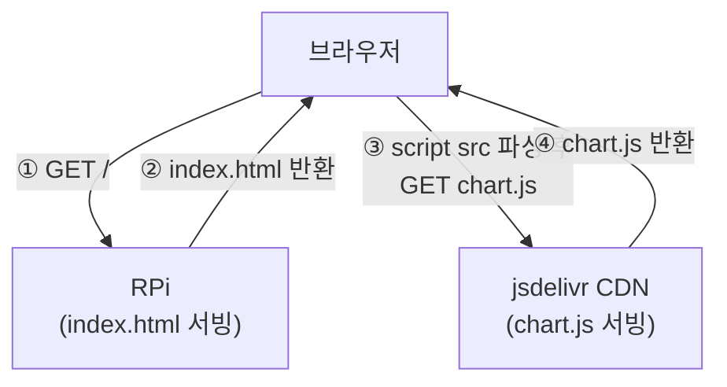

# 11주차 맥락 — 웹 대시보드 완성: Chart.js 그래프, 임계값 설정 폼, 펌프 이력 화면

## 현재 진행 상황

- [x] 저장 버튼 토스트 메시지 구현 (`showToast()`, CSS fadeOut 애니메이션) ✅
- [x] Chart.js 센서 그래프 — 토양 수분 / 온도 / 습도 시계열 그래프 (`sensor_chart.js` 분리) ✅
- [x] 임계값 설정 폼 — 10주차에 이미 구현됨 확인 ✅
- [x] 펌프 이력 화면 — 10주차에 이미 구현됨 확인 ✅
- **11주차 완료** ✅

---

## 구현된 파일 구조

```
plant_monitor_rpi/static/
├── index.html         # 센서 그래프 카드 + canvas 3개, CDN <script> 추가
├── style.css          # 토스트 스타일, .chart-wrap 스타일 추가
├── constants.js       # 상수 (기존)
├── sensor_chart.js    # 11주차 신규 — createChart(), addDataPoint()
└── app.js             # 차트 인스턴스 생성, SSE 핸들러에 그래프 업데이트 추가
```

---

## 11주차 구현 코드

### `sensor_chart.js`

```js
const _MAX_POINTS = 20;

/**
 * @param {HTMLCanvasElement} canvas
 * @param {string} label
 * @param {string} color
 * @returns Chart
 */
function createChart(canvas, label, color) {
    return new Chart(canvas, {
        type: "line",
        data: {
            labels: [],
            datasets: [{
                label: label,
                data: [],
                borderColor: color,
                backgroundColor: color + "22",
                tension: 0.3,
                pointRadius: 3,
            }]
        },
        options: {
            animation: false,
            responsive: true,
            maintainAspectRatio: false,
            scales: {
                y: { beginAtZero: false }
            }
        }
    });
}

/**
 * @param {Chart} chart
 * @param {string} label
 * @param {number} value
 */
function addDataPoint(chart, label, value) {
    chart.data.labels.push(label);
    chart.data.datasets[0].data.push(value);

    if (chart.data.labels.length > _MAX_POINTS) {
        chart.data.labels.shift();
        chart.data.datasets[0].data.shift();
    }

    chart.update();
}
```

### `app.js` — 차트 관련 추가 부분

```js
// DOM 참조
const elChartSoil     = document.getElementById("chart-soil");
const elChartTemp     = document.getElementById("chart-temp");
const elChartHumidity = document.getElementById("chart-humidity");

// 차트 인스턴스 생성
const chartSoil     = createChart(elChartSoil,     "토양 수분 (%)", "#2e7d32");
const chartTemp     = createChart(elChartTemp,     "온도 (°C)",     "#1565c0");
const chartHumidity = createChart(elChartHumidity, "습도 (%)",      "#6a1b9a");

// SSE onmessage TYPE_SENSOR_DATA 분기
const time = new Date().toLocaleTimeString("ko-KR");
elLastUpdated.textContent = time;
addDataPoint(chartSoil,     time, data.soil_moisture_pct);
addDataPoint(chartTemp,     time, data.air_temperature);
addDataPoint(chartHumidity, time, data.air_humidity);
```

### `app.js` — 토스트

```js
function showToast(message) {
    const toast = document.createElement("div");
    toast.className = "toast";
    toast.textContent = message;
    document.getElementById("toast-container").appendChild(toast);

    setTimeout(() => {
        toast.classList.add("hide");
        toast.addEventListener("transitionend", () => toast.remove());
    }, 2000);
}
```

### `style.css` — 추가 스타일

```css
/* 토스트 */
#toast-container {
    position: fixed;
    bottom: 24px;
    right: 24px;
    display: flex;
    flex-direction: column;
    gap: 8px;
}

.toast {
    background-color: #323232;
    color: #fff;
    padding: 12px 20px;
    border-radius: 8px;
    font-size: 14px;
    opacity: 1;
    transition: opacity 0.4s ease;
}

.toast.hide {
    opacity: 0;
}

/* 그래프 래퍼 */
.chart-wrap {
    position: relative;
    height: 160px;
    margin-bottom: 24px;
}

.chart-wrap:last-child {
    margin-bottom: 0;
}
```

---

## 이번 주 배운 것들

---

### 1. CSS padding/margin 단축 표기 (shorthand)

CSS의 `padding`과 `margin`은 값을 1~4개 쓸 수 있다. 순서는 **시계 방향** (위 → 오른쪽 → 아래 → 왼쪽)이다.

| 값 개수 | 예시 | 적용 |
|---|---|---|
| 1개 | `padding: 12px` | 상하좌우 모두 12px |
| 2개 | `padding: 12px 20px` | 상하 12px / 좌우 20px |
| 3개 | `padding: 10px 20px 5px` | 위 10px / 좌우 20px / 아래 5px |
| 4개 | `padding: 10px 20px 5px 8px` | 위 / 오른쪽 / 아래 / 왼쪽 (시계방향) |

`padding: 12px 20px`처럼 2개를 쓰면 세로로 좁고 가로로 넓은 모양이 된다. 버튼이나 토스트 같은 UI에서 자주 쓰는 패턴이다.

---

### 2. CSS `transition`

```css
transition: opacity 0.4s ease;
```

세 부분으로 구성된다.

- **`opacity`**: 어떤 CSS 속성에 전환 효과를 적용할지 지정한다. `all`로 쓰면 모든 속성에 적용된다.
- **`0.4s`**: 전환에 걸리는 시간. `ms` 단위도 된다 (`400ms`).
- **`ease`**: 시간에 따른 속도 변화 곡선(easing function).

| 값 | 동작 |
|---|---|
| `linear` | 처음부터 끝까지 일정한 속도 |
| `ease` | 천천히 시작 → 빠르게 → 천천히 끝 |
| `ease-in` | 천천히 시작 → 점점 빠르게 |
| `ease-out` | 빠르게 시작 → 천천히 끝 |

평소에는 아무 일도 하지 않는다. `.hide` 클래스가 붙어서 `opacity: 0`으로 바뀌는 순간, 브라우저가 transition 규칙을 적용해서 0.4초에 걸쳐 서서히 바꿔준다. JS가 직접 애니메이션을 처리하지 않아도 된다. Kotlin의 `ObjectAnimator.ofFloat(view, "alpha", 1f, 0f)`와 같은 역할이다.

---

### 3. JS 호이스팅 — `function` 선언과 `const`/`let`의 차이

JS 엔진은 코드를 실행하기 전에 **호이스팅(hoisting)** 처리를 한다. `function` 키워드로 선언된 함수를 파일 전체에서 먼저 수집해서 메모리에 올린 뒤 실행을 시작한다. 그래서 선언보다 앞에서 호출해도 동작한다.

```js
loadSettings();   // ✅ 동작함 — function 선언은 호이스팅됨

function loadSettings() { ... }
```

반면 `const`/`let` 화살표 함수는 호이스팅되지 않는다.

```js
showToast("안녕");   // ❌ ReferenceError

const showToast = (message) => { ... };
```

관례적으로 함수 정의를 먼저 쓰고 실행 코드(`loadSettings()` 등)를 파일 맨 아래에 두는 패턴이 가독성에 좋다. 강제 규칙은 아니다.

---

### 4. JS 타입 시스템 — 동적 타입, JSDoc, TypeScript

JS는 **동적 타입 언어**라 파라미터에 타입을 명시하지 않는다. 런타임에 아무 값이나 들어올 수 있고 엔진이 막지 않는다.

```js
function showToast(message) { ... }

showToast("저장하였습니다.");  // ✅
showToast(42);                // ✅ 에러 없음
```

string만 받도록 강제하는 방법은 세 가지다.

**① 런타임 체크**
```js
function showToast(message) {
    if (typeof message !== "string") return;
    ...
}
```
`typeof`는 값의 타입을 문자열로 반환하는 JS 내장 연산자다.

**② JSDoc 주석** — VS Code가 타입 힌트와 경고를 표시해준다. 실행 시 강제는 없다.
```js
/**
 * @param {string} message
 */
function showToast(message) { ... }
```

**③ TypeScript** — JS의 상위 집합 언어. 컴파일 타임에 타입을 강제한다.
```ts
function showToast(message: string): void { ... }
showToast(42);  // ❌ 컴파일 에러
```
이 프로젝트는 빌드 툴 없이 HTML에서 직접 JS를 로드하는 구조라 TypeScript 도입은 번거롭다.

---

### 5. Flexbox — `display: flex`, `flex-direction`, `gap`

`display: flex`를 선언하면 자식 요소들이 기본적으로 **가로(row)** 방향으로 나란히 배치된다. `flex-direction: column`을 추가하면 **세로** 방향으로 바뀐다.

| CSS | Android |
|---|---|
| `display: flex` | `LinearLayout` |
| `flex-direction: row` | `orientation="horizontal"` |
| `flex-direction: column` | `orientation="vertical"` |

`gap`은 자식 요소들 사이에 간격을 준다. `margin-bottom`과 달리 **마지막 요소에는 간격이 생기지 않는다**. `margin-bottom`은 마지막 자식에도 불필요한 간격이 생기지만 `gap`은 요소 사이에만 적용된다.

```css
#toast-container {
    display: flex;
    flex-direction: column;
    gap: 8px;
}
```

토스트가 여러 개 쌓일 때 자동으로 8px 간격이 생기고, 마지막 토스트 아래에는 간격이 없다.

---

### 6. CSS 선택자 `.`(클래스)과 `:`(의사 클래스)

**`.` — 클래스 선택자**

HTML의 `class` 속성값을 기준으로 요소를 찾는다.

```css
.card { }           /* class="card"인 모든 요소 */
```

점 두 개를 붙이면 두 클래스를 모두 가진 요소를 선택한다.

```css
.toast.hide { opacity: 0; }
/* class="toast hide"처럼 두 클래스가 동시에 붙어있는 요소 */
```

**`:` — 의사 클래스(Pseudo-class)**

HTML에 명시된 클래스가 아니라 **브라우저가 판단하는 상태나 위치 조건**으로 요소를 선택한다. 개발자가 클래스를 직접 붙이지 않아도 브라우저가 자동으로 판단한다.

| 의사 클래스 | 조건 |
|---|---|
| `:last-child` | 부모 안에서 마지막 자식인 요소 |
| `:first-child` | 부모 안에서 첫 번째 자식인 요소 |
| `:nth-child(n)` | 부모 안에서 n번째 자식인 요소 |
| `:hover` | 마우스가 올라가 있는 요소 |
| `:focus` | 포커스된 요소 (input 클릭 시 등) |

```css
.chart-wrap:last-child { margin-bottom: 0; }
/* .chart-wrap이면서 부모 안에서 마지막 자식인 요소 */
```

혼동하기 쉬운 케이스:

```css
.chart-wrap.last-child  /* class="chart-wrap last-child"인 요소 — 클래스 두 개 */
.chart-wrap:last-child  /* class="chart-wrap"이고 마지막 자식인 요소 — 클래스 + 의사 클래스 */
```

---

### 7. 토스트 메시지 구현 — HTML + CSS + JS

Android의 `Toast.makeText()`와 같은 개념. 웹에는 브라우저 내장 기능이 없어서 직접 구현해야 한다.

**구현 구조**



**타이밍 흐름**

```
토스트 생성 (opacity: 1)
  │
  └─ 2000ms 후 → .hide 추가 (CSS transition 시작 → opacity: 0)
                    │
                    └─ 400ms 후 → transitionend 이벤트 → DOM에서 remove()
```

`transitionend` 이벤트를 쓰는 이유: `setTimeout(400)`으로 제거해도 되지만, CSS에서 transition 시간을 바꿀 때마다 JS도 같이 수정해야 한다. `transitionend`는 애니메이션 종료 시점을 CSS에 위임하므로 두 곳을 동기화할 필요가 없다.

`<div id="toast-container">`는 `<script>` 태그 앞에 두어야 한다. JS에서 `showToast()`가 페이지 로드 직후 호출되지 않더라도, 스크립트가 실행되는 시점에 DOM에 없는 요소는 `getElementById`가 `null`을 반환하기 때문이다.

---

### 8. CDN vs npm 설치

**CDN (Content Delivery Network)**

전 세계 여러 서버에 파일을 분산 배치해두고 요청자에게 가장 가까운 서버에서 파일을 내려주는 배포 네트워크다. 개발자 입장에서는 URL 한 줄이다.

```html
<script src="https://cdn.jsdelivr.net/npm/chart.js"></script>
```

브라우저가 이 태그를 만나면 jsdelivr 서버에 직접 요청한다. RPi는 이 과정에 관여하지 않는다.

**CDN 다운로드 주체**



RPi가 인터넷에 연결되어 있는지는 무관하다. 브라우저를 실행하는 컴퓨터만 인터넷에 연결되어 있으면 동작한다.

**npm + 번들러 방식**

```bash
npm install chart.js
```

`node_modules/`에 파일이 다운로드된다. `import`로 불러와서 쓰고, Vite·Webpack 같은 번들러가 여러 파일을 하나의 `bundle.js`로 합쳐준다. React/Vue 같은 프레임워크를 쓸 때의 표준 방식이다.

| | CDN | npm + 번들러 |
|---|---|---|
| 설치 | URL 한 줄 | `npm install` + 빌드 설정 |
| 사용 | 전역 변수로 바로 사용 | `import`로 불러옴 |
| 적합한 상황 | 빌드 툴 없는 단순 프로젝트 | React/Vue 프레임워크 |
| 오프라인 | 브라우저 인터넷 필요 | 동작함 |

---

### 9. Chart.js — 구조와 실시간 업데이트

Chart.js는 `<canvas>` 위에 그래프를 그려주는 JS 라이브러리다. `<canvas>`는 픽셀 단위로 직접 그림을 그릴 수 있는 HTML 태그인데, Chart.js는 그 복잡한 드로잉을 대신 해주는 래퍼다.

**기본 구조**

```js
const chart = new Chart(canvas, {
    type: "line",       // 그래프 종류
    data: { ... },      // 표시할 데이터
    options: { ... }    // 시각적 설정
});
```

| Chart.js | RecyclerView |
|---|---|
| `canvas` | `RecyclerView` XML 뷰 |
| `data` | `List<Item>` (어댑터 데이터) |
| `options` | `LayoutManager`, `ItemDecoration` |
| `chart.update()` | `adapter.notifyDataSetChanged()` |

**`data` 구조**

```js
data: {
    labels: ["12:00", "12:01", "12:02"],  // X축 레이블
    datasets: [{
        label: "토양 수분",
        data: [45, 43, 41],               // Y축 값 (labels와 1:1 대응)
        borderColor: "#2e7d32",
        backgroundColor: "#2e7d3222",     // hex + 2자리 투명도
        tension: 0.3,
    }]
}
```

`datasets`가 배열인 이유는 여러 그래프를 한 캔버스에 겹쳐 그릴 수 있기 때문이다.

**실시간 업데이트 — push + shift + update()**

```js
function addDataPoint(chart, label, value) {
    chart.data.labels.push(label);
    chart.data.datasets[0].data.push(value);

    if (chart.data.labels.length > MAX_POINTS) {
        chart.data.labels.shift();           // 가장 오래된 항목 제거
        chart.data.datasets[0].data.shift();
    }

    chart.update();  // 빠뜨리면 화면이 갱신되지 않음
}
```

`push()`는 배열 맨 뒤에 추가, `shift()`는 맨 앞을 제거한다. 새 데이터는 오른쪽에 추가되고 오래된 데이터는 왼쪽에서 밀려나는 실시간 스크롤 그래프의 원리가 이것이다.

**주요 options**

| 옵션 | 값 | 이유 |
|---|---|---|
| `animation: false` | false | 실시간 업데이트 시 매번 애니메이션이 돌면 어색함 |
| `maintainAspectRatio` | false | true(기본값)이면 CSS 높이를 무시하고 비율을 고정함 |
| `responsive` | true | 창 크기 변경 시 캔버스 크기 자동 조정 |

`position: relative`를 `.chart-wrap`에 주는 이유: Chart.js 내부에서 canvas 크기를 계산할 때 `position: relative`인 조상 요소를 기준점으로 삼는다. 이 선언이 없으면 높이 계산이 틀어질 수 있다.

**파일 분리 — `sensor_chart.js`**

CDN으로 로드한 Chart.js 라이브러리와 파일명 충돌을 피하기 위해 `chart.js`가 아닌 `sensor_chart.js`로 이름을 지었다. 로드 순서가 중요하다.

```html
<script src="https://cdn.jsdelivr.net/npm/chart.js"></script>  <!-- 라이브러리 -->
<script src="/static/constants.js"></script>
<script src="/static/sensor_chart.js"></script>   <!-- createChart, addDataPoint 정의 -->
<script src="/static/app.js"></script>             <!-- createChart 호출 -->
```

`sensor_chart.js`가 `app.js`보다 먼저 로드되어야 `app.js`에서 `createChart()`를 사용할 수 있다. `constants.js`의 상수를 `app.js`에서 그냥 쓰는 것과 동일한 원리다.
