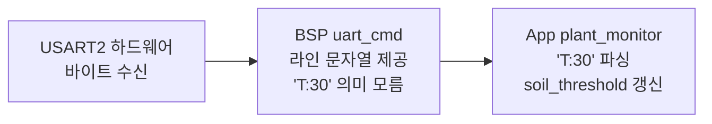
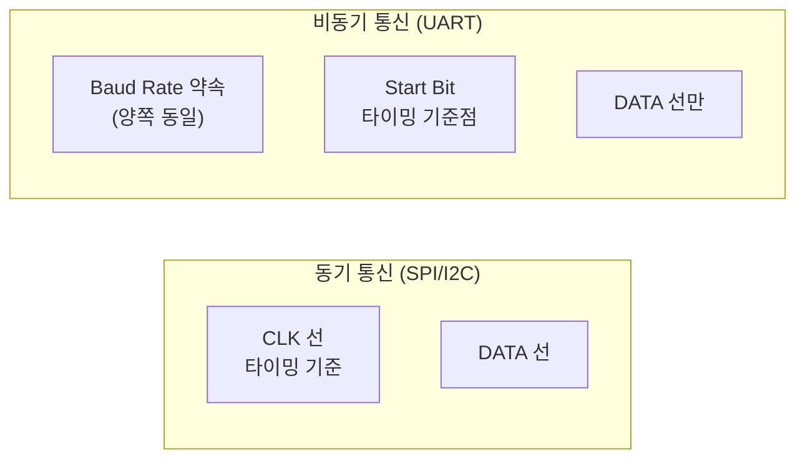
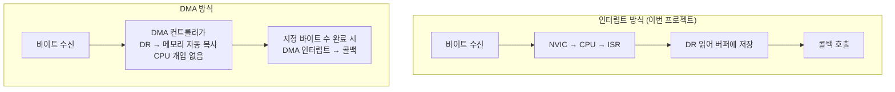
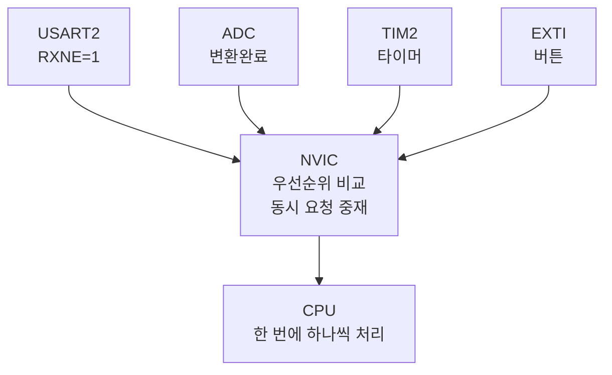
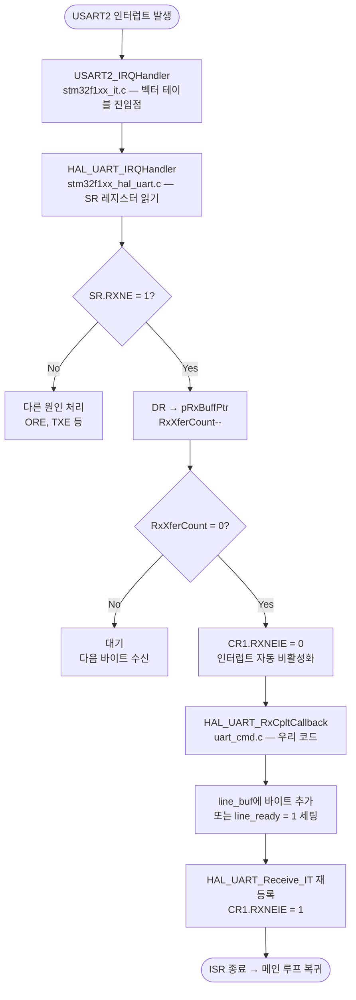
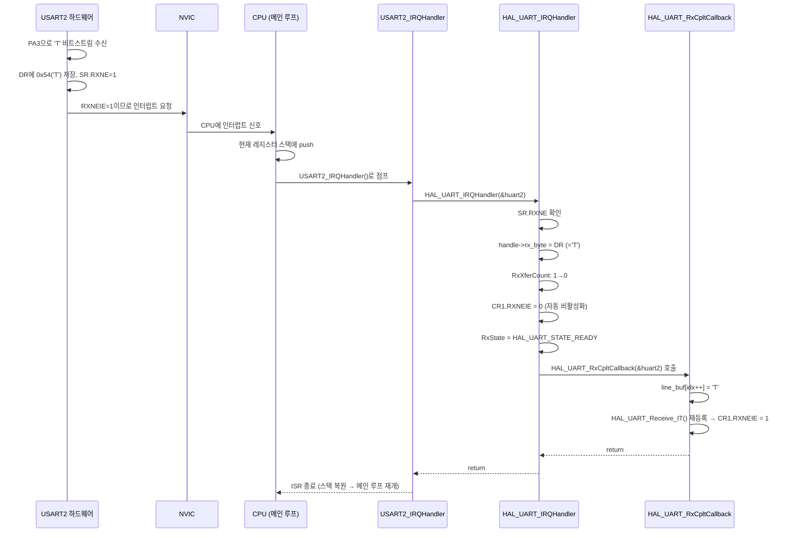

# 7주차 맥락 — UART 명령 수신, oled_display 모듈 분리, sensor_monitor 주기 제어

## 현재 진행 상황

- `oled_display` App 모듈 신규 분리 완료 (`oled_display.h`, `oled_display.c`) ✅
- `sensor_monitor`: `HAL_Delay` → `HAL_GetTick` 기반 non-blocking 2000ms 주기 제어로 전환 ✅
- `BSP/uart_cmd`: UART 수신 인터럽트 드라이버 구현 완료 (`uart_cmd.h`, `uart_cmd.c`) ✅
- `stm32f1xx_it.c`: `USART2_IRQHandler` 추가, `extern UART_HandleTypeDef huart2` 선언 ✅
- `plant_monitor`: `PlantMonitor_HandleUartCmd()` 추가, `UartCmd_Init` 연동 ✅
- `plant_monitor.h`: `PlantMonitor_Init`에 `UART_HandleTypeDef *huart` 파라미터 추가 ✅
- `main.c`: `PlantMonitor_Init` 호출 시 `&huart2` 전달 ✅
- 실물 테스트: VS Code 시리얼 모니터에서 `T:30` 전송 → `soil_threshold` 30% 변경 확인 ✅
- **7주차 완료** ✅

---

## 파일 구조 (7주차 현재)

```
plant_monitor_stm32/
├── Core/
│   ├── Inc/   main.h, stm32f1xx_hal_conf.h, stm32f1xx_it.h
│   └── Src/   main.c, stm32f1xx_it.c (USART2_IRQHandler 추가)
│
├── BSP/
│   ├── Inc/   soil_sensor.h, rht01.h, ssd1306.h, ssd1306_font.h, relay.h, uart_cmd.h  ← 신규
│   └── Src/   soil_sensor.c, rht01.c, ssd1306.c, ssd1306_font.c, relay.c, uart_cmd.c  ← 신규
│
├── App/
│   ├── Inc/   plant_monitor.h, sensor_monitor.h, water_pump.h, oled_display.h  ← 신규
│   └── Src/   plant_monitor.c, sensor_monitor.c, water_pump.c, oled_display.c  ← 신규
│
├── Drivers/   (HAL, CMSIS — CubeMX 자동생성)
├── CMakeLists.txt
└── plant_monitor_stm32.ioc
```

**7주차에 변경된 핵심 내용:**

- `oled_display.h` / `oled_display.c`: 신규. `plant_monitor`에 있던 OLED 초기화/표시 로직을 App 모듈로 분리
- `sensor_monitor.c`: `HAL_Delay(2000)` → `HAL_GetTick()` 기반 2000ms 주기 제어로 교체. 루프 블로킹 제거
- `uart_cmd.h` / `uart_cmd.c`: 신규. UART 수신 인터럽트 BSP 드라이버. `UartCmd_Handle` 패턴 적용
- `stm32f1xx_it.c`: `USART2_IRQHandler` 추가, `extern UART_HandleTypeDef huart2` 선언
- `plant_monitor.h`: `PlantMonitor_Init` 시그니처에 `UART_HandleTypeDef *huart` 파라미터 추가
- `plant_monitor.c`: `static UartCmd_Handle uart_handle` 추가, `UartCmd_Init` 호출, `PlantMonitor_HandleUartCmd()` static 함수 추가
- `system_architecture.md`: STM32 펌웨어 계층 Mermaid 다이어그램 추가 (uart_cmd BSP 포함), FastAPI 데이터 흐름 Mermaid 다이어그램 추가

---

## UART 명령 수신 설계

### 프로토콜

```
PC / RPi5  →  STM32
"T:30\n"        → soil_threshold = 30%
"T:100\n"       → soil_threshold = 100%
```

`\r\n` 도 지원 (`\r`은 BSP에서 자동 무시).

### 계층 분리 원칙



BSP는 하드웨어를 추상화해 "한 줄의 문자열"을 제공하는 것까지만 담당한다. 그 문자열이 무엇을 의미하는지는 App이 판단한다.

### UartCmd_Handle 구조체

```c
#define UART_CMD_BUF_SIZE 16

typedef struct {
    UART_HandleTypeDef *huart;            // 어느 USART인지 (콜백에서 Instance 비교용)
    uint8_t             rx_byte;          // HAL이 1바이트씩 수신 결과를 써주는 버퍼
    char                line_buf[UART_CMD_BUF_SIZE]; // \n 전까지 누적하는 라인 버퍼
    uint8_t             idx;              // line_buf 현재 쓰기 위치 (O(1) 접근)
    volatile uint8_t    line_ready;       // ISR↔메인 루프 공유 플래그 (volatile 필수)
} UartCmd_Handle;
```

- `UART_CMD_BUF_SIZE 16`: 가장 긴 명령 `"T:100\n"` = 7바이트. 여유 포함해 16. (2의 거듭제곱 관례)
- `rx_byte`: HAL이 쓰는 수신 버퍼. `HAL_UART_Receive_IT(huart, &handle->rx_byte, 1)` 호출 시 이 주소를 HAL에 전달 → HAL이 수신된 바이트를 이 변수에 씀
- `idx`: 바이트 수신마다 O(1)로 다음 위치에 씀. `strlen()` 매번 호출하는 것보다 효율적
- `volatile line_ready`: ISR(콜백)이 쓰고, 메인 루프가 읽는다. `volatile` 없으면 컴파일러가 최적화로 제거 가능

---

## 이번 주 배운 것들

---

### 1. UART 통신 기본

#### 직렬 vs 병렬

```
병렬 통신 (8비트 동시 전송)
A ════════════════ B      선 8개, 빠르지만 비쌈

직렬 통신 (1비트씩 순서대로 전송)
A ────────────────── B    선 1개, 느리지만 단순하고 장거리 가능
```

UART는 직렬 통신이다. 데이터를 비트 하나씩 전선에 올린다.

#### 비동기(Asynchronous)란?

동기 통신(SPI, I2C)은 클록 선이 있어서 "지금 이 클록에 맞춰 읽어라"고 알려준다. UART는 클록 선이 없다. 대신 양쪽이 **미리 같은 속도(Baud Rate)를 약속**하고, **Start Bit로 타이밍 기준점**을 잡는다.



#### Baud Rate

초당 전송하는 비트 수.

```
115200 bps (bits per second)
→ 1비트 전송 시간 = 1 / 115200 ≈ 8.68 µs
→ 1바이트(10비트) 전송 시간 ≈ 87 µs
```

#### UART 연결 구조

```
STM32 Nucleo                     PC (ST-Link VCP 경유)
┌──────────────────┐             ┌──────────────────┐
│  PA2 (TX2) ──────┼─────────────┼── RX             │
│  PA3 (RX2) ──────┼─────────────┼── TX             │
│                  │             │                  │
└──────────────────┘             └──────────────────┘

TX ↔ RX 교차 연결 (내가 보내는 것을 상대가 받음)
전이중(Full Duplex): TX/RX 동시 독립 동작 가능
```

---

### 2. 한 바이트 전송 프레임 구조

UART는 바이트 하나를 전송할 때 Start Bit, Data Bits, Stop Bit로 감싸서 보낸다.

```
Idle 상태: 선로는 항상 HIGH(1) 유지

0x41 = 'A' = 0b01000001, LSB 먼저 전송
→ D0=1, D1=0, D2=0, D3=0, D4=0, D5=0, D6=1, D7=0
```

```
         HIGH→LOW 하강 엣지                               LOW→HIGH 상승 엣지
         수신측이 이 엣지를 감지해                           Stop bit 시작
         샘플링 타이밍 기준을 잡음
              │                                                │
              ↓                                                ↓
──────────────┐      ┌──────┐                    ┌──────┐      ┌────────────
              │      │      │                    │      │      │
              └──────┘      └────────────────────┘      └──────┘

  Idle       Start    D0     D1   D2  D3  D4  D5  D6     D7   Stop   Idle
  HIGH        LOW    HIGH    LOW  LOW LOW LOW LOW HIGH   LOW  HIGH   HIGH

  ←──────────────────────────── 10비트 ≈ 87µs ─────────────────────────────→
```

**각 비트의 역할:**

| 비트 | 값 | 설명 |
|------|----|------|
| Idle | HIGH | 아무것도 안 보낼 때 선로 상태 |
| Start | LOW | "지금부터 데이터 보낸다" 신호. HIGH→LOW 하강 엣지로 수신측이 타이밍 기준을 잡음 |
| D0~D7 | 데이터 | LSB(최하위 비트) 먼저 전송. 0이면 LOW, 1이면 HIGH |
| Stop | HIGH | 프레임 종료. LOW→HIGH 상승 엣지 |

**수신측 샘플링 타이밍:**
Start Bit의 하강 엣지를 감지한 뒤 1.5비트 후에 D0을 샘플링하고, 이후 1비트 간격으로 D1~D7을 샘플링한다.

---

### 3. USART2 레지스터 구조

STM32 페리페럴은 메모리 주소에 매핑된 레지스터로 제어된다. USART2 베이스 주소는 `0x40004400`.

```
USART2 레지스터 맵

오프셋  레지스터  역할
─────────────────────────────────────────────────────────────
+0x00   SR       Status Register      — 현재 상태 (읽기 전용)
+0x04   DR       Data Register        — 송수신 데이터 (RDR/TDR 겸용)
+0x08   BRR      Baud Rate Register   — 통신 속도 분주비
+0x0C   CR1      Control Register 1   — 주요 동작 설정
+0x10   CR2      Control Register 2   — 스톱비트 등
+0x14   CR3      Control Register 3   — 흐름제어, DMA 설정


SR (Status Register) — 비트 구성
─────────────────────────────────────────────────────────────
비트: [9]CTS [8]LBD [7]TXE [6]TC [5]RXNE [4]IDLE [3]ORE [2]NE [1]FE [0]PE

  RXNE (비트5): RX Not Empty
    0 = DR에 읽을 데이터 없음
    1 = DR에 새 수신 바이트 있음  ← 수신 완료 시 하드웨어가 자동 세팅
        DR 읽으면 하드웨어가 자동 클리어

  TXE  (비트7): TX Empty — 다음 송신 데이터 쓸 수 있음
  TC   (비트6): Transmission Complete — 마지막 비트까지 전송 완료

  ORE  (비트3): Overrun Error
    DR을 미처 읽기 전에 다음 바이트 수신 완료 → 새 데이터가 이전 데이터를 덮어씀
    → 이전 데이터 유실


DR (Data Register) — RDR과 TDR을 하나의 주소가 담당
─────────────────────────────────────────────────────────────
  읽기(Read)  → RDR(Receive Data Register) 접근  : 수신 바이트 꺼냄
  쓰기(Write) → TDR(Transmit Data Register) 접근 : 송신 바이트 넣음
  STM32F1은 RDR/TDR이 같은 주소(DR). F4 이후는 주소 분리.


CR1 (Control Register 1) — 주요 비트
─────────────────────────────────────────────────────────────
  UE     (비트13): USART Enable — 페리페럴 전체 ON/OFF
  TE     (비트3) : Transmit Enable — 송신 가능
  RE     (비트2) : Receive Enable — 수신 가능
  RXNEIE (비트5) : RXNE Interrupt Enable
    0 = RXNE=1 돼도 인터럽트 없음 (폴링으로 직접 확인해야 함)
    1 = RXNE=1 되면 NVIC에 인터럽트 요청 발생
        ← HAL_UART_Receive_IT()가 이 비트를 1로 세팅
        ← 수신 완료 후 HAL이 이 비트를 0으로 클리어


USART2 수신 하드웨어 내부 구조
─────────────────────────────────────────────────────────────

       PA3 (RX2 핀)
           │
           ▼
  [수신 시프트 레지스터]   ← 1비트씩 들어옴 (8.68µs 간격)
           │  8비트 다 모이면 자동 복사
           ▼
         [DR]              ← SW가 읽기 접근
           │ 동시에
           ▼
      SR.RXNE = 1          ← 하드웨어 자동 세팅
           │ RXNEIE=1이면
           ▼
      NVIC에 인터럽트 요청

  ※ 시프트 레지스터 → DR 이동 후, 시프트 레지스터는 비어서 다음 바이트 수신 즉시 시작
  ※ DR을 미처 읽기 전에 시프트 레지스터에서 다음 바이트 완성 → SR.ORE=1 (오버런 에러)
```

---

### 4. 수신 방식 비교 — 폴링 / 인터럽트 / DMA

#### 폴링 (Polling)

```c
while (1) {
    if (USART2->SR & USART_SR_RXNE) {   // CPU가 직접 계속 확인
        data = USART2->DR;
        처리();
    }
    센서읽기();    // ← UART 확인하느라 이 코드가 늦게 실행됨
    OLED갱신();
}
```

CPU가 쉬지 않고 RXNE 비트를 확인한다. 데이터가 없어도 계속 확인한다.

#### 인터럽트 (Interrupt)

```c
while (1) {
    센서읽기();    // ← 평소엔 이 코드가 정상 실행
    OLED갱신();
    // 바이트 수신 시에만 CPU가 잠깐 빠져나가 ISR 처리 후 복귀
}
```

UART 데이터가 도착했을 때만 CPU에 신호(인터럽트)를 보낸다. 평소에는 CPU가 다른 일을 한다.

**이 프로젝트에서 인터럽트 방식을 쓰는 이유:** 센서 읽기, OLED 갱신, 펌프 상태 머신이 동시에 돌아야 하므로. UART 수신을 blocking으로 기다리면 나머지가 멈춘다.

#### DMA 방식



| 구분 | 폴링 방식 | 인터럽트 방식 | DMA 방식 |
|------|----------|-------------|---------|
| CPU 부하 | 항상 높음 (계속 확인) | 바이트마다 ISR 실행 | 거의 없음 |
| 설정 복잡도 | 단순 | 단순 | 복잡 (DMA 채널 설정) |
| 가변 길이 수신 | 가능 | 쉬움 (`\n` 감지) | 불편 (길이 미리 알아야 함) |
| 적합한 용도 | 간단한 테스트 | 짧은 명령어 수신 | 고속 대량 데이터 |

이 프로젝트처럼 `"T:30\n"` 같은 짧은 명령어 수신에는 인터럽트 방식이 더 적합하다.

---

### 5. NVIC (Nested Vectored Interrupt Controller)

NVIC는 Cortex-M3 코어에 내장된 **인터럽트 교통 정리 컨트롤러**다.



**"Vectored"의 의미:** 인터럽트 소스마다 고정된 핸들러 함수 주소(벡터)를 테이블에 가진다. 인터럽트 발생 시 CPU가 테이블에서 해당 주소를 찾아 자동으로 점프한다.

**벡터 테이블** (`startup_stm32f103xb.s`, CubeMX 자동생성):

```asm
__Vectors:
    DCD  Reset_Handler
    DCD  NMI_Handler
    DCD  HardFault_Handler
    ...
    DCD  USART2_IRQHandler    ← USART2 인터럽트 발생 시 여기로 점프
    DCD  USART3_IRQHandler
    ...
```

**"Nested"의 의미:** 낮은 우선순위 ISR 실행 중 높은 우선순위 인터럽트가 오면 선점(Preempt)할 수 있다.

**USART2 NVIC 활성화:** `HAL_UART_Receive_IT()`는 UART 페리페럴의 `CR1.RXNEIE` 비트만 켠다. NVIC 레벨에서도 별도로 활성화해야 한다.

```c
HAL_NVIC_SetPriority(USART2_IRQn, 0, 0);
HAL_NVIC_EnableIRQ(USART2_IRQn);
// CubeMX에서 "USART2 global interrupt" 체크하면 자동 생성
```

---

### 6. ISR과 volatile

ISR은 **인터럽트 발생 시 CPU가 실행하는 함수**다.

```
메인 루프 실행 중...
    PlantMonitor_Run()
        SensorMonitor_Run()
            ← 바로 여기서 USART2 인터럽트 발생!

CPU 동작:
  1. 현재 PC(Program Counter), R0~R3, LR 등 레지스터를 스택에 저장 (하드웨어 자동)
  2. USART2_IRQHandler()로 점프
  3. ISR 실행 완료
  4. 스택에서 레지스터 복원 (하드웨어 자동)
  5. SensorMonitor_Run() 중단됐던 자리부터 재개

메인 루프 입장에서는 잠깐 멈췄다 재개된 것처럼 보임
(실제로는 스택 저장/복원으로 컨텍스트 보존)
```

**ISR 설계 원칙 — 최소한만 처리**

ISR 실행 시간이 길어지면 다음 인터럽트 처리가 늦어지고, 다른 기능(센서 읽기 등)이 지연된다.

```c
// ❌ 잘못된 패턴 — ISR 안에서 오래 걸리는 작업
void HAL_UART_RxCpltCallback(UART_HandleTypeDef *huart) {
    printf("received!\r\n");   // HAL_UART_Transmit blocking → 수백 µs
    HAL_Delay(10);             // 절대 금지 — 10ms 동안 모든 처리 멈춤
    OledDisplay_Display(...);  // I2C 전송 blocking
}

// ✅ 올바른 패턴 — ISR은 플래그만 세팅, 처리는 메인 루프에서
void HAL_UART_RxCpltCallback(UART_HandleTypeDef *huart) {
    h->line_ready = 1;         // 수 나노초
    HAL_UART_Receive_IT(...);  // 재등록 (필수)
}

void PlantMonitor_Run(void) {
    if (UartCmd_HasLine(&uart_handle)) {
        // 여기서 처리 — 시간이 걸려도 됨
        parse_and_update();
    }
}
```

#### volatile

ISR이 쓰고 메인 루프가 읽는 변수에 반드시 필요하다.

```c
// volatile 없을 때
uint8_t line_ready = 0;

void HAL_UART_RxCpltCallback(...) { line_ready = 1; }

void PlantMonitor_Run(void) {
    while (line_ready == 0) { ... }   // 컴파일러 최적화 후:
    // → while (1) { ... }  ← 영원히 탈출 못 함!
    // 이유: 이 함수 안에서 line_ready를 바꾸는 코드가 없으므로
    //       컴파일러가 "항상 0이겠지"라고 판단해 레지스터에 캐시
}

// volatile 있을 때
volatile uint8_t line_ready = 0;
// → 컴파일러가 매번 메모리 주소에서 직접 읽도록 강제
// → ISR이 바꾼 값을 메인 루프가 정확히 읽을 수 있음
```

**volatile이 필요한 두 상황:**
1. ISR과 메인 루프가 공유하는 변수 (`line_ready`, `rx_byte` 등)
2. 메모리 매핑된 하드웨어 레지스터 (HAL에서 이미 `__IO` = `volatile`로 선언됨)

---

### 7. USART2_IRQHandler

CPU는 USART2 인터럽트가 발생하면 벡터 테이블에서 `USART2_IRQHandler` 주소를 찾아 자동으로 점프한다. CubeMX는 startup 파일에 이를 `__weak`(기본값: 무한루프)로 선언해둔다.

```asm
; startup_stm32f103xb.s
.weak  USART2_IRQHandler
.thumb_set USART2_IRQHandler, Default_Handler   ← 기본값: 무한루프
```

우리가 `stm32f1xx_it.c`에 `USART2_IRQHandler`를 직접 정의하면 링커가 이 버전을 사용한다. 정의하지 않으면 `Default_Handler`(무한루프)로 점프해 인터럽트가 걸릴 때마다 시스템이 멈춘다.

`USART2_IRQHandler`는 **USART2 인터럽트의 유일한 진입점**이다. RXNE(수신), TXE(송신 준비), TC(송신 완료), ORE(오버런) 등 USART2의 **모든 인터럽트 원인이 이 하나의 함수로 들어온다.** 어떤 원인인지는 SR 레지스터를 읽어야 안다.

```c
// stm32f1xx_it.c
extern UART_HandleTypeDef huart2;   // main.c에 선언됨, 여기서 참조

void USART2_IRQHandler(void) {
    HAL_UART_IRQHandler(&huart2);   // 원인 분류를 HAL에 위임
}
```

직접 SR을 읽어 분기하는 로직을 짤 수도 있지만, 그 역할을 HAL_UART_IRQHandler에 맡긴다.

---

### 8. HAL_UART_IRQHandler + flowchart

`HAL_UART_IRQHandler`는 HAL 라이브러리(stm32f1xx_hal_uart.c)에 구현되어 있다. 역할은 USART2의 SR 레지스터를 읽어 인터럽트 원인을 분류하고, 적절한 처리를 수행하는 것이다.

```c
// HAL_UART_IRQHandler 내부 (개념적 요약)
void HAL_UART_IRQHandler(UART_HandleTypeDef *huart) {

    uint32_t sr = READ_REG(huart->Instance->SR);   // SR 레지스터 전체 읽기

    // ── 수신 처리 ──────────────────────────────────────────
    if (sr & USART_SR_RXNE) {                      // RXNE=1: 수신 데이터 있음
        *huart->pRxBuffPtr = READ_REG(huart->Instance->DR);  // DR 읽어 버퍼에 저장
        huart->pRxBuffPtr++;                       // 버퍼 포인터 전진
        huart->RxXferCount--;                      // 남은 바이트 카운트 감소

        if (huart->RxXferCount == 0) {             // 요청한 바이트 수 완료
            CLEAR_BIT(huart->Instance->CR1, USART_CR1_RXNEIE);  // 인터럽트 비활성화
            huart->RxState = HAL_UART_STATE_READY;
            HAL_UART_RxCpltCallback(huart);        // 사용자 콜백 호출
        }
    }

    // ── 오버런 에러 처리 ────────────────────────────────────
    if (sr & USART_SR_ORE) {
        // DR 읽어 ORE 플래그 클리어 (안 하면 무한 인터럽트)
        READ_REG(huart->Instance->DR);
        HAL_UART_ErrorCallback(huart);
    }

    // ── 송신 처리 ───────────────────────────────────────────
    if (sr & USART_SR_TXE) { ... }   // printf 등 TX 완료 처리
}
```

**핵심 포인트:**
- `pRxBuffPtr`는 `HAL_UART_Receive_IT()` 호출 시 우리가 넘긴 `&handle->rx_byte` 주소다. HAL은 그 주소가 어떤 구조체인지 모르고, 그냥 해당 주소에 DR 값을 쓴다.
- `RxXferCount`가 0이 되어야 콜백이 불린다. n=1로 등록했으면 바이트 1개 수신 즉시 콜백.
- `RXNEIE`는 콜백 직전에 HAL이 자동으로 끈다 → 콜백에서 `HAL_UART_Receive_IT()` 재등록하지 않으면 다음 바이트를 받지 못한다.



---

### 9. HAL_UART_Receive_IT + rx_byte 원리

```c
// HAL 내부 개념적 동작
HAL_StatusTypeDef HAL_UART_Receive_IT(UART_HandleTypeDef *huart,
                                       uint8_t *pData, uint16_t Size) {
    if (huart->RxState == HAL_UART_STATE_READY) {
        huart->pRxBuffPtr  = pData;   // 수신 데이터 저장 주소 기억
        huart->RxXferSize  = Size;    // 총 받을 바이트 수
        huart->RxXferCount = Size;    // 남은 바이트 카운터 (카운트다운)

        SET_BIT(huart->Instance->CR1, USART_CR1_RXNEIE);  // 인터럽트 활성화
        return HAL_OK;
    }
    return HAL_BUSY;
}

// 바이트 수신될 때마다 HAL 내부:
*huart->pRxBuffPtr++ = (uint8_t)READ_REG(huart->Instance->DR);
huart->RxXferCount--;

if (huart->RxXferCount == 0) {
    CLEAR_BIT(huart->Instance->CR1, USART_CR1_RXNEIE);  // ← 자동 비활성화
    HAL_UART_RxCpltCallback(huart);                       // ← 콜백 호출
}
```

`n=1`로 1바이트씩 받으면: 수신 → 카운트 1→0 → 즉시 비활성화+콜백 → **콜백 안에서 반드시 재등록해야 다음 바이트 수신 가능**.

재등록을 빠뜨리면 첫 바이트만 수신하고 영원히 기다린다.

HAL은 `UartCmd_Handle`을 전혀 모른다. **우리가 넘겨준 메모리 주소**에 쓸 뿐이다.

```
[1] UartCmd_Init 안에서:
    HAL_UART_Receive_IT(huart, &handle->rx_byte, 1)
                                ↑
                        "수신된 바이트를 이 주소에 써라"

[2] HAL 내부에서:
    huart->pRxBuffPtr = &handle->rx_byte   ← 주소 저장

[3] ISR 안 HAL_UART_IRQHandler에서:
    *huart->pRxBuffPtr = READ_REG(USART2->DR)
         ↑
    저장해뒀던 주소(&handle->rx_byte)에 DR 값 씀
    HAL은 그게 UartCmd_Handle인지 모름. 그냥 주소.

[4] 우리 콜백에서:
    h->rx_byte  ← HAL이 방금 써준 값
```

---

### 10. HAL weak 심볼과 콜백 디스패치

```c
// HAL 라이브러리 내부 (stm32f1xx_hal_uart.c)
__weak void HAL_UART_RxCpltCallback(UART_HandleTypeDef *huart) {
    UNUSED(huart);   // 아무것도 안 함
}
```

`__weak` 키워드는 링커에게 "이보다 강한 정의가 있으면 그걸 써라"고 알린다.

```
링커 동작:
    HAL_UART_RxCpltCallback 찾기
    ├─ uart_cmd.c에 __weak 없이 정의됨 → 이걸 사용 ✅
    └─ 없으면 HAL의 __weak 버전 사용 (아무것도 안 함)
```

프로젝트 전체에서 **단 하나**만 정의해야 한다. 두 곳에 정의하면 링크 에러.

### USE_HAL_UART_REGISTER_CALLBACKS

HAL이 콜백을 호출하는 두 가지 방식:

```c
// stm32f1xx_hal_uart.c 내부
#if (USE_HAL_UART_REGISTER_CALLBACKS == 1)
    huart->RxCpltCallback(huart);    // handle에 등록된 함수 포인터 호출
#else
    HAL_UART_RxCpltCallback(huart);  // weak 심볼 호출 ← 기본값, 우리가 쓰는 방식
#endif
```

기본값이 `0`이므로 weak 심볼 override 방식이 동작한다. `stm32f1xx_hal_conf.h`를 건드리지 않아도 된다.

런타임 등록 방식(`== 1`)은 `HAL_UART_RegisterCallback()`으로 handle마다 다른 함수 포인터를 등록할 수 있어 유연하지만 설정이 복잡하다.

---

### 11. HAL_UART_RxCpltCallback — 다중 UART 지원

콜백 함수 이름은 전역에 **하나**뿐이다. 여러 UART를 지원하려면 `huart->Instance`로 분기한다.

```c
// uart_cmd.c 내부
static UartCmd_Handle *handles[MAX_UART_HANDLES];
static uint8_t         handle_count = 0;

// 전역 콜백 — 프로젝트에 하나만 (HAL weak 심볼 override)
void HAL_UART_RxCpltCallback(UART_HandleTypeDef *huart) {
    for (uint8_t i = 0; i < handle_count; i++) {
        UartCmd_Handle *h = handles[i];
        if (h->huart->Instance != huart->Instance) continue;  // 내 UART가 아니면 skip

        // 바이트 처리
        if (h->rx_byte == '\n') {
            h->line_buf[h->idx] = '\0';
            h->line_ready = 1;     // 플래그만 세팅
            h->idx = 0;
        } else if (h->rx_byte != '\r' && h->idx < UART_CMD_BUF_SIZE - 1) {
            h->line_buf[h->idx++] = h->rx_byte;   // \r 무시 (CRLF 대응)
        }
        HAL_UART_Receive_IT(h->huart, &h->rx_byte, 1);  // 재등록
        break;
    }
}
```

나중에 RPi5 통신용으로 USART1을 추가하면:

```c
static UartCmd_Handle pc_handle;    // USART2 — PC 명령
static UartCmd_Handle rpi_handle;   // USART1 — RPi5 통신

UartCmd_Init(&pc_handle,  &huart2);
UartCmd_Init(&rpi_handle, &huart1);
// 콜백 안에서 Instance로 자동 분기
```

---

### 12. 인터럽트 전체 흐름 (종합)

#### 초기화

```
UartCmd_Init(&uart_handle, &huart2) 호출
    └─ HAL_UART_Receive_IT(&huart2, &handle->rx_byte, 1)
            └─ HAL 내부:
                 huart2.pRxBuffPtr  = &handle->rx_byte  (수신 데이터 저장 주소)
                 huart2.RxXferCount = 1                  (몇 바이트 더 받을지)
                 CR1.RXNEIE = 1                          (이제 수신 감지 준비 완료)
```

#### 바이트 수신 시 (예: 'T' 수신)



---

### 13. Overrun Error(ORE)와 데이터 유실

#### ISR 중단점의 함정

ISR 안에 중단점을 걸면 CPU가 멈추는 동안 UART 하드웨어는 계속 동작한다.

```
'T' 수신 → ISR 진입 → 중단점으로 CPU 정지
                       (RXNEIE는 HAL이 이미 0으로 껐음)

CPU 멈춘 사이:
':' 도착 → DR에 ':' 적재, RXNE=1
           RXNEIE=0이므로 인터럽트 없이 DR에 대기

'3' 도착 → 시프트 레지스터에서 DR로 복사 시도
           그런데 DR은 아직 ':' 읽히지 않음
           → Overrun Error (ORE=1), '3' 유실

'0', '\n' → 유실
```

사용자가 "T:30\n" 전송했는데 콜백에서 "T:"만 보인 것이 이 현상이었다.

#### 연속 바이트 전송 시 유실 위험?

"T:30\n" 5바이트를 한 번에 전송할 때, 각 바이트 처리 사이에 다음 바이트가 도착하지 않을까?

```
115200bps에서 바이트 간격: 87µs
ISR 처리 + HAL_UART_Receive_IT 재등록: @72MHz CPU, < 1µs

87µs >> 1µs  →  다음 바이트 오기 전에 재등록 완료
```

또한 USART 하드웨어에는 **수신 시프트 레지스터**가 있어서:
- 현재 바이트가 DR에 있는 동안 다음 바이트를 시프트 레지스터에서 계속 수신
- DR을 읽는 시간 동안 시프트 레지스터가 버퍼링

실제로는 문제없다. 단, ISR 처리가 87µs를 넘어갈 만큼 길어지면 Overrun Error(ORE)가 발생한다. ISR 최소화가 중요한 또 다른 이유다.

#### 올바른 디버깅 방법

```c
// ISR 안에 중단점 대신 카운터로 관찰
static volatile uint32_t rx_count = 0;
static volatile char     last_rx_char = 0;

void HAL_UART_RxCpltCallback(UART_HandleTypeDef *huart) {
    rx_count++;
    last_rx_char = h->rx_byte;
    // ... 기존 로직
}
```

디버거의 **Live Watch** 창에서 `rx_count`, `last_rx_char`를 CPU 정지 없이 실시간 관찰하거나, 중단점 없이 플래시 후 `printf` 출력으로 확인한다.

---

### 14. atoi()

ASCII to Integer. C 표준 라이브러리 `<stdlib.h>` 제공.

```c
atoi("35")    → 35
atoi("100")   → 100
atoi("0")     → 0
atoi("abc")   → 0     // 숫자로 시작하지 않으면 0
atoi("12ab")  → 12    // 숫자 끝나는 시점에서 멈춤

// 사용 예 — "T:35"에서 숫자 부분만 파싱
char buf[] = "T:35";
uint8_t val = (uint8_t)atoi(&buf[2]);   // &buf[2] = "35"
// → val = 35
```

**주의:** atoi는 에러 처리가 없다. 범위 초과, 음수, 오버플로우를 구분하지 못한다. 그래서 `val <= 100` 범위 체크를 별도로 한다.

---

### 15. VS Code 시리얼 모니터 줄끝 설정

코드가 `\n`을 라인 감지 기준으로 쓰는데, 터미널마다 Enter 시 보내는 문자가 다르다.

```
VS Code 시리얼 모니터 하단 "줄 끝" 설정:

  [줄끝 없음]  → Enter 시 아무것도 안 보냄
               → \n이 안 와서 line_ready 영원히 0
               → 동작 안 함 ❌

  [LF]        → Enter 시 \n 전송
               → line_ready = 1 → 정상 동작 ✅

  [CRLF]      → Enter 시 \r\n 전송
               → \r은 uart_cmd.c에서 무시, \n 감지 → 정상 동작 ✅
```

이번 주 동작 안 한 최종 원인이었다.

---

## 발견된 문제 및 해결

| 문제 | 원인 | 해결 |
|------|------|------|
| 콜백이 `T:` 이후 안 불림 | ISR 안에 중단점 → CPU 정지 사이에 후속 바이트 Overrun 유실 | 중단점 제거, printf/카운터로 확인 |
| `T:30` 전송해도 전혀 반응 없음 | VS Code 시리얼 모니터 줄끝 설정 "없음" → `\n` 미전송 → `line_ready` 영원히 0 | 줄끝 설정을 LF 또는 CRLF로 변경 |
