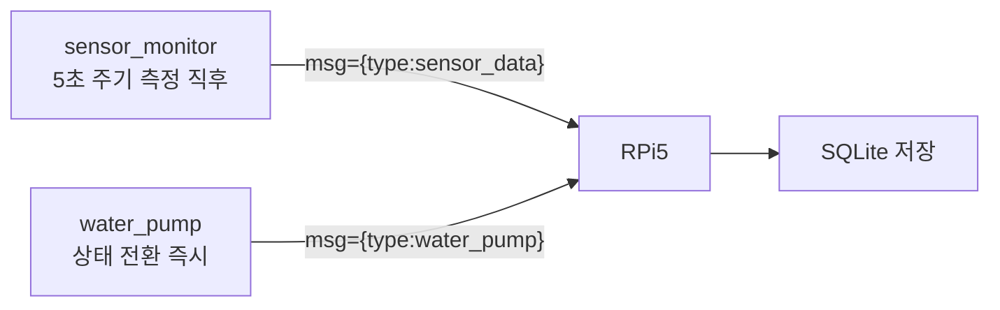
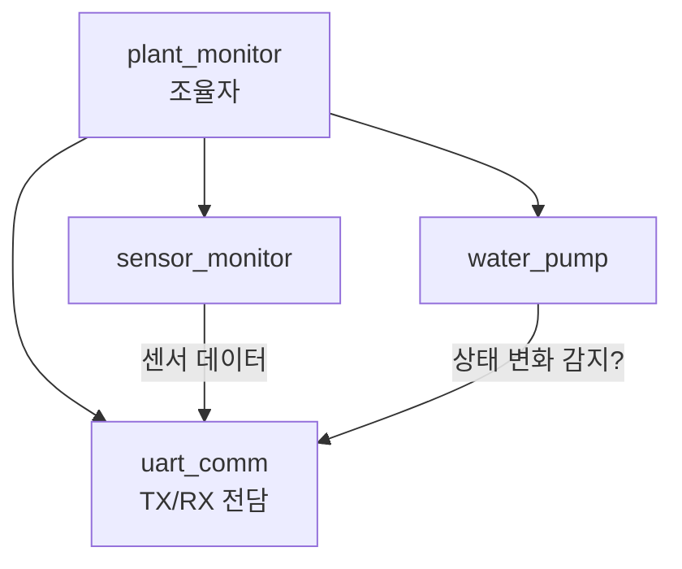
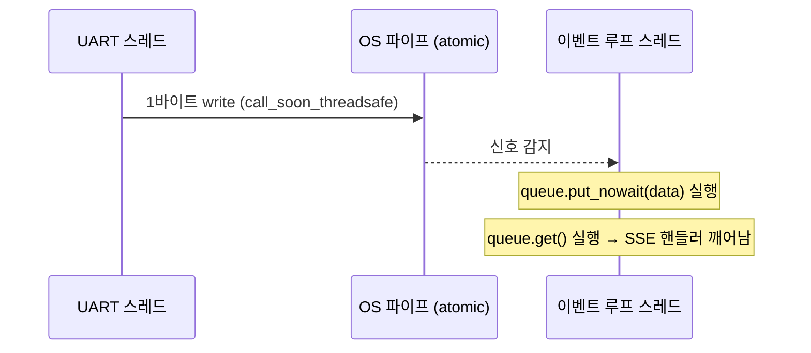

# 8주차 맥락 — RPi5 기반 구축 준비: UART 통신 프로토콜 정의 및 STM32 송신 구현

## 현재 진행 상황

- `system_architecture.md`: 펌프 수동 제어 관련 항목 제거 (`POST /pump/control`, `pump_logs.trigger` 컬럼) ✅
- STM32 ↔ RPi5 UART 통신 프로토콜 정의 완료 ✅
- `uart_cmd.h`: `UART_CMD_BUF_SIZE` 16 → 32 변경 완료 ✅
- `plant_monitor.c`: `T:{value}` 파싱 → `msg={"threshold":N}` JSON 파싱으로 교체 완료 ✅
- `sensor_monitor`: 센서 데이터 JSON 송신 구현 (실패 시 null) ✅
- `water_pump`: 상태 전환 시 JSON 송신 구현 ✅
- RPi5 UART 수신 스크립트 작성 (`uart/serial_port.py`, `uart/protocol.py`) ✅
- SQLite DB 구성 및 저장 로직 (`db/database.py`, `db/repository.py`) ✅
- `service/uart_listener.py`: UART 백그라운드 서비스 구현 ✅
- **8주차 완료** ✅

---

## UART 통신 프로토콜

### 공통 설정

| 항목 | 값 |
|------|----|
| Baud Rate | 115200 |
| 연결 | STM32 Nucleo USB → RPi5 `/dev/ttyACM0` |
| 줄끝 | `\n` (LF) |

---

### STM32 → RPi5

두 메시지는 독립적으로 각자 발생 시점에 전송된다. 앞에 `msg=`를 붙여 디버그 printf와 구분한다.

**센서 데이터** — 센서 측정 직후 즉시 전송 (`sensor_monitor`에서 printf):
```
msg={"type":"sensor_data","data":{"soil_moisture_pct":55,"air_temperature":22.5,"air_humidity":60.0}}\n
```

센서 읽기 실패 시 해당 필드는 `null`로 전송:
```
msg={"type":"sensor_data","data":{"soil_moisture_pct":null,"air_temperature":null,"air_humidity":null}}\n
```

**펌프 상태** — 상태 변경 즉시 전송 (`water_pump`에서 printf):
```
msg={"type":"water_pump","data":{"state":"WATER_PUMP_PUMPING"}}\n
```

| 필드 | 타입 | 설명 |
|------|------|------|
| `type` | 문자열 | 메시지 종류 (`"sensor_data"` / `"water_pump"`) |
| `data.soil_moisture_pct` | 정수 또는 `null` | 토양 수분 (%) — 센서 읽기 실패 시 `null` |
| `data.air_temperature` | 소수점 1자리 또는 `null` | 온도 (°C) — 센서 읽기 실패 시 `null` |
| `data.air_humidity` | 소수점 1자리 또는 `null` | 공기 습도 (%) — 센서 읽기 실패 시 `null` |
| `data.state` | 문자열 | `WaterPump_State` 열거형 이름 그대로 사용 |

`WaterPump_State` 값 (`water_pump.h` 정의 기준):

| 값 | 의미 |
|----|------|
| `"WATER_PUMP_IDLE"` | 대기 중 — 수분 감시 |
| `"WATER_PUMP_PUMPING"` | 펌프 ON — 급수 중 |
| `"WATER_PUMP_SOAKING"` | 펌프 OFF — 물 흡수 대기 |
| `"UNKNOWN"` | 열거형 범위 초과 — 비정상 상태 |

---

### RPi5 → STM32 (임계값 설정)

```json
msg={"threshold":30}\n
```

| 필드 | 타입 | 설명 |
|------|------|------|
| `threshold` | 정수 (0~100) | 토양 수분 임계값 (%) |

---

## 아키텍처 변경 사항

### 제거된 항목

- `POST /pump/control` 엔드포인트 — 펌프 수동 제어 없음, 자동 제어만
- `pump_logs.trigger` 컬럼 — AUTO/MANUAL 구분 불필요

### DB 설계 (최종)

**sensor_logs**: id, timestamp, soil_moisture_pct, air_humidity, air_temperature

**pump_logs**: id, timestamp, action(ON/OFF)

**settings**: id, soil_humidity_min, updated_at

---

## 이번 주 배운 것들

---

### 1. STM32 → RPi5 JSON 프로토콜 설계 고려사항

#### printf로 JSON 조립

STM32에서 JSON을 보내는 방법은 별도 라이브러리 없이 `printf`로 문자열을 직접 조립하는 것이다.

```c
// sensor_monitor에서 측정 직후
printf("msg={\"type\":\"sensor_data\",\"data\":{\"soil_moisture_pct\":%d,"
       "\"air_temperature\":%.1f,\"air_humidity\":%.1f}}\n",
       data->soil_moisture_pct,
       data->air_temperature,
       data->air_humidity);

// water_pump에서 상태 전환 시
printf("msg={\"type\":\"water_pump\",\"data\":{\"state\":\"%s\"}}\n",
       WaterPump_StateStr(state));
```

`float` 출력(`%.1f`)은 링커에서 `-u _printf_float` 플래그가 필요하다. 이 프로젝트는 이미 활성화되어 있으므로 추가 설정 불필요. → 자세한 내용은 3주차 맥락 참고.

#### 열거형 이름을 문자열로 변환

C에는 열거형 값을 자동으로 문자열로 변환하는 기능이 없다. 별도 매핑 함수나 배열이 필요하다.

```c
static const char *WaterPump_StateStr(WaterPump_State state) {
    switch (state) {
        case WATER_PUMP_IDLE:    return "WATER_PUMP_IDLE";
        case WATER_PUMP_PUMPING: return "WATER_PUMP_PUMPING";
        case WATER_PUMP_SOAKING: return "WATER_PUMP_SOAKING";
        default:                 return "UNKNOWN";
    }
}
```

#### 하나의 JSON vs 분리된 메시지

센서 데이터와 펌프 상태를 **분리된 메시지**로 전송하기로 결정했다. 각자 발생 시점이 다르기 때문이다. 센서 데이터는 5초 주기로 측정 직후 전송하고, 펌프 상태는 상태 전환 즉시 전송한다. 이를 통해 대시보드에서 펌프 상태 변화를 실시간으로 반영할 수 있다.



---

### 2. RPi5 → STM32 JSON 수신 처리 방향

기존 `uart_cmd.c`는 `T:30\n` 형태의 단순 텍스트를 파싱했다. JSON으로 교체하면 키 존재 여부로 명령 종류를 구분할 수 있다.

```c
// 수신된 라인 예: msg={"threshold":30}
// msg= 접두사 확인 후 JSON 파싱
if (strncmp(line, "msg=", 4) == 0) {
    const char *json = line + 4;
    if (strstr(json, "threshold")) {
        // sscanf 또는 strstr + atoi로 값 추출
    }
}
```

STM32에서 JSON 파서 라이브러리(cJSON 등)를 쓰면 편하지만, 명령 포맷이 단순하므로 `strstr` + `sscanf` 조합으로도 충분하다.

---

### 3. 파싱에 사용한 C 표준 라이브러리 함수 (`<string.h>`, `<stdio.h>`)

#### `strcmp` vs `strncmp`

```c
int strcmp(const char *s1, const char *s2);
int strncmp(const char *s1, const char *s2, size_t n);
```

두 문자열을 비교하여 같으면 `0`, 다르면 비 `0`을 반환한다.

| 함수 | 비교 범위 | 사용 상황 |
|------|-----------|-----------|
| `strcmp` | 문자열 전체 (`\0` 까지) | 두 문자열이 완전히 같은지 확인할 때 |
| `strncmp` | 앞에서 n글자만 | 특정 접두사로 시작하는지 확인할 때 |

`strcmp`로 접두사를 확인하면 뒤에 내용이 붙어 있으므로 항상 불일치가 된다.

```c
// buf = "msg={\"threshold\":30}"
strcmp(buf, "msg=") != 0   // 전체가 다르므로 항상 불일치 — 잘못된 방법
strncmp(buf, "msg=", 4) == 0  // 앞 4글자만 비교 — 올바른 방법
```

#### `strstr`

```c
char *strstr(const char *haystack, const char *needle);
```

`haystack` 문자열 안에서 `needle` 부분 문자열을 찾아 해당 위치의 포인터를 반환한다. 찾지 못하면 `NULL`을 반환한다.

```c
// json = {"threshold":30}
char *p = strstr(json, "threshold");
// p → "threshold\":30}" 를 가리키는 포인터

if (strstr(json, "threshold")) { ... }  // NULL이 아니면 = 키가 존재하면 진입
```

반환된 포인터 자체를 쓰지 않더라도, **키 존재 여부 확인**만으로도 유용하다. 나중에 명령 종류가 늘어날 때 키 이름으로 분기할 수 있다.

```c
if (strstr(json, "threshold")) { ... }
else if (strstr(json, "interval")) { ... }  // 측정 주기 변경 명령 추가 시
```

#### `sscanf`

```c
int sscanf(const char *str, const char *format, ...);
```

`scanf`의 문자열 버전이다. 파일이나 stdin 대신 **문자열에서 직접 값을 추출**한다. 반환값은 성공적으로 파싱된 변수의 개수다.

```c
int val;
int ret = sscanf(json, "{\"threshold\":%d}", &val);
// json = {"threshold":30} 이면 val = 30, ret = 1
// 포맷 불일치이면 ret = 0, val은 쓰레기값
```

`\"` 는 C 문자열 안에서 `"` 를 표현하는 이스케이프 시퀀스다. 실제 비교 문자열은 `{"threshold":30}` 이 된다.

반환값을 반드시 확인해야 한다. 확인하지 않으면 파싱 실패 시 초기화되지 않은 `val` 로 `soil_threshold`를 덮어쓸 수 있다.

```c
if (sscanf(json, "{\"threshold\":%d}", &val) == 1) {
    // 파싱 성공한 경우만 처리
}
```

---

### 4. sprintf vs snprintf

#### sprintf

```c
int sprintf(char *buf, const char *format, ...);
```

포맷 문자열을 조립해서 `buf`에 쓴다. **버퍼 크기를 전혀 확인하지 않는다.** 버퍼를 초과해도 오류 없이 인접 메모리를 덮어쓴다. STM32처럼 메모리가 제한된 환경에서는 스택이나 다른 변수가 조용히 오염될 수 있다.

#### snprintf

```c
int snprintf(char *buf, size_t n, const char *format, ...);
```

`n - 1`바이트까지만 쓰고, 마지막은 반드시 `\0`으로 끝낸다. 버퍼 초과분은 버린다. **항상 snprintf를 사용해야 한다.**

#### 반환값

둘 다 **실제로 쓰려 했던 글자 수**를 반환한다 (`\0` 제외). `snprintf`에서 이 값이 `n`보다 크면 잘렸다는 의미다.

```c
int written = snprintf(buf, sizeof(buf), "...");
if (written >= (int)sizeof(buf)) {
    // 잘렸음
}
```

#### snprintf 누적 패턴

JSON처럼 조건부로 문자열을 이어붙일 때 `len`을 누적해 가며 쓴다.

```c
char buf[128];
int len = 0;

len += snprintf(buf + len, sizeof(buf) - len, "prefix:");
len += snprintf(buf + len, sizeof(buf) - len, "%d", value);
snprintf(buf + len, sizeof(buf) - len, "\n");  // 마지막은 len+= 불필요
printf("%s", buf);
```

- `buf + len`: 이미 쓴 만큼 포인터를 앞으로 당긴다. 이전 `\0` 위치부터 새 내용을 덮어쓰므로 자연스럽게 이어붙여진다.
- `sizeof(buf) - len`: 남은 공간만큼만 허용해 버퍼 오버플로우를 방지한다.
- `sizeof(buf)`는 배열 선언 크기이므로 항상 고정값(128)이다. `- len`이 없으면 이미 쓴 공간을 다시 허용하게 된다.
- 마지막 `snprintf`에 `len +=`를 붙이지 않는 이유: 이후에 이어붙일 내용이 없어 반환값을 누적할 필요가 없다.

#### printf("%s", buf) 한 번에 출력하는 이유

여러 번 `printf`를 나눠 호출하면 UART 인터럽트 타이밍에 따라 다른 메시지가 사이에 끼어들 수 있다. 버퍼에 완성본을 만들고 한 번에 내보내면 메시지가 깨지지 않는다.

---

### 5. 센서 읽기 실패 시 null 처리 설계

#### 문제

`SoilSensor_Read()`와 `RHT01_Read()` 모두 `HAL_OK`를 보장하지 않는다. 실패 시 `0`을 그대로 전송하면 RPi5에서 정상 데이터와 구분할 수 없다.

#### 해결 방향

반환값을 변수에 저장해 성공 여부를 JSON 조립 시점까지 유지한다.

```c
// 기존: if 안에서 바로 소비 → 나중에 성공 여부를 알 수 없음
if (SoilSensor_Read(&soil_handle) == HAL_OK) { ... }

// 변경: 변수에 저장 → JSON 조립 시점에도 참조 가능
HAL_StatusTypeDef soil_ok = SoilSensor_Read(&soil_handle);
HAL_StatusTypeDef rht_ok  = RHT01_Read(&rht_handle);
```

### 6. UART 송신 설계 결정: printf 직접 vs 별도 모듈

#### 고민한 방향

UART 송수신을 전담하는 별도 모듈(`uart_comm.c`)을 만들어 관심사를 분리하는 방안을 검토했다.



#### water_pump 상태 변화 감지 문제

`uart_comm`이 펌프 상태 전환을 감지하려면 별도 메커니즘이 필요하다.

- **방법 A (polling)**: `plant_monitor`에서 `prev_state`와 현재 상태를 비교
- **방법 B (콜백)**: `water_pump`에 함수 포인터를 등록해 전환 시점에 직접 호출

polling은 메인 루프가 `HAL_GetTick()` 기반 non-blocking이라 실제 딜레이가 무시할 수준이다.

#### 결론: printf 직접 사용

이 프로젝트 규모에서는 분리의 이점보다 복잡도 증가가 크다.

| | printf 직접 | uart_comm 모듈 |
|---|---|---|
| 코드량 | 최소 | 새 파일 2개 + 플래그 또는 콜백 |
| 상태 변화 감지 | 전환 시점 정확 | 추가 메커니즘 필요 |
| 실질적 이점 | | UART 하드웨어 교체 시 한 곳만 수정 |

`sensor_monitor`와 `water_pump` 모두 이미 `#include <stdio.h>`가 있고 디버그 printf를 쓰고 있으므로, JSON printf 추가는 자연스러운 확장이다.

---

### 7. uint8_t와 printf 포맷 지정자

`uint8_t`는 `int`보다 작은 타입이라, 가변 인자(`...`)로 전달될 때 C 표준 규칙(integer promotion)에 의해 자동으로 `int`로 승격된다. 명시적 캐스팅 없이 `%d`를 그대로 쓸 수 있다.

```c
uint8_t val = 55;
printf("%d", val);        // 정상 — int로 자동 승격
printf("%d", (int)val);  // 동일한 결과 — 명시적 캐스팅은 불필요
```

`uint8_t`를 `%.2f` 등 float 포맷으로 출력하면 가변 인자 스택에서 엉뚱한 바이트를 읽어 쓰레기값이 출력된다. 타입에 맞는 포맷 지정자를 반드시 사용해야 한다.

---

### 8. 웹/백엔드 아키텍처 — HTTP 폴링 vs SSE vs WebSocket

#### HTTP 폴링

브라우저가 `setInterval`로 주기적으로 API를 호출해 새 데이터를 가져오는 방식. 데이터가 없어도 매번 요청이 발생한다.

#### SSE (Server-Sent Events)

브라우저가 한 번 연결하면 서버가 연결을 끊지 않고, 새 데이터가 생길 때마다 서버가 능동적으로 브라우저로 전송하는 방식. 단방향(서버 → 브라우저).

```
브라우저: "연결할게" →  서버
브라우저:            ←  서버: "새 데이터!" (연결 유지)
브라우저:            ←  서버: "새 데이터!" (연결 유지)
```

- `uart_listener`가 `asyncio.Queue`에 데이터를 넣음
- SSE 엔드포인트(`GET /stream`)가 Queue를 지켜보다가 데이터 오면 브라우저로 전송
- 브라우저 `EventSource`가 수신 즉시 콜백 실행

```javascript
const source = new EventSource("/stream");
source.onmessage = (e) => { /* 데이터 올 때마다 자동 호출 */ };
```

#### WebSocket

양방향 통신. 이 프로젝트에서 브라우저 → 서버 방향은 임계값 설정 하나뿐이라 SSE + 일반 POST로 충분하다.

#### SQLite는 변경 알림이 없다

PostgreSQL의 `LISTEN/NOTIFY`와 달리 SQLite는 파일 기반이라 DB 변경을 직접 구독할 수 없다. 그래서 Python 프로세스 내부의 `asyncio.Queue`로 pub/sub을 구현한다.

---

### 9. RPi5 소프트웨어 계층 설계

각 파일이 하나의 관심사만 담당하도록 계층을 나눈다.

| 계층 | 파일 | 역할 |
|---|---|---|
| Transport | `uart/serial_port.py` | 시리얼 포트 하드웨어만 담당, 파싱 없음 |
| Protocol | `uart/protocol.py` | `msg=` 줄 → Python 타입 객체 변환 |
| Persistence | `db/repository.py` | DB CRUD, SQL 쿼리를 여기서만 씀 |
| Service | `service/uart_listener.py` | 계층들을 조립하는 백그라운드 스레드, Queue 발행 |
| API | `api/*.py` | HTTP 요청 처리 |

`GET /sensor/current`는 DB에서 최신값을 한 번 반환하는 일반 엔드포인트. 실시간 스트리밍은 별도 `GET /stream` SSE 엔드포인트가 담당한다.

---

### 10. Python 기초

#### `/dev/ttyACM0`

Linux는 하드웨어 장치를 파일로 취급한다. STM32 Nucleo를 USB로 연결하면 `/dev/ttyACM0` 파일로 나타난다. `serial.Serial("/dev/ttyACM0")`은 그 파일을 열어 읽고 쓰는 것이다.

#### `self`

메서드 안에서 자기 자신(인스턴스)을 가리키는 참조다. Python은 메서드의 첫 번째 파라미터로 명시적으로 받아야 한다. 인스턴스 메서드는 항상 첫 번째 인자로 `self`를 적어야 한다.

`self`가 전혀 필요 없는 함수라면 `@staticmethod` 데코레이터로 `self` 없이 정의할 수 있다.

#### `__init__`

객체 생성 시 자동 호출되는 초기화 메서드. 반환값을 가질 수 없다. 인스턴스 변수는 `__init__` 안에서 `self.변수명 = 값`으로 선언과 동시에 초기화한다.

#### 타입 힌트

Python의 기본 타입은 전부 소문자다: `str`, `int`, `float`, `bool`. 타입 힌트는 강제가 아니라 IDE와 개발자를 위한 문서 역할이다. 런타임에 검사하지 않는다.

#### `Optional[T]`

`T` 또는 `None` 둘 중 하나를 허용한다는 표시다. 센서 읽기 실패 시 `None`이 될 수 있는 필드에 사용했다.

#### `Union[A, B]`

`A` 또는 `B` 둘 중 하나라는 의미다. `parse_line`은 한 줄을 받아 `SensorData` 또는 `PumpState` 중 하나만 반환한다. 호출하는 쪽에서 `isinstance()`로 타입을 구분한다.

```python
result = parse_line(line)
if isinstance(result, SensorData):
    # sensor_logs에 저장
elif isinstance(result, PumpState):
    # pump_logs에 저장
```

#### `@dataclass`

클래스에 붙이면 `__init__`, `__repr__`, `__eq__`를 자동 생성해 준다. 멤버 함수도 추가할 수 있다.

#### `except ... pass`

```python
try:
    ...
except (json.JSONDecodeError, KeyError):
    pass   # 블록을 비워두면 문법 오류 → pass로 명시
```

여러 예외를 괄호 안에 묶어 한 번에 잡을 수 있다. `pass`는 "아무것도 하지 않음"을 명시하는 키워드다.

#### 딕셔너리

이름표가 붙은 보관함. `{"key": value}` 형태로 선언. `dict["key"]`로 접근. `sqlite3.Row`를 `dict(row)`로 변환하면 딕셔너리가 된다.

#### 튜플

변경 불가능한 리스트. `(1, 2, 3)` 형태. 원소가 1개일 때는 반드시 뒤에 콤마 필요: `(value,)`. 없으면 그냥 괄호 취급. `conn.execute(sql, params)`의 두 번째 인자로 사용.

#### `logging` 모듈

파일마다 `logging.getLogger(__name__)`으로 전용 로거를 만든다. `__name__`은 Python이 자동으로 채우는 모듈 이름이다. 로거 설정(`basicConfig` 등)은 `main.py`에서 한 번만 하면 모든 파일의 로거에 적용된다.

로그 레벨 심각도 순서: `DEBUG → INFO → WARNING → ERROR → CRITICAL`

---

### 11. asyncio 이벤트 루프

#### asyncio란, 언제 시작되는가

asyncio는 Python 표준 라이브러리로, **단일 스레드에서 여러 작업을 동시에 처리하는 것처럼 보이게 해주는 프레임워크**다. 프로그램 시작 시 자동 생성되지 않는다. `asyncio.run()`을 명시적으로 호출해야 이벤트 루프가 생성되고 실행된다.

```python
import asyncio

async def main():
    await asyncio.sleep(1)

asyncio.run(main())  # ← 이 줄이 이벤트 루프를 생성하고 시작함
```

`asyncio.run()`이 하는 일:
1. 이벤트 루프 객체 생성
2. `main()` 코루틴을 루프에 등록하고 실행
3. `main()`이 끝나면 루프 종료 및 정리

FastAPI는 내부적으로 `asyncio.run()`을 대신 호출해준다. 따라서 FastAPI 앱이 시작되면 이미 이벤트 루프가 돌고 있는 상태다.

#### 이벤트 루프의 정체: "무한 while 루프 + 할 일 목록"

이벤트 루프의 실체는 개념적으로 아래와 같다.

```python
# asyncio 내부를 극단적으로 단순화하면
while True:
    할일목록 = 실행_가능한_코루틴_모두_가져오기()
    for 코루틴 in 할일목록:
        코루틴.한_스텝_실행()   # await를 만날 때까지 실행
    IO_이벤트_확인()            # 소켓, 파일, 타이머 등
```

코루틴은 `await`를 만나는 순간 **자발적으로 멈추고 루프에게 제어권을 돌려준다.** 루프는 그 틈에 다른 코루틴을 실행한다. 스레드를 여러 개 쓰는 게 아니라, 하나의 스레드 안에서 코루틴들이 서로 양보(yield)하며 번갈아 실행되는 구조다.

```
이벤트 루프 타임라인 (단일 스레드):

시간 ──────────────────────────────────────────►

[코루틴 A] 실행──► await sleep(1) ──────────────────► 재개──►
[코루틴 B]                        실행──► await queue.get() ──► 재개
[코루틴 C]                                               실행──►
```

#### 이벤트 루프는 스레드가 아니다

**이벤트 루프는 스레드가 아니라, 스레드 위에서 돌아가는 스케줄러다.** 스레드는 OS가 관리하는 실행 단위이고, 이벤트 루프는 그 스레드 안에서 Python이 직접 코루틴들을 번갈아 실행하는 로직이다.

"이벤트 루프 스레드"라는 표현은 **"이벤트 루프가 돌고 있는 스레드"**, 즉 메인 스레드를 가리키는 말이다. `asyncio.Queue`, `asyncio.Event` 같은 객체들은 이 스레드 안에서만 안전하게 쓸 수 있도록 설계되어 있다.

```
[메인 스레드 — 이벤트 루프가 돌고 있는 스레드]
  └─ asyncio 이벤트 루프 (스케줄러)
        ├─ HTTP 요청 수신 대기 (await)
        ├─ SSE /stream → await queue.get() 대기
        └─ 타이머, 콜백 처리...
        → 모든 것이 이 한 스레드 안에서 순서대로 실행됨
```

#### 블로킹 I/O와 별도 스레드의 필요성

`serial.readline()`은 Python 표준 라이브러리의 **동기 블로킹 함수**다. `async def` 안에 넣어도 그 함수 자체가 비동기로 바뀌지 않는다. `await readline()`이라고 쓸 수도 없고, 그냥 `readline()`을 호출하면 이벤트 루프 스레드 전체가 블로킹된다.

코틀린 비유: 코루틴 안에서 `Thread.sleep()`을 직접 호출하는 것과 같다. `Dispatchers.IO`로 디스패치해야 하듯, Python도 블로킹 I/O는 **별도 스레드**에서 실행해야 한다.

```python
# 잘못된 방법 — 이벤트 루프 스레드가 블로킹됨
async def bad_reader():
    while True:
        line = serial_port.readline()   # 여기서 이벤트 루프 전체가 멈춤, HTTP 처리 불가

# 올바른 방법 — 블로킹 I/O를 별도 스레드로 격리
threading.Thread(target=_read_loop, daemon=True).start()
```

`async def` 함수가 코틀린의 `suspend fun`과 비슷하다는 직관이 맞다. Python의 `async def`는 "이벤트 루프(코루틴 컨텍스트) 안에서만 `await`로 호출 가능"하고, 코틀린의 `suspend fun`은 "코루틴 안에서만 호출 가능"하다. 개념이 동일하다.

#### daemon 스레드

"데몬(Daemon)"은 Unix에서 백그라운드에서 조용히 돌아가는 프로세스를 부르는 전통적인 용어다(`sshd`, `httpd` 등). 스레드에서도 같은 의미로 쓴다. **메인 스레드를 보조하는 백그라운드 스레드**가 데몬 스레드다.

OS는 모든 스레드가 끝나야 프로세스를 종료한다. `daemon=True`를 붙이면 **메인 스레드가 종료될 때 강제로 같이 종료**된다. "죽을 때 같이 죽는다"는 결과이지 정의는 아니다. 정의는 "메인 스레드를 보조하는 백그라운드 스레드"이며, 그 특성으로 인해 메인 종료 시 강제 종료된다.

`readline()`은 데이터가 올 때까지 무한 블로킹이라 정상 종료가 어렵다. `daemon=True`로 OS에 위임하는 게 실용적인 선택이다.

```
daemon=False (기본):
  메인 스레드 종료 → UART 스레드 살아있음 → 프로세스가 죽지 않음 (좀비 상태)

daemon=True:
  메인 스레드 종료 → UART 스레드 강제 종료 → 프로세스 정상 종료
```

---

### 12. asyncio.Queue와 스레드 간 통신

#### asyncio.Queue vs threading.Queue

| | `asyncio.Queue` | `threading.Queue` |
|---|---|---|
| 내부 락(mutex) | 없음 | 있음 |
| 사용 가능 위치 | 이벤트 루프 스레드에서만 | 어느 스레드에서든 |
| put/get 방식 | 이벤트 루프 안에서만 직접 호출 가능 | 여러 스레드에서 직접 호출 가능 |

`asyncio.Queue`에 락이 없는 이유는 **이벤트 루프 스레드 전용으로 설계**되어 있기 때문이다. 이벤트 루프는 단일 스레드라 동시 접근 자체가 없다는 전제 하에 만들어졌다.

#### 레이스 컨디션이란

두 스레드가 **같은 자원을 동시에 수정할 때**, 실행 순서에 따라 결과가 달라지는 버그다. "경쟁 상태"라고도 한다.

```
counter = 0

스레드 A: ① 읽기(0) → ② +1 계산(1) → ③ 쓰기(1)
스레드 B: ① 읽기(0) → ② +1 계산(1) → ③ 쓰기(1)

기대값: 2 / 실제값: 1
```

A가 ①을 하고 B가 ①을 하면, 둘 다 0을 읽고 둘 다 1을 쓴다. `counter + 1`은 CPU 입장에서 읽기 → 계산 → 쓰기의 3단계이고, 이 사이에 다른 스레드가 끼어들 수 있다.

`asyncio.Queue`는 내부적으로 `deque`(덱)와 여러 상태 변수(`_unfinished_tasks`, `_getters` 리스트 등)를 관리한다. UART 스레드가 `queue.put_nowait(data)`를 직접 호출하면:

```
[UART 스레드]                    [이벤트 루프 스레드]
  queue.put_nowait(data) 실행 중   queue.get() 실행 중
    → deque에 data 추가 중           → deque 읽는 중
    → _unfinished_tasks += 1         → _getters 리스트 수정 중
    → _getters 리스트 수정 중
                ↕ 동시 접근 → 내부 상태 파괴
```

결과는 예측 불가하다. 데이터 유실, 무한 대기, 크래시 중 하나가 된다.

#### `call_soon_threadsafe` — put을 이벤트 루프에 위임

```python
loop.call_soon_threadsafe(queue.put_nowait, data)
```

UART 스레드가 Queue를 직접 건드리지 않고, **이벤트 루프 스레드에게 put 실행을 위임**한다. 내부적으로 OS 수준의 **파이프(pipe)**를 사용한다. UART 스레드가 파이프에 1바이트를 쓰는 것은 atomic 연산이라 항상 안전하다. 이벤트 루프는 파이프를 감시하다가 신호를 받으면 등록된 콜백(`queue.put_nowait`)을 자신의 스레드에서 실행한다.

결과적으로 **put도, get도 이벤트 루프 스레드 혼자** 실행하게 된다. 동시 접근이 원천 차단된다.



코틀린 비유: Android의 `handler.post(runnable)`와 정확히 같은 패턴이다. 다른 스레드에서 메인 루프(Looper+MessageQueue)에 작업을 등록하는 것과 동일하다.

#### UART 스레드가 FastAPI 이벤트 루프에 종속되는 구조

`uart_listener.start()`는 FastAPI 앱이 초기화될 때, 즉 이미 이벤트 루프가 실행 중인 시점에 호출된다. 이 시점에 `asyncio.get_event_loop()`로 **FastAPI의 이벤트 루프 레퍼런스를 캡처**해서 UART 스레드에 넘긴다.

`asyncio.get_event_loop()`는 호출한 스레드에 연결된 루프를 반환한다. UART 스레드는 asyncio 루프가 없는 일반 스레드이므로, UART 스레드 안에서 호출하면 루프를 가져올 수 없다. 루프 캡처는 반드시 **이벤트 루프 스레드(메인 스레드)에서 미리** 해야 한다.

```python
def start(port: SerialPort, queue: asyncio.Queue) -> None:
    loop = asyncio.get_event_loop()   # FastAPI의 루프를 메인 스레드에서 캡처
    thread = threading.Thread(
        target=_read_loop,
        args=(port, queue, loop),     # 캡처한 루프를 UART 스레드에 전달
        daemon=True,
    )
    thread.start()
```

이로써 UART 스레드는 FastAPI의 이벤트 루프 큐에 데이터를 등록하고, FastAPI SSE 핸들러가 그 데이터를 꺼내 브라우저로 전송하는 파이프라인이 완성된다.

---

### 13. SSE 엔드포인트의 yield 패턴

#### SSE (Server-Sent Events) 프로토콜

HTTP 연결을 끊지 않고 서버가 클라이언트에게 데이터를 **지속적으로 단방향 전송**하는 방식이다. 브라우저의 `EventSource` API가 이를 지원한다.

SSE 포맷은 `data:` 접두사 + 내용 + `\n\n`(빈 줄 두 개)이다. `\n\n`이 하나의 이벤트 경계를 나타내는 **SSE 스펙**이며, 이 형식이 아니면 브라우저가 이벤트로 인식하지 못한다.

```
data: {"soil_moisture_pct": 45, "air_temperature": 23.1}\n\n
data: {"soil_moisture_pct": 46, "air_temperature": 23.2}\n\n
```

브라우저 측에서는 `EventSource`로 연결하고 `onmessage` 콜백을 등록한다:

```javascript
const source = new EventSource("/stream");
source.onmessage = (e) => {
    const data = JSON.parse(e.data);
    // 데이터 올 때마다 자동 호출
};
```

#### return vs yield — 제너레이터 함수

`return`은 값을 반환하고 함수를 **끝낸다**. `yield`는 값을 반환하되 함수를 **일시정지**시키고, 다음 호출 때 거기서 **재개**한다. `yield`를 쓰는 함수를 **제너레이터 함수**라고 한다.

```python
async def stream():
    while True:
        data = await queue.get()              # 데이터 올 때까지 이벤트 루프 양보 (블로킹 없음)
        yield f"data: {json.dumps(data)}\n\n" # 이 줄만 브라우저로 전송, while 루프 계속
```

`await queue.get()`은 데이터가 올 때까지 이벤트 루프에 제어권을 돌려준다. 루프는 그 사이에 다른 HTTP 요청 등을 처리한다. 데이터가 오면 이 코루틴이 재개되고, `yield`로 한 이벤트를 브라우저에 보낸 뒤 다시 `await`로 돌아간다.

FastAPI는 `yield`를 쓰는 async 함수를 스트리밍 응답으로 인식해, `yield`마다 그 내용을 HTTP 청크로 브라우저에 전송하고 연결을 유지한다. 클라이언트가 연결을 끊거나 서버가 함수를 종료할 때까지 연결이 유지된다.

---

### 14. Python asyncio vs 코틀린 코루틴 비교

코틀린 코루틴도 내부적으로 완전히 같은 구조다. 다만 이름과 노출 방식이 다를 뿐이다.

#### 이벤트 루프 = Android Looper + MessageQueue

코틀린에서 `Dispatchers.Main`이 바로 이벤트 루프다. Android의 `Looper` + `MessageQueue`가 Python asyncio 이벤트 루프와 정확히 같은 역할을 한다.

```kotlin
// Android 메인 스레드의 이벤트 루프 = Python asyncio 이벤트 루프
launch(Dispatchers.Main) {
    val data = withContext(Dispatchers.IO) { fetchData() }  // IO 스레드로 디스패치
    textView.text = data                                     // 다시 메인 스레드로
}
```

코틀린이 낯설지 않은 이유는 이미 Android에서 Looper/MessageQueue를 써봤기 때문이다. Python asyncio가 낯선 이유는 코틀린/Android 프레임워크가 숨겨주는 것을 직접 다뤄야 하기 때문이다. 개념 자체는 이미 알고 있는 것이다.

#### handler.post() = call_soon_threadsafe()

```
Android:                              Python asyncio:

[메인 스레드]                          [메인 스레드]
  Looper.loop()                         asyncio 이벤트 루프
    └─ MessageQueue 꺼내서 실행            └─ 할일목록 꺼내서 실행

[다른 스레드]                          [UART 스레드]
  handler.post(runnable)                 loop.call_soon_threadsafe(fn)
  → 메인 스레드 MessageQueue에 등록       → 이벤트 루프 큐에 등록
```

`handler.post()`와 `call_soon_threadsafe()`는 **완전히 동일한 패턴**이다. 다른 스레드에서 메인 루프의 큐에 작업을 등록하는 것이다.

#### suspend fun = async def

코틀린의 `suspend fun`은 "코루틴 안에서만 호출 가능"하고, Python의 `async def`는 "이벤트 루프(코루틴 컨텍스트) 안에서만 `await`로 호출 가능"하다. 개념이 동일하다.

```kotlin
suspend fun fetchData(): Data { ... }
// 코루틴 밖에서 직접 호출 불가 — runBlocking { } 또는 다른 suspend fun 안에서만
```

```python
async def fetch_data() -> Data: ...
# 이벤트 루프 밖에서 await 불가 — async def 안이나 asyncio.run() 안에서만
```

#### Flow vs asyncio.Queue — 추상화 수준 차이

코틀린 `Flow`는 `flowOn(Dispatchers.IO)`만으로 스레드 간 브릿지를 자동 생성한다. 생산자와 소비자가 서로의 스레드나 루프를 알 필요가 없다.

```kotlin
flow {
    emit(readUart())       // IO 스레드에서 생산
}
.flowOn(Dispatchers.IO)
.collect { data ->         // 구독 스레드에서 소비
    updateUI(data)
}
```

Python `asyncio.Queue`는 `call_soon_threadsafe`로 직접 브릿지를 구현해야 한다. UART 스레드가 FastAPI의 이벤트 루프 레퍼런스를 알아야 하고, put을 직접 위임해야 한다. Python asyncio가 코틀린 코루틴보다 저수준에 가깝고, 그만큼 내부 동작을 더 명시적으로 다뤄야 한다.

| | Python asyncio | Kotlin 코루틴 |
|---|---|---|
| 스케줄러 | 이벤트 루프 | CoroutineDispatcher |
| 일시정지 키워드 | `await` | `suspend` |
| 블로킹 I/O | 별도 스레드 직접 생성 | `Dispatchers.IO` |
| 스레드 간 통신 | `call_soon_threadsafe` (직접) | `handler.post()` (Android, 프레임워크가 처리) |
| 스트리밍 | `yield` 제너레이터 + `asyncio.Queue` | `Flow` (브릿지 자동) |

---

### 15. React와 웹 UI 구조

웹은 브라우저(JS)와 서버(Python)가 완전히 다른 프로세스이며 네트워크로만 통신한다.

JS로 직접 DOM을 조작하면 페이지 전체 새로고침 없이 특정 요소만 갱신할 수 있다. **React**는 상태(`useState`)가 바뀌면 영향받는 컴포넌트만 자동으로 다시 그린다.

React로 대시보드를 재구성하는 것은 완성 이후 고도화 항목으로 등록했다.
