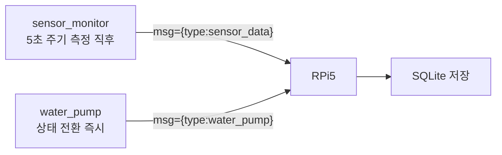
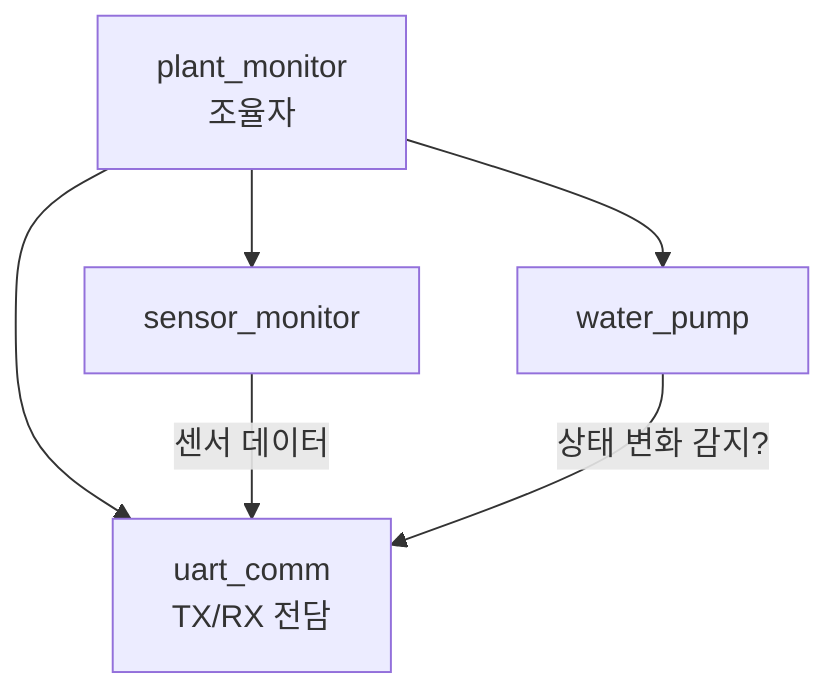

# 8주차 맥락 — RPi5 기반 구축 준비: UART 통신 프로토콜 정의 및 STM32 송신 구현

## 현재 진행 상황

- `system_architecture.md`: 펌프 수동 제어 관련 항목 제거 (`POST /pump/control`, `pump_logs.trigger` 컬럼) ✅
- STM32 ↔ RPi5 UART 통신 프로토콜 정의 완료 ✅
- `uart_cmd.h`: `UART_CMD_BUF_SIZE` 16 → 32 변경 완료 ✅
- `plant_monitor.c`: `T:{value}` 파싱 → `msg={"threshold":N}` JSON 파싱으로 교체 완료 ✅
- `sensor_monitor`: 센서 데이터 JSON 송신 구현 (실패 시 null) ✅
- `water_pump`: 상태 전환 시 JSON 송신 구현 ✅
- RPi5 UART 수신 스크립트 작성 (`uart/serial_port.py`, `uart/protocol.py`) ✅
- SQLite DB 구성 및 저장 로직: 예정 ⬜
- FastAPI 앱 골격 구성: 예정 ⬜

---

## UART 통신 프로토콜

### 공통 설정

| 항목 | 값 |
|------|----|
| Baud Rate | 115200 |
| 연결 | STM32 Nucleo USB → RPi5 `/dev/ttyACM0` |
| 줄끝 | `\n` (LF) |

---

### STM32 → RPi5

두 메시지는 독립적으로 각자 발생 시점에 전송된다. 앞에 `msg=`를 붙여 디버그 printf와 구분한다.

**센서 데이터** — 센서 측정 직후 즉시 전송 (`sensor_monitor`에서 printf):
```
msg={"type":"sensor_data","data":{"soil_moisture_pct":55,"air_temperature":22.5,"air_humidity":60.0}}\n
```

센서 읽기 실패 시 해당 필드는 `null`로 전송:
```
msg={"type":"sensor_data","data":{"soil_moisture_pct":null,"air_temperature":null,"air_humidity":null}}\n
```

**펌프 상태** — 상태 변경 즉시 전송 (`water_pump`에서 printf):
```
msg={"type":"water_pump","data":{"state":"WATER_PUMP_PUMPING"}}\n
```

| 필드 | 타입 | 설명 |
|------|------|------|
| `type` | 문자열 | 메시지 종류 (`"sensor_data"` / `"water_pump"`) |
| `data.soil_moisture_pct` | 정수 또는 `null` | 토양 수분 (%) — 센서 읽기 실패 시 `null` |
| `data.air_temperature` | 소수점 1자리 또는 `null` | 온도 (°C) — 센서 읽기 실패 시 `null` |
| `data.air_humidity` | 소수점 1자리 또는 `null` | 공기 습도 (%) — 센서 읽기 실패 시 `null` |
| `data.state` | 문자열 | `WaterPump_State` 열거형 이름 그대로 사용 |

`WaterPump_State` 값 (`water_pump.h` 정의 기준):

| 값 | 의미 |
|----|------|
| `"WATER_PUMP_IDLE"` | 대기 중 — 수분 감시 |
| `"WATER_PUMP_PUMPING"` | 펌프 ON — 급수 중 |
| `"WATER_PUMP_SOAKING"` | 펌프 OFF — 물 흡수 대기 |
| `"UNKNOWN"` | 열거형 범위 초과 — 비정상 상태 |

---

### RPi5 → STM32 (임계값 설정)

```json
msg={"threshold":30}\n
```

| 필드 | 타입 | 설명 |
|------|------|------|
| `threshold` | 정수 (0~100) | 토양 수분 임계값 (%) |

---

## 아키텍처 변경 사항

### 제거된 항목

- `POST /pump/control` 엔드포인트 — 펌프 수동 제어 없음, 자동 제어만
- `pump_logs.trigger` 컬럼 — AUTO/MANUAL 구분 불필요

### DB 설계 (최종)

**sensor_logs**: id, timestamp, soil_moisture_pct, air_humidity, air_temperature

**pump_logs**: id, timestamp, action(ON/OFF)

**settings**: id, soil_humidity_min, updated_at

---

## 이번 주 배운 것들

---

### 1. STM32 → RPi5 JSON 프로토콜 설계 고려사항

#### printf로 JSON 조립

STM32에서 JSON을 보내는 방법은 별도 라이브러리 없이 `printf`로 문자열을 직접 조립하는 것이다.

```c
// sensor_monitor에서 측정 직후
printf("msg={\"type\":\"sensor_data\",\"data\":{\"soil_moisture_pct\":%d,"
       "\"air_temperature\":%.1f,\"air_humidity\":%.1f}}\n",
       data->soil_moisture_pct,
       data->air_temperature,
       data->air_humidity);

// water_pump에서 상태 전환 시
printf("msg={\"type\":\"water_pump\",\"data\":{\"state\":\"%s\"}}\n",
       WaterPump_StateStr(state));
```

`float` 출력(`%.1f`)은 링커에서 `-u _printf_float` 플래그가 필요하다. 이 프로젝트는 이미 활성화되어 있으므로 추가 설정 불필요. → 자세한 내용은 3주차 맥락 참고.

#### 열거형 이름을 문자열로 변환

C에는 열거형 값을 자동으로 문자열로 변환하는 기능이 없다. 별도 매핑 함수나 배열이 필요하다.

```c
static const char *WaterPump_StateStr(WaterPump_State state) {
    switch (state) {
        case WATER_PUMP_IDLE:    return "WATER_PUMP_IDLE";
        case WATER_PUMP_PUMPING: return "WATER_PUMP_PUMPING";
        case WATER_PUMP_SOAKING: return "WATER_PUMP_SOAKING";
        default:                 return "UNKNOWN";
    }
}
```

#### 하나의 JSON vs 분리된 메시지

센서 데이터와 펌프 상태를 **분리된 메시지**로 전송하기로 결정했다. 각자 발생 시점이 다르기 때문이다. 센서 데이터는 5초 주기로 측정 직후 전송하고, 펌프 상태는 상태 전환 즉시 전송한다. 이를 통해 대시보드에서 펌프 상태 변화를 실시간으로 반영할 수 있다.



---

### 2. RPi5 → STM32 JSON 수신 처리 방향

기존 `uart_cmd.c`는 `T:30\n` 형태의 단순 텍스트를 파싱했다. JSON으로 교체하면 키 존재 여부로 명령 종류를 구분할 수 있다.

```c
// 수신된 라인 예: msg={"threshold":30}
// msg= 접두사 확인 후 JSON 파싱
if (strncmp(line, "msg=", 4) == 0) {
    const char *json = line + 4;
    if (strstr(json, "threshold")) {
        // sscanf 또는 strstr + atoi로 값 추출
    }
}
```

STM32에서 JSON 파서 라이브러리(cJSON 등)를 쓰면 편하지만, 명령 포맷이 단순하므로 `strstr` + `sscanf` 조합으로도 충분하다.

---

### 3. 파싱에 사용한 C 표준 라이브러리 함수 (`<string.h>`, `<stdio.h>`)

#### `strcmp` vs `strncmp`

```c
int strcmp(const char *s1, const char *s2);
int strncmp(const char *s1, const char *s2, size_t n);
```

두 문자열을 비교하여 같으면 `0`, 다르면 비 `0`을 반환한다.

| 함수 | 비교 범위 | 사용 상황 |
|------|-----------|-----------|
| `strcmp` | 문자열 전체 (`\0` 까지) | 두 문자열이 완전히 같은지 확인할 때 |
| `strncmp` | 앞에서 n글자만 | 특정 접두사로 시작하는지 확인할 때 |

`strcmp`로 접두사를 확인하면 뒤에 내용이 붙어 있으므로 항상 불일치가 된다.

```c
// buf = "msg={\"threshold\":30}"
strcmp(buf, "msg=") != 0   // 전체가 다르므로 항상 불일치 — 잘못된 방법
strncmp(buf, "msg=", 4) == 0  // 앞 4글자만 비교 — 올바른 방법
```

#### `strstr`

```c
char *strstr(const char *haystack, const char *needle);
```

`haystack` 문자열 안에서 `needle` 부분 문자열을 찾아 해당 위치의 포인터를 반환한다. 찾지 못하면 `NULL`을 반환한다.

```c
// json = {"threshold":30}
char *p = strstr(json, "threshold");
// p → "threshold\":30}" 를 가리키는 포인터

if (strstr(json, "threshold")) { ... }  // NULL이 아니면 = 키가 존재하면 진입
```

반환된 포인터 자체를 쓰지 않더라도, **키 존재 여부 확인**만으로도 유용하다. 나중에 명령 종류가 늘어날 때 키 이름으로 분기할 수 있다.

```c
if (strstr(json, "threshold")) { ... }
else if (strstr(json, "interval")) { ... }  // 측정 주기 변경 명령 추가 시
```

#### `sscanf`

```c
int sscanf(const char *str, const char *format, ...);
```

`scanf`의 문자열 버전이다. 파일이나 stdin 대신 **문자열에서 직접 값을 추출**한다. 반환값은 성공적으로 파싱된 변수의 개수다.

```c
int val;
int ret = sscanf(json, "{\"threshold\":%d}", &val);
// json = {"threshold":30} 이면 val = 30, ret = 1
// 포맷 불일치이면 ret = 0, val은 쓰레기값
```

`\"` 는 C 문자열 안에서 `"` 를 표현하는 이스케이프 시퀀스다. 실제 비교 문자열은 `{"threshold":30}` 이 된다.

반환값을 반드시 확인해야 한다. 확인하지 않으면 파싱 실패 시 초기화되지 않은 `val` 로 `soil_threshold`를 덮어쓸 수 있다.

```c
if (sscanf(json, "{\"threshold\":%d}", &val) == 1) {
    // 파싱 성공한 경우만 처리
}
```

---

### 4. sprintf vs snprintf

#### sprintf

```c
int sprintf(char *buf, const char *format, ...);
```

포맷 문자열을 조립해서 `buf`에 쓴다. **버퍼 크기를 전혀 확인하지 않는다.** 버퍼를 초과해도 오류 없이 인접 메모리를 덮어쓴다. STM32처럼 메모리가 제한된 환경에서는 스택이나 다른 변수가 조용히 오염될 수 있다.

#### snprintf

```c
int snprintf(char *buf, size_t n, const char *format, ...);
```

`n - 1`바이트까지만 쓰고, 마지막은 반드시 `\0`으로 끝낸다. 버퍼 초과분은 버린다. **항상 snprintf를 사용해야 한다.**

#### 반환값

둘 다 **실제로 쓰려 했던 글자 수**를 반환한다 (`\0` 제외). `snprintf`에서 이 값이 `n`보다 크면 잘렸다는 의미다.

```c
int written = snprintf(buf, sizeof(buf), "...");
if (written >= (int)sizeof(buf)) {
    // 잘렸음
}
```

#### snprintf 누적 패턴

JSON처럼 조건부로 문자열을 이어붙일 때 `len`을 누적해 가며 쓴다.

```c
char buf[128];
int len = 0;

len += snprintf(buf + len, sizeof(buf) - len, "prefix:");
len += snprintf(buf + len, sizeof(buf) - len, "%d", value);
snprintf(buf + len, sizeof(buf) - len, "\n");  // 마지막은 len+= 불필요
printf("%s", buf);
```

- `buf + len`: 이미 쓴 만큼 포인터를 앞으로 당긴다. 이전 `\0` 위치부터 새 내용을 덮어쓰므로 자연스럽게 이어붙여진다.
- `sizeof(buf) - len`: 남은 공간만큼만 허용해 버퍼 오버플로우를 방지한다.
- `sizeof(buf)`는 배열 선언 크기이므로 항상 고정값(128)이다. `- len`이 없으면 이미 쓴 공간을 다시 허용하게 된다.
- 마지막 `snprintf`에 `len +=`를 붙이지 않는 이유: 이후에 이어붙일 내용이 없어 반환값을 누적할 필요가 없다.

#### printf("%s", buf) 한 번에 출력하는 이유

여러 번 `printf`를 나눠 호출하면 UART 인터럽트 타이밍에 따라 다른 메시지가 사이에 끼어들 수 있다. 버퍼에 완성본을 만들고 한 번에 내보내면 메시지가 깨지지 않는다.

---

### 5. 센서 읽기 실패 시 null 처리 설계

#### 문제

`SoilSensor_Read()`와 `RHT01_Read()` 모두 `HAL_OK`를 보장하지 않는다. 실패 시 `0`을 그대로 전송하면 RPi5에서 정상 데이터와 구분할 수 없다.

#### 해결 방향

반환값을 변수에 저장해 성공 여부를 JSON 조립 시점까지 유지한다.

```c
// 기존: if 안에서 바로 소비 → 나중에 성공 여부를 알 수 없음
if (SoilSensor_Read(&soil_handle) == HAL_OK) { ... }

// 변경: 변수에 저장 → JSON 조립 시점에도 참조 가능
HAL_StatusTypeDef soil_ok = SoilSensor_Read(&soil_handle);
HAL_StatusTypeDef rht_ok  = RHT01_Read(&rht_handle);
```

### 6. UART 송신 설계 결정: printf 직접 vs 별도 모듈

#### 고민한 방향

UART 송수신을 전담하는 별도 모듈(`uart_comm.c`)을 만들어 관심사를 분리하는 방안을 검토했다.



#### water_pump 상태 변화 감지 문제

`uart_comm`이 펌프 상태 전환을 감지하려면 별도 메커니즘이 필요하다.

- **방법 A (polling)**: `plant_monitor`에서 `prev_state`와 현재 상태를 비교
- **방법 B (콜백)**: `water_pump`에 함수 포인터를 등록해 전환 시점에 직접 호출

polling은 메인 루프가 `HAL_GetTick()` 기반 non-blocking이라 실제 딜레이가 무시할 수준이다.

#### 결론: printf 직접 사용

이 프로젝트 규모에서는 분리의 이점보다 복잡도 증가가 크다.

| | printf 직접 | uart_comm 모듈 |
|---|---|---|
| 코드량 | 최소 | 새 파일 2개 + 플래그 또는 콜백 |
| 상태 변화 감지 | 전환 시점 정확 | 추가 메커니즘 필요 |
| 실질적 이점 | | UART 하드웨어 교체 시 한 곳만 수정 |

`sensor_monitor`와 `water_pump` 모두 이미 `#include <stdio.h>`가 있고 디버그 printf를 쓰고 있으므로, JSON printf 추가는 자연스러운 확장이다.

---

### 7. uint8_t와 printf 포맷 지정자

`uint8_t`는 `int`보다 작은 타입이라, 가변 인자(`...`)로 전달될 때 C 표준 규칙(integer promotion)에 의해 자동으로 `int`로 승격된다. 명시적 캐스팅 없이 `%d`를 그대로 쓸 수 있다.

```c
uint8_t val = 55;
printf("%d", val);        // 정상 — int로 자동 승격
printf("%d", (int)val);  // 동일한 결과 — 명시적 캐스팅은 불필요
```

`uint8_t`를 `%.2f` 등 float 포맷으로 출력하면 가변 인자 스택에서 엉뚱한 바이트를 읽어 쓰레기값이 출력된다. 타입에 맞는 포맷 지정자를 반드시 사용해야 한다.

---

### 8. 웹/백엔드 아키텍처 — HTTP 폴링 vs SSE vs WebSocket

#### HTTP 폴링

브라우저가 `setInterval`로 주기적으로 API를 호출해 새 데이터를 가져오는 방식. 데이터가 없어도 매번 요청이 발생한다.

#### SSE (Server-Sent Events)

브라우저가 한 번 연결하면 서버가 연결을 끊지 않고, 새 데이터가 생길 때마다 서버가 능동적으로 브라우저로 전송하는 방식. 단방향(서버 → 브라우저).

```
브라우저: "연결할게" →  서버
브라우저:            ←  서버: "새 데이터!" (연결 유지)
브라우저:            ←  서버: "새 데이터!" (연결 유지)
```

- `uart_listener`가 `asyncio.Queue`에 데이터를 넣음
- SSE 엔드포인트(`GET /stream`)가 Queue를 지켜보다가 데이터 오면 브라우저로 전송
- 브라우저 `EventSource`가 수신 즉시 콜백 실행

```javascript
const source = new EventSource("/stream");
source.onmessage = (e) => { /* 데이터 올 때마다 자동 호출 */ };
```

#### WebSocket

양방향 통신. 이 프로젝트에서 브라우저 → 서버 방향은 임계값 설정 하나뿐이라 SSE + 일반 POST로 충분하다.

#### SQLite는 변경 알림이 없다

PostgreSQL의 `LISTEN/NOTIFY`와 달리 SQLite는 파일 기반이라 DB 변경을 직접 구독할 수 없다. 그래서 Python 프로세스 내부의 `asyncio.Queue`로 pub/sub을 구현한다.

---

### 9. RPi5 소프트웨어 계층 설계

각 파일이 하나의 관심사만 담당하도록 계층을 나눈다.

| 계층 | 파일 | 역할 |
|---|---|---|
| Transport | `uart/serial_port.py` | 시리얼 포트 하드웨어만 담당, 파싱 없음 |
| Protocol | `uart/protocol.py` | `msg=` 줄 → Python 타입 객체 변환 |
| Persistence | `db/repository.py` | DB CRUD, SQL 쿼리를 여기서만 씀 |
| Service | `service/uart_listener.py` | 계층들을 조립하는 백그라운드 스레드, Queue 발행 |
| API | `api/*.py` | HTTP 요청 처리 |

`GET /sensor/current`는 DB에서 최신값을 한 번 반환하는 일반 엔드포인트. 실시간 스트리밍은 별도 `GET /stream` SSE 엔드포인트가 담당한다.

---

### 10. Python 기초

#### `/dev/ttyACM0`

Linux는 하드웨어 장치를 파일로 취급한다. STM32 Nucleo를 USB로 연결하면 `/dev/ttyACM0` 파일로 나타난다. `serial.Serial("/dev/ttyACM0")`은 그 파일을 열어 읽고 쓰는 것이다.

#### `self`

메서드 안에서 자기 자신(인스턴스)을 가리키는 참조다. Python은 메서드의 첫 번째 파라미터로 명시적으로 받아야 한다. 인스턴스 메서드는 항상 첫 번째 인자로 `self`를 적어야 한다.

`self`가 전혀 필요 없는 함수라면 `@staticmethod` 데코레이터로 `self` 없이 정의할 수 있다.

#### `__init__`

객체 생성 시 자동 호출되는 초기화 메서드. 반환값을 가질 수 없다. 인스턴스 변수는 `__init__` 안에서 `self.변수명 = 값`으로 선언과 동시에 초기화한다.

#### 타입 힌트

Python의 기본 타입은 전부 소문자다: `str`, `int`, `float`, `bool`. 타입 힌트는 강제가 아니라 IDE와 개발자를 위한 문서 역할이다. 런타임에 검사하지 않는다.

#### `Optional[T]`

`T` 또는 `None` 둘 중 하나를 허용한다는 표시다. 센서 읽기 실패 시 `None`이 될 수 있는 필드에 사용했다.

#### `Union[A, B]`

`A` 또는 `B` 둘 중 하나라는 의미다. `parse_line`은 한 줄을 받아 `SensorData` 또는 `PumpState` 중 하나만 반환한다. 호출하는 쪽에서 `isinstance()`로 타입을 구분한다.

```python
result = parse_line(line)
if isinstance(result, SensorData):
    # sensor_logs에 저장
elif isinstance(result, PumpState):
    # pump_logs에 저장
```

#### `@dataclass`

클래스에 붙이면 `__init__`, `__repr__`, `__eq__`를 자동 생성해 준다. 멤버 함수도 추가할 수 있다.

#### `except ... pass`

```python
try:
    ...
except (json.JSONDecodeError, KeyError):
    pass   # 블록을 비워두면 문법 오류 → pass로 명시
```

여러 예외를 괄호 안에 묶어 한 번에 잡을 수 있다. `pass`는 "아무것도 하지 않음"을 명시하는 키워드다.

#### `logging` 모듈

파일마다 `logging.getLogger(__name__)`으로 전용 로거를 만든다. `__name__`은 Python이 자동으로 채우는 모듈 이름이다. 로거 설정(`basicConfig` 등)은 `main.py`에서 한 번만 하면 모든 파일의 로거에 적용된다.

로그 레벨 심각도 순서: `DEBUG → INFO → WARNING → ERROR → CRITICAL`

---

### 11. React와 웹 UI 구조

웹은 브라우저(JS)와 서버(Python)가 완전히 다른 프로세스이며 네트워크로만 통신한다.

JS로 직접 DOM을 조작하면 페이지 전체 새로고침 없이 특정 요소만 갱신할 수 있다. **React**는 상태(`useState`)가 바뀌면 영향받는 컴포넌트만 자동으로 다시 그린다.

React로 대시보드를 재구성하는 것은 완성 이후 고도화 항목으로 등록했다.

---

## 다음 대화 이어가기

### git 상태

- `stm32` → `main` FF 머지 완료
- `rpi` 브랜치를 `main` 위로 리베이스 완료
- 현재 작업 브랜치: `rpi`

### RPi5 아키텍처 확정 (system_architecture.md 반영 완료)

**폴더 구조**

```
plant_monitor_rpi/
├── main.py
├── uart/
│   ├── serial_port.py       ✅ 구현 완료
│   └── protocol.py          ✅ 구현 완료
├── db/
│   ├── database.py          ⬜
│   └── repository.py        ⬜
├── service/
│   └── uart_listener.py     ⬜
├── api/
│   ├── sensor.py            ⬜
│   ├── pump.py              ⬜
│   └── settings.py          ⬜
└── static/                  ⬜ (10~11주차)
```

**핵심 설계 결정**

- 실시간 데이터 전달: SSE (Server-Sent Events) 방식 채택
  - `uart_listener`가 DB 저장 + `asyncio.Queue` 발행 동시 수행
  - `GET /stream`이 SSE 엔드포인트, `GET /sensor/current`는 DB 최신값 일반 반환
  - 브라우저는 `EventSource("/stream")`으로 연결, 수신 즉시 화면 갱신
- 웹 대시보드는 HTML+JS+Chart.js로 구현, React 재구성은 완성 후 고도화 항목으로 등록

**계층별 역할**

| 계층 | 파일 | 역할 |
|---|---|---|
| Transport | `uart/serial_port.py` | 시리얼 포트 열기/읽기/쓰기 |
| Protocol | `uart/protocol.py` | `msg=` 파싱 → `SensorData` / `PumpState` 반환 |
| Persistence | `db/repository.py` | SQLite CRUD |
| Service | `service/uart_listener.py` | 백그라운드 스레드 조립, Queue 발행 |
| API | `api/*.py` | HTTP 요청 처리 |

### 구현된 파일 내용 요약

**`uart/serial_port.py`**

`SerialPort` 클래스. `/dev/ttyACM0`, 115200bps. `readline()` / `write()` / `close()`.

**`uart/protocol.py`**

JSON 키를 모두 모듈 상수로 분리. `parse_line(line)` → `msg=` 아니면 `None`, `sensor_data` → `SensorData`, `water_pump` → `PumpState`, 파싱 실패 시 `logger.warning` 후 `None`. `logging.getLogger(__name__)` 사용.

### 다음 작업

`db/database.py`, `db/repository.py` 구현 — SQLite 연결, 테이블 생성, CRUD.

DB 스키마:
- `sensor_logs`: id, timestamp, soil_moisture_pct, air_humidity, air_temperature
- `pump_logs`: id, timestamp, action (ON/OFF)
- `settings`: id, soil_humidity_min, updated_at
