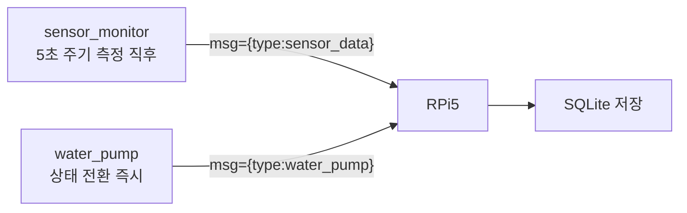

# 8주차 맥락 — RPi5 기반 구축 준비: UART 통신 프로토콜 정의

## 현재 진행 상황

- `system_architecture.md`: 펌프 수동 제어 관련 항목 제거 (`POST /pump/control`, `pump_logs.trigger` 컬럼) ✅
- STM32 ↔ RPi5 UART 통신 프로토콜 정의 완료 ✅
- `uart_cmd.h`: `UART_CMD_BUF_SIZE` 16 → 32 변경 완료 ✅
- `plant_monitor.c`: `T:{value}` 파싱 → `msg={"threshold":N}` JSON 파싱으로 교체 완료 ✅
- STM32 UART 송신 구현 (`sensor_monitor`, `water_pump`): 예정 ⬜
- RPi5 UART 수신 스크립트 작성: 예정 ⬜
- SQLite DB 구성 및 저장 로직: 예정 ⬜
- FastAPI 앱 골격 구성: 예정 ⬜

---

## 할 일 (STM32)

- [ ] `sensor_monitor`에서 센서 측정 직후 `msg={"type":"sensor_data","data":{...}}` printf 추가
- [ ] `water_pump`에서 상태 전환 시점에 `msg={"type":"water_pump","data":{"state":"..."}}` printf 추가

---

## UART 통신 프로토콜

### 공통 설정

| 항목 | 값 |
|------|----|
| Baud Rate | 115200 |
| 연결 | STM32 Nucleo USB → RPi5 `/dev/ttyACM0` |
| 줄끝 | `\n` (LF) |

---

### STM32 → RPi5

두 메시지는 독립적으로 각자 발생 시점에 전송된다. 앞에 `msg=`를 붙여 디버그 printf와 구분한다.

**센서 데이터** — 센서 측정 직후 즉시 전송 (`sensor_monitor`에서 printf):
```
msg={"type":"sensor_data","data":{"soil_moisture_pct":55,"air_temperature":22.5,"air_humidity":60.0}}\n
```

**펌프 상태** — 상태 변경 즉시 전송 (`water_pump`에서 printf):
```
msg={"type":"water_pump","data":{"state":"WATER_PUMP_PUMPING"}}\n
```

| 필드 | 타입 | 설명 |
|------|------|------|
| `type` | 문자열 | 메시지 종류 (`"sensor_data"` / `"water_pump"`) |
| `data.soil_moisture_pct` | 정수 | 토양 수분 (%) |
| `data.air_temperature` | 소수점 1자리 | 온도 (°C) |
| `data.air_humidity` | 소수점 1자리 | 공기 습도 (%) |
| `data.state` | 문자열 | `WaterPump_State` 열거형 이름 그대로 사용 |

`WaterPump_State` 값 (`water_pump.h` 정의 기준):

| 값 | 의미 |
|----|------|
| `"WATER_PUMP_IDLE"` | 대기 중 — 수분 감시 |
| `"WATER_PUMP_PUMPING"` | 펌프 ON — 급수 중 |
| `"WATER_PUMP_SOAKING"` | 펌프 OFF — 물 흡수 대기 |

---

### RPi5 → STM32 (임계값 설정)

```json
msg={"threshold":30}\n
```

| 필드 | 타입 | 설명 |
|------|------|------|
| `threshold` | 정수 (0~100) | 토양 수분 임계값 (%) |

---

## 아키텍처 변경 사항

### 제거된 항목

- `POST /pump/control` 엔드포인트 — 펌프 수동 제어 없음, 자동 제어만
- `pump_logs.trigger` 컬럼 — AUTO/MANUAL 구분 불필요

### DB 설계 (최종)

**sensor_logs**: id, timestamp, soil_moisture_pct, air_humidity, air_temperature

**pump_logs**: id, timestamp, action(ON/OFF)

**settings**: id, soil_humidity_min, updated_at

---

## 이번 주 배운 것들

---

### 1. STM32 → RPi5 JSON 프로토콜 설계 고려사항

#### printf로 JSON 조립

STM32에서 JSON을 보내는 방법은 별도 라이브러리 없이 `printf`로 문자열을 직접 조립하는 것이다.

```c
// sensor_monitor에서 측정 직후
printf("msg={\"type\":\"sensor_data\",\"data\":{\"soil_moisture_pct\":%d,"
       "\"air_temperature\":%.1f,\"air_humidity\":%.1f}}\n",
       data->soil_moisture_pct,
       data->air_temperature,
       data->air_humidity);

// water_pump에서 상태 전환 시
printf("msg={\"type\":\"water_pump\",\"data\":{\"state\":\"%s\"}}\n",
       WaterPump_StateStr(state));
```

`float` 출력(`%.1f`)은 링커에서 `-u _printf_float` 플래그가 필요하다. 이 프로젝트는 이미 활성화되어 있으므로 추가 설정 불필요. → 자세한 내용은 3주차 맥락 참고.

#### 열거형 이름을 문자열로 변환

C에는 열거형 값을 자동으로 문자열로 변환하는 기능이 없다. 별도 매핑 함수나 배열이 필요하다.

```c
static const char *WaterPump_StateStr(WaterPump_State state) {
    switch (state) {
        case WATER_PUMP_IDLE:    return "WATER_PUMP_IDLE";
        case WATER_PUMP_PUMPING: return "WATER_PUMP_PUMPING";
        case WATER_PUMP_SOAKING: return "WATER_PUMP_SOAKING";
        default:                 return "UNKNOWN";
    }
}
```

#### 하나의 JSON vs 분리된 메시지

센서 데이터와 펌프 상태를 **분리된 메시지**로 전송하기로 결정했다. 각자 발생 시점이 다르기 때문이다. 센서 데이터는 5초 주기로 측정 직후 전송하고, 펌프 상태는 상태 전환 즉시 전송한다. 이를 통해 대시보드에서 펌프 상태 변화를 실시간으로 반영할 수 있다.



---

### 2. RPi5 → STM32 JSON 수신 처리 방향

기존 `uart_cmd.c`는 `T:30\n` 형태의 단순 텍스트를 파싱했다. JSON으로 교체하면 키 존재 여부로 명령 종류를 구분할 수 있다.

```c
// 수신된 라인 예: msg={"threshold":30}
// msg= 접두사 확인 후 JSON 파싱
if (strncmp(line, "msg=", 4) == 0) {
    const char *json = line + 4;
    if (strstr(json, "threshold")) {
        // sscanf 또는 strstr + atoi로 값 추출
    }
}
```

STM32에서 JSON 파서 라이브러리(cJSON 등)를 쓰면 편하지만, 명령 포맷이 단순하므로 `strstr` + `sscanf` 조합으로도 충분하다.

---

### 3. 파싱에 사용한 C 표준 라이브러리 함수 (`<string.h>`, `<stdio.h>`)

#### `strcmp` vs `strncmp`

```c
int strcmp(const char *s1, const char *s2);
int strncmp(const char *s1, const char *s2, size_t n);
```

두 문자열을 비교하여 같으면 `0`, 다르면 비 `0`을 반환한다.

| 함수 | 비교 범위 | 사용 상황 |
|------|-----------|-----------|
| `strcmp` | 문자열 전체 (`\0` 까지) | 두 문자열이 완전히 같은지 확인할 때 |
| `strncmp` | 앞에서 n글자만 | 특정 접두사로 시작하는지 확인할 때 |

`strcmp`로 접두사를 확인하면 뒤에 내용이 붙어 있으므로 항상 불일치가 된다.

```c
// buf = "msg={\"threshold\":30}"
strcmp(buf, "msg=") != 0   // 전체가 다르므로 항상 불일치 — 잘못된 방법
strncmp(buf, "msg=", 4) == 0  // 앞 4글자만 비교 — 올바른 방법
```

#### `strstr`

```c
char *strstr(const char *haystack, const char *needle);
```

`haystack` 문자열 안에서 `needle` 부분 문자열을 찾아 해당 위치의 포인터를 반환한다. 찾지 못하면 `NULL`을 반환한다.

```c
// json = {"threshold":30}
char *p = strstr(json, "threshold");
// p → "threshold\":30}" 를 가리키는 포인터

if (strstr(json, "threshold")) { ... }  // NULL이 아니면 = 키가 존재하면 진입
```

반환된 포인터 자체를 쓰지 않더라도, **키 존재 여부 확인**만으로도 유용하다. 나중에 명령 종류가 늘어날 때 키 이름으로 분기할 수 있다.

```c
if (strstr(json, "threshold")) { ... }
else if (strstr(json, "interval")) { ... }  // 측정 주기 변경 명령 추가 시
```

#### `sscanf`

```c
int sscanf(const char *str, const char *format, ...);
```

`scanf`의 문자열 버전이다. 파일이나 stdin 대신 **문자열에서 직접 값을 추출**한다. 반환값은 성공적으로 파싱된 변수의 개수다.

```c
int val;
int ret = sscanf(json, "{\"threshold\":%d}", &val);
// json = {"threshold":30} 이면 val = 30, ret = 1
// 포맷 불일치이면 ret = 0, val은 쓰레기값
```

`\"` 는 C 문자열 안에서 `"` 를 표현하는 이스케이프 시퀀스다. 실제 비교 문자열은 `{"threshold":30}` 이 된다.

반환값을 반드시 확인해야 한다. 확인하지 않으면 파싱 실패 시 초기화되지 않은 `val` 로 `soil_threshold`를 덮어쓸 수 있다.

```c
if (sscanf(json, "{\"threshold\":%d}", &val) == 1) {
    // 파싱 성공한 경우만 처리
}
```
