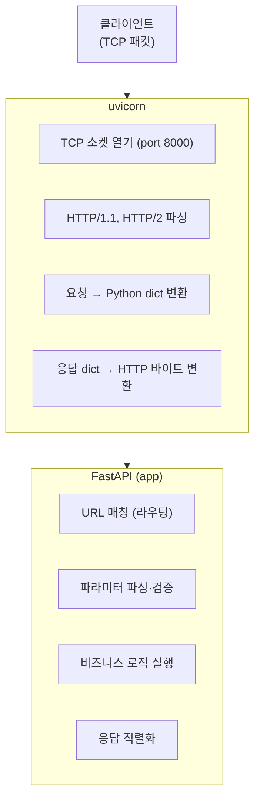

# 9주차 맥락 — FastAPI REST API 전체 구현 및 STM32 초기 동기화

## 현재 진행 상황

- FastAPI 앱 진입점 구현 (`main.py`) ✅
- SSE 엔드포인트 구현 (`GET /stream`) ✅
- 센서 API 라우터 구현 (`api/sensor.py`) — `GET /sensors/latest`, `GET /sensors/history` ✅
- 펌프 이력 API 라우터 구현 (`api/pump.py`) — `GET /pump/logs`. 펌프 ON/OFF 직접 제어 없음. STM32가 임계값 기준으로 자동 제어 ✅
- 설정 API 라우터 구현 (`api/settings.py`) — `GET /settings`, `POST /settings/threshold` (DB 저장 + UART로 STM32 전달) ✅
- `uart_listener` 연결 상태 노출 (`threading.Event`, `get_port()`, `wait_until_connected()`) ✅
- STM32 초기 임계값 동기화 (`service/uart_setup.py`) ✅
- 도메인 모델 분리 (`models/settings.py`) ✅
- **9주차 완료** ✅

---

## 구현된 파일 구조

```
plant_monitor_rpi/
├── main.py                    # FastAPI 앱, lifespan, 라우터 등록
├── models/
│   └── settings.py            # Settings dataclass (DB·UART 양쪽에서 공유)
├── uart/
│   ├── serial_port.py         # 시리얼 포트 열기/읽기/쓰기, port_name 프로퍼티
│   └── protocol.py            # msg= 파싱, create_setting_message(Settings)
├── db/
│   ├── database.py            # SQLite 연결, 테이블 생성
│   └── repository.py          # CRUD, get_settings() → Settings 반환
├── service/
│   ├── uart_listener.py       # 포트 연결/재연결, 데이터 수신, threading.Event
│   └── uart_setup.py          # 서버 시작 시 STM32 초기 임계값 동기화
└── api/
    ├── constants.py           # SSE 페이로드 타입 키 상수
    ├── stream.py              # GET /stream (SSE)
    ├── sensor.py              # GET /sensors/latest, GET /sensors/history
    ├── pump.py                # GET /pump/logs
    └── settings.py            # GET /settings, POST /settings/threshold
```

---

## 주요 구현 코드

### `main.py`

```python
from contextlib import asynccontextmanager
import asyncio, logging
from fastapi import FastAPI
from service import uart_listener, uart_setup
from db.database import init_db
from api import stream, sensor, pump, settings

logging.basicConfig(level=logging.INFO)

@asynccontextmanager
async def lifespan(app: FastAPI):
    init_db()
    queue: asyncio.Queue = asyncio.Queue()
    uart_listener.start(queue)

    loop = asyncio.get_event_loop()
    loop.run_in_executor(None, uart_setup.sync_setting)  # 블로킹 함수를 스레드풀에서 실행

    app.state.queue = queue
    yield

app = FastAPI(lifespan=lifespan)
app.include_router(stream.router)
app.include_router(sensor.router)
app.include_router(pump.router)
app.include_router(settings.router)
```

### `models/settings.py`

```python
from dataclasses import dataclass

@dataclass
class Settings:
    soil_moisture_min: int
    updated_at: str
```

### `service/uart_listener.py` — 연결 상태 노출 추가분

```python
from typing import Optional
import threading

_current_port: Optional[SerialPort] = None
_connected_event = threading.Event()

def get_port() -> Optional[SerialPort]:
    return _current_port

def wait_until_connected(timeout: float = None) -> bool:
    return _connected_event.wait(timeout)

def _read_loop(queue, loop):
    global _current_port
    while True:
        try:
            port = SerialPort()
            _current_port = port
            _connected_event.set()          # 연결됨 신호
            logger.info("STM32 연결됨 (%s)", port.port_name)
        except (serial.SerialException, FileNotFoundError):
            logger.warning("STM32 없음, %d초 후 재시도...", _RETRY_INTERVAL)
            time.sleep(_RETRY_INTERVAL)
            continue
        try:
            while True:
                line = port.readline()
                ...
        except (serial.SerialException, OSError):
            _current_port = None
            _connected_event.clear()        # 연결 끊김 신호
            logger.warning("STM32 연결 끊김, 재연결 대기...")
            port.close()
```

### `service/uart_setup.py`

```python
import logging
from db import repository
from uart import protocol
from service import uart_listener

logger = logging.getLogger(__name__)

def sync_setting() -> None:
    logger.info("STM32 연결 대기 중(초기 설정값 동기화)...")
    uart_listener.wait_until_connected()   # 연결될 때까지 스레드 블로킹

    settings = repository.get_settings()
    msg = protocol.create_setting_message(settings)
    uart_listener.get_port().write(msg)

    logger.info("초기 설정값 동기화 완료: soil_moisture_min=%d%%", settings.soil_moisture_min)
```

### `api/settings.py`

```python
from dataclasses import asdict
from fastapi import APIRouter, HTTPException
from pydantic import BaseModel, Field
from uart import protocol
from db import repository
from service import uart_listener

router = APIRouter()

class SettingsResponse(BaseModel):
    soil_moisture_min: int
    updated_at: str

class ThresholdRequest(BaseModel):
    soil_moisture_min: int = Field(ge=0, le=100)

@router.get("/settings", response_model=SettingsResponse)
async def get_settings():
    return asdict(repository.get_settings())

@router.post("/settings/threshold", response_model=SettingsResponse)
async def update_threshold(body: ThresholdRequest):
    port = uart_listener.get_port()
    if port is None:
        raise HTTPException(status_code=503, detail="STM32 미연결")
    repository.update_soil_min(body.soil_moisture_min)
    msg = protocol.create_setting_message(repository.get_settings())
    port.write(msg)
    return asdict(repository.get_settings())
```

---

## 발생한 문제 및 해결

### 1. `/dev/ttyACM0` 없어도 서버가 동작하게 하기

**문제**: `main.py`에서 `SerialPort()`를 직접 생성하면 STM32 미연결 시 앱 시작 실패.

**해결**: `SerialPort` 생성을 `uart_listener._read_loop` 안으로 이동. 리스너가 직접 포트 열기를 시도하고, 실패하면 3초 대기 후 재시도. 분리 시에는 `serial.SerialException`을 잡아 루프 재시작.

### 2. STM32 초기 동기화 타이밍 문제

**문제**: `lifespan`에서 동기화를 시도하면 STM32가 아직 연결되지 않았을 수 있음.

**해결**: `threading.Event`로 연결 신호를 관리. `uart_setup.sync_setting()`은 `wait_until_connected()`로 연결될 때까지 대기한 후 전송. 이 함수는 블로킹이므로 `run_in_executor`로 스레드풀에서 실행해 lifespan을 막지 않음.

### 3. Settings 컬럼 이름 하드코딩 문제

**문제**: `row["soil_moisture_min"]`처럼 문자열 키가 여러 곳에 흩어지면 컬럼 이름 변경 시 찾기 어려움.

**해결**: `models/settings.py`에 `Settings` dataclass를 만들어 `repository.get_settings()`가 `Settings` 객체를 반환. 호출하는 쪽은 `settings.soil_moisture_min`으로 접근해 DB 컬럼 이름이 밖으로 노출되지 않음.

### 4. 순환 참조 방지를 위한 `models/` 분리

**문제**: `protocol.py`의 `create_setting_message`가 `Settings`를 파라미터로 받으려면 `repository.py`에서 import해야 하는데, `repository.py`는 이미 `protocol.py`를 import하고 있어 순환 참조 발생.

**해결**: `Settings`를 `models/settings.py`로 분리. `repository.py`와 `protocol.py` 모두 `models.settings`를 import해서 순환 없이 공유.

```
models/settings.py   ← 아무것도 import 안 함 (최하위)
       ↑                    ↑
repository.py        protocol.py
```

---

## 이번 주 배운 것들

---

### 1. FastAPI 개요 — "서버"가 두 개인 이유

FastAPI 앱을 실행할 때 `uvicorn main:app`이라는 명령을 쓴다. 여기서 **FastAPI**와 **uvicorn**은 역할이 완전히 다른 두 개의 소프트웨어다.



**uvicorn은 네트워크 담당, FastAPI는 로직 담당**이다. Android로 비유하면: uvicorn은 OkHttp가 TCP 연결·HTTP 파싱을 담당하는 것처럼 저수준 네트워크를 처리하고, FastAPI는 그 위에서 실제 앱 로직을 처리한다.

---

### 2. ASGI — uvicorn과 FastAPI를 연결하는 표준 인터페이스

uvicorn과 FastAPI는 서로 다른 팀이 만든 소프트웨어인데 어떻게 연결되는가? **ASGI(Asynchronous Server Gateway Interface)** 라는 표준 인터페이스로 연결된다.

```python
# ASGI 앱의 실제 모습 (FastAPI 내부에서 이렇게 동작)
async def app(scope, receive, send):
    # scope: 요청 메타데이터 (method, path, headers...)
    # receive: 요청 바디를 읽는 함수
    # send: 응답을 보내는 함수
    ...
```

FastAPI는 이 규약을 구현한 클래스다. uvicorn도 이 규약에 맞는 객체라면 무엇이든 실행할 수 있어서, FastAPI 대신 Starlette, Litestar 같은 다른 프레임워크도 uvicorn 위에서 동작한다.

코틀린의 **인터페이스(interface)** 와 완전히 같은 개념이다. `RecyclerView.Adapter`가 특정 메서드 시그니처를 강제하듯, ASGI는 `app(scope, receive, send)` 시그니처를 강제한다. RecyclerView(uvicorn)는 Adapter(FastAPI)가 어떻게 구현됐는지 몰라도 인터페이스만 맞으면 동작한다.

#### WSGI와의 차이 — 왜 ASGI가 필요한가

구버전 표준인 **WSGI(Web Server Gateway Interface)** 는 동기 방식이었다.

```
WSGI: 요청 1개 처리 완료 → 요청 2개 처리 시작 (순차)
ASGI: 요청 1이 await로 대기하는 동안 요청 2 처리 (동시)
```

SSE(`/stream`)처럼 연결을 오래 유지하는 기능은 WSGI로 구현할 수 없다. 요청 하나가 연결을 잡고 있으면 다른 모든 요청이 블로킹되기 때문이다. ASGI는 이벤트 루프 기반이라 수천 개의 SSE 연결을 동시에 열어도 된다.

---

### 3. APIRouter — 엔드포인트를 파일로 분리하기

FastAPI 앱 하나에 모든 엔드포인트를 쓰면 `main.py`가 수백 줄이 된다. `APIRouter`로 파일을 나누고 `app.include_router()`로 붙이는 구조가 표준이다.

```python
# api/stream.py
router = APIRouter()        # 빈 그릇 생성

@router.get("/stream")      # 그릇에 엔드포인트 담기
async def stream(...): ...
```

```python
# main.py
from api import stream
app.include_router(stream.router)   # 그릇을 앱에 붙이는 시점에 실제 등록됨
```

`stream.py` 안의 `router` 객체는 `include_router()`가 호출되기 전까지 FastAPI 앱과 아무런 연결이 없다. Android의 NavGraph에서 각 Fragment가 독립적으로 존재하다가 NavGraph에 등록되면 연결되는 구조와 동일하다.

---

### 4. Python 데코레이터 vs Kotlin 어노테이션

`@router.get("/stream")`을 처음 보면 Kotlin 어노테이션처럼 보이지만, 동작 방식이 근본적으로 다르다.

#### Kotlin 어노테이션 — 메타데이터 태그

```kotlin
@GET("/stream")
suspend fun getStream(): Response
```

`@GET`은 "이 함수는 GET 요청을 처리한다"는 정보를 붙여둘 뿐이다. 실제 동작은 Retrofit 라이브러리가 리플렉션으로 읽어서 처리한다. 어노테이션 자체가 코드를 실행하지 않는다.

#### Python 데코레이터 — 즉시 실행되는 함수 호출

```python
@router.get("/stream")
async def stream(): ...

# 위 코드는 아래와 완전히 동일
async def stream(): ...
stream = router.get("/stream")(stream)   # 정의되는 순간 즉시 실행
```

`router.get("/stream")`이 호출되면서 `router` 객체 안에 `"/stream"` 경로와 `stream` 함수를 그 자리에서 바로 등록한다.

| | Kotlin 어노테이션 | Python 데코레이터 |
|--|---|---|
| 본질 | 메타데이터 태그 | 함수를 인자로 받는 함수 |
| 실행 시점 | 컴파일/런타임에 다른 코드가 읽음 | 정의되는 순간 즉시 실행 |
| 객체 연결 | 불가 | 가능 (`router.get()`) |

---

### 5. lifespan 컨텍스트 매니저

`lifespan`은 앱의 "시작~종료" 구간을 관리하는 함수다. Android의 `Application.onCreate()` / `onTerminate()`와 동일한 역할이다.

```python
@asynccontextmanager
async def lifespan(app: FastAPI):
    # ① 앱 시작 (yield 이전)
    init_db()
    queue = asyncio.Queue()
    uart_listener.start(queue)
    app.state.queue = queue

    yield  # ← 이 지점에서 일시정지. FastAPI가 요청을 처리하는 구간 전체

    # ② 앱 종료 (yield 이후, Ctrl+C 등 종료 신호 수신 시)
```

`yield`를 만나면 함수가 일시정지되고, FastAPI가 HTTP 요청을 처리하기 시작한다. `Ctrl+C`로 서버를 종료하면 uvicorn이 lifespan 함수에 신호를 보내고, `yield` 이후 코드가 실행된다.

#### @asynccontextmanager

`yield`가 있는 함수를 **컨텍스트 매니저**로 만들어주는 데코레이터다. `yield` 앞 = `__aenter__`(시작), `yield` 뒤 = `__aexit__`(종료).

```python
# 클래스로 직접 구현하면 복잡하다
class Lifespan:
    async def __aenter__(self):
        init_db()
        ...
    async def __aexit__(self, *args):
        port.close()

# @asynccontextmanager를 쓰면 yield 하나로 표현
```

---

### 6. app.state — 앱 전역 저장소

FastAPI 앱 객체(`app`)에는 **`state`라는 빈 네임스페이스**가 내장되어 있다. 개발자가 아무 이름으로나 데이터를 붙여서 전역 저장소처럼 쓸 수 있다.

```python
# lifespan에서 저장
app.state.queue = queue

# 엔드포인트에서 꺼냄
queue = request.app.state.queue
```

Android의 `Application` 클래스에 프로퍼티를 추가해 전역 접근하는 패턴과 같다. 단, Python은 타입 검사가 없으므로 꺼낼 때 타입이 맞는지 개발자가 직접 알고 있어야 한다.

---

### 7. async def — Kotlin suspend fun과의 관계

`async def`는 Python의 `suspend fun`이다. 둘 다 "이 함수는 중간에 실행을 양보할 수 있다"는 선언이다.

핵심 오해: `async def`는 **다른 스레드에서 실행**되는 게 아니다. **같은 스레드에서 실행되지만 중간에 멈출 수 있다**는 선언이다. `await`를 만나면 현재 코루틴이 멈추고 이벤트 루프가 다른 코루틴을 실행한다.

| | Kotlin | Python |
|--|--------|--------|
| 실행 주체 | `CoroutineScope` (Dispatchers.IO 등) | `asyncio` 이벤트 루프 |
| 호출 키워드 | `launch { }`, `async { }` | `await` |
| 진입점 | `runBlocking { }` | `asyncio.run()` |

Python asyncio는 **단일 스레드**다. Kotlin `Dispatchers.IO`처럼 실제 스레드를 바꾸는 게 아니라, `Dispatchers.Main`에서 `suspend fun`이 번갈아 실행되는 것과 더 가깝다.

---

### 8. asyncio 이벤트 루프 종류와 이름의 유래

`asyncio`는 Python 표준 내장 이벤트 루프다.

| 라이브러리 | 특징 |
|-----------|------|
| `asyncio` | Python 표준 내장. 가장 범용적 |
| `uvloop` | C로 작성된 고성능 대체제. asyncio API 그대로 쓰면서 내부만 교체. 2~4배 빠름 |
| `trio` | asyncio와 다른 독자적 설계. 구조적 동시성 철학 |

이름의 `io`는 **I/O 대기**에서 비동기가 진짜 빛을 발하기 때문이다. 네트워크 응답 대기·DB 쿼리·파일 읽기·UART 데이터 대기에서 병목이 생기는데, asyncio는 이 대기 시간 동안 다른 코루틴을 끼워 넣어 낭비를 없앤다.

Kotlin `Dispatchers.IO`가 **스레드풀에서 실제 다른 스레드가 I/O를 담당**하는 것과 달리, Python asyncio는 **단일 스레드에서 I/O 대기 시간을 재활용**해 동시성을 확보한다.

---

### 9. Request 클래스

FastAPI가 HTTP 요청 전체를 담아서 넘겨주는 객체다. 경로/쿼리 파라미터처럼 FastAPI가 자동으로 파싱해주지 않는 **원시 요청 정보**에 접근할 때 사용한다.

```python
request.method          # "GET", "POST" 등
request.url             # 요청 URL 전체
request.headers         # 요청 헤더
request.app             # FastAPI 앱 객체 (→ app.state.queue 접근에 사용)
request.is_disconnected()  # 클라이언트 연결 끊김 여부 (async)
```

SSE에서 `Request`가 필요한 이유: `request.app.state.queue`로 Queue에 접근하고, `request.is_disconnected()`로 클라이언트가 탭을 닫았는지 감지하기 위해서다.

---

### 10. `await request.is_disconnected()` — await의 위치와 의미

```python
if await request.is_disconnected():
    break
```

`await`는 "이 비동기 작업이 끝날 때까지 기다렸다가 결과를 꺼내라"는 의미다. **바로 뒤에 오는 표현식 하나에만** 적용된다.

`await` 없이 쓰면 함수를 실행하는 게 아니라 **코루틴 객체 자체**를 반환받는다. 객체는 항상 `True`로 평가되어 루프가 즉시 종료되는 버그가 생긴다.

```python
if request.is_disconnected():   # 코루틴 객체 자체 (항상 truthy) → 항상 즉시 종료 버그
    break

if await request.is_disconnected():   # 실행 후 결과(bool)로 판단 → 올바름
    break
```

---

### 11. yield — 두 가지 전혀 다른 용도

#### ① lifespan에서의 yield — 함수 일시정지

```python
@asynccontextmanager
async def lifespan(app):
    # 시작
    yield   # ← 여기서 함수 일시정지. 앱이 종료될 때까지 이 자리에서 기다림
    # 종료
```

#### ② _event_generator에서의 yield — 값을 하나씩 생산

```python
async def _event_generator(request, queue):
    while True:
        data = await queue.get()
        yield f"data: {json.dumps(data)}\n\n"   # 문자열 하나를 생산하고 루프 계속
```

`return`은 값을 반환하고 함수를 **끝낸다**. `yield`는 값을 반환하되 함수를 **일시정지**시키고, 호출자가 다음 값을 요청할 때 거기서 재개한다. `yield`를 쓰는 함수를 **제너레이터 함수**라고 한다.

`StreamingResponse`는 이 제너레이터를 받아서 `yield`로 나오는 문자열을 그때그때 HTTP 응답으로 내보낸다.

---

### 12. SSE(Server-Sent Events) 프로토콜과 StreamingResponse

클라이언트(브라우저)가 HTTP 연결을 맺으면, 서버가 연결을 끊지 않고 데이터를 계속 내려보내는 방식이다. WebSocket과 달리 단방향(서버→클라이언트)이고 HTTP 표준이라 구현이 단순하다.

SSE 메시지 형식: `data:` + 내용 + `\n\n`. `\n\n`이 하나의 메시지 경계를 나타내는 SSE 스펙이다.

```javascript
const source = new EventSource("/stream");
source.onmessage = (e) => {
    const data = JSON.parse(e.data);  // 데이터 올 때마다 자동 호출
};
```

#### asyncio.wait_for — 이벤트 루프 블로킹 방지

```python
parsed = await asyncio.wait_for(queue.get(), timeout=1.0)
```

`queue.get()`은 데이터가 없으면 무한정 대기한다. `asyncio.wait_for`로 1초 타임아웃을 걸면, 타임아웃 없이 무한 대기하면 이벤트 루프 전체가 멈춰 다른 모든 요청이 블로킹된다.

#### keepalive 코멘트

```python
yield ": keepalive\n\n"
```

SSE의 코멘트 형식(`:` 로 시작하는 줄)이다. 아무것도 안 보내면 TCP 연결이 idle 타임아웃으로 끊긴다. 연결을 살아있게 유지하기 위한 주기적 신호다.

#### StreamingResponse 헤더 의미

```python
return StreamingResponse(
    _event_generator(request, queue),
    media_type="text/event-stream",
    headers={
        "Cache-Control": "no-cache",
        "X-Accel-Buffering": "no",
    },
)
```

- **`media_type="text/event-stream"`**: 브라우저가 SSE로 인식하는 Content-Type. 없으면 일반 텍스트로 취급해 연결이 끊길 때까지 기다렸다가 한꺼번에 표시한다.
- **`Cache-Control: no-cache`**: 브라우저나 중간 프록시가 SSE 스트림을 캐싱하지 못하게 막는다.
- **`X-Accel-Buffering: no`**: nginx가 앞단에 있을 때 버퍼에 모았다가 한 번에 전달하는 기본 동작을 끈다. 없으면 실시간성이 깨진다.

---

### 13. `**asdict(parsed)` 패턴 — 딕셔너리 언팩

```python
d = {"a": 1, "b": 2}
{"type": "sensor", **d}
# → {"type": "sensor", "a": 1, "b": 2}
```

`**`는 딕셔너리의 key-value를 펼쳐서 삽입한다. `asdict(parsed)`로 dataclass를 dict로 변환한 뒤 `**`로 언팩하면, `type` 필드를 앞에 추가하면서 dataclass의 모든 필드를 합치는 관용적인 패턴이 된다.

```python
{"type": "sensor_data", **asdict(parsed)}
# → {"type": "sensor_data", "soil_moisture_pct": 55, "air_temperature": 22.5, ...}
```

---

### 14. nginx — 리버스 프록시

nginx는 클라이언트와 uvicorn 사이에 앉아서 모든 요청을 대신 받고 전달하는 **리버스 프록시**다. "리버스"가 붙은 이유: 일반 프록시는 클라이언트 대신 요청을 보내는 것(VPN처럼), 리버스 프록시는 서버 대신 요청을 받는 것이기 때문이다.


| 역할 | 설명 |
|------|------|
| HTTPS 처리 | TLS 인증서 관리. uvicorn은 평문 HTTP만 처리하면 됨 |
| 정적 파일 서빙 | HTML, CSS, JS를 uvicorn 거치지 않고 직접 반환 |
| 포트 관리 | 8000번 포트를 80/443으로 매핑 |
| 로드 밸런싱 | uvicorn 프로세스 여러 개 띄울 때 요청 분산 |

이번 프로젝트는 nginx 없이 uvicorn 직접 실행으로 충분하다.

---

### 15. 가상환경과 Docker

Raspberry Pi OS(Debian 기반)는 시스템 Python을 보호하기 위해 `pip install`을 시스템 전역에 실행하지 못하도록 막아놓는다. OS 자체가 Python 패키지에 의존하는데, `pip`로 다른 버전을 설치하면 버전 충돌로 OS가 불안정해질 수 있기 때문이다.

```bash
python3 -m venv .venv       # 가상환경 생성
source .venv/bin/activate   # 활성화 (터미널 앞에 (.venv) 표시됨)
pip install fastapi uvicorn pyserial
```

systemd 서비스 등록 시에는 가상환경 경로를 직접 지정한다:

```ini
ExecStart=/home/msk/Embedded_Projects/plant-monitor/plant_monitor_rpi/.venv/bin/uvicorn main:app --host 0.0.0.0 --port 8000
```

Docker를 쓰면 컨테이너 자체가 격리된 환경이므로 가상환경 없이 바로 `pip install` 가능하다. UART 디바이스는 `--device` 옵션으로 전달한다 (고도화 예정).

---

### 16. Python import 방식과 상수 공유

```python
from api import constants           # 모듈 import → 접두어 필요: constants.TYPE_KEY
from api.constants import TYPE_KEY  # 직접 import → 바로 사용: TYPE_KEY
```

`_PORT`처럼 언더스코어로 시작하는 이름은 Python 관례상 **모듈 내부용**을 의미한다. 외부 모듈에서 가져다 쓸 상수라면 `DEFAULT_PORT`처럼 공개 이름으로 선언하는 게 명확하다.

UART 프로토콜(STM32 ↔ RPi5)과 SSE 프로토콜(RPi5 ↔ 브라우저)은 독립적인 레이어다. 키 값이 달라도 되고, 오히려 분리하는 게 더 좋은 설계다.

---

### 17. 데몬 스레드와 종료 시 정리 작업

데몬 스레드는 메인 프로세스가 종료되면 **즉시 강제 종료**된다. `port.close()` 같은 정리 코드를 실행할 기회가 없다.

정리 작업이 필요하다면 일반 스레드 + `threading.Event`로 종료 신호를 보내는 방식을 써야 한다:

```python
stop_event = threading.Event()

def _read_loop(queue, loop, stop_event):
    while not stop_event.is_set():
        ...
    port.close()   # 종료 신호 받으면 정리 후 종료
```

이번 프로젝트에서는 `serial.Serial`이 GC 소멸 시 자동으로 포트를 닫고, 프로세스 종료 시 OS도 모든 파일 디스크립터를 회수한다. 그래서 데몬 스레드로도 실질적인 문제가 없다.

---

### 18. FastAPI 자동 API 문서

코드만 작성하면 문서를 자동으로 생성한다.

| URL | 내용 |
|-----|------|
| `http://[RPi5_IP]:8000/docs` | Swagger UI (브라우저에서 직접 테스트 가능) |
| `http://[RPi5_IP]:8000/redoc` | ReDoc (읽기 좋은 문서 형태) |

Validation Error 항목은 FastAPI가 `response_model`을 보고 자동으로 추가한다. 422 응답이 날 수 있다는 것을 문서로 표시하는 것이다.

---

### 19. Pydantic — BaseModel과 런타임 검증

Python의 타입 힌트(`int`, `str`, `Optional[float]`)는 원래 힌트일 뿐 실제로 강제되지 않는다. Pydantic은 이 타입 힌트를 **실행 시점에 검증**한다. `BaseModel`을 상속받아 클래스를 만들면 Pydantic의 검증 엔진이 탑재된 데이터 컨테이너가 된다.

```python
class SensorResponse(BaseModel):
    id: int
    timestamp: str
    soil_moisture_pct: Optional[int]

# 타입 자동 변환 (변환 가능한 경우)
SensorResponse(id="1", ...)   # "1" → 1로 자동 변환

# 변환 불가 → ValidationError → FastAPI가 자동으로 HTTP 422 반환
SensorResponse(id="abc", ...)
```

FastAPI와 함께 쓸 때 `response_model`을 지정하면:
- 반환값을 모델로 자동 변환
- 모델에 없는 필드는 응답에서 자동 제거
- Swagger 문서에 응답 스키마 자동 생성

#### `response_model` vs `response_class`

두 파라미터는 목적이 완전히 다르다.

- **`response_model`**: 응답 **내용(데이터 구조)**을 지정. Pydantic 모델로 정의하며 JSON 스키마 생성.
- **`response_class`**: 응답 **형식(HTTP 응답 타입)**을 지정. 기본값은 `JSONResponse`. HTML, 스트림 등 JSON이 아닌 응답에 사용.

```python
@router.get("/sensors/latest", response_model=SensorResponse)   # JSON 구조 지정
async def get_latest(): ...

@router.get("/", response_class=HTMLResponse)    # HTML 응답으로 바꿈
async def root(): return "<h1>Hello</h1>"
```

SSE의 `StreamingResponse`도 `response_class`에 해당한다. 연결을 유지하며 데이터를 흘려보내는 형식이라 `response_model`을 붙일 수 없어 Swagger에서 `string`으로 표시된다.

#### `Field` — 추가 제약 조건

타입 힌트만으로 표현할 수 없는 범위 제한 등을 붙인다.

```python
class ThresholdRequest(BaseModel):
    soil_moisture_min: int = Field(ge=0, le=100)
```

| 옵션 | 의미 |
|------|------|
| `ge` | greater or equal (이상) |
| `le` | less or equal (이하) |
| `gt` | greater than (초과) |
| `lt` | less than (미만) |

`soil_moisture_min: 150`으로 POST가 들어오면 Pydantic이 즉시 422를 반환. 엔드포인트 함수 안에서 `if value > 100: raise ...` 코드를 쓸 필요가 없다.

---

### 20. 클래스 괄호 `()` — 상속

Python에서 클래스 선언의 괄호는 **상속**을 의미한다.

```python
class SensorResponse(BaseModel):   # BaseModel을 상속
    ...

class SensorResponse:   # 괄호 없으면 암묵적으로 object 상속
    ...
```

Kotlin의 `class SensorResponse : BaseModel()`과 동일하다. `BaseModel`을 상속받으면 Pydantic이 클래스 정의 시점에 메타클래스 마법을 통해 타입 힌트를 읽어 검증 로직을 자동으로 심어놓는다.

#### `@dataclass` vs `BaseModel`

| | `@dataclass` | `BaseModel` |
|--|---|---|
| 목적 | 보일러플레이트 제거 (내부 데이터 구조) | 외부 데이터 검증 + 직렬화 |
| 타입 강제 | 없음 (힌트만) | 있음 (런타임 검증) |
| JSON 변환 | `asdict()` 별도 필요 | `.model_dump()` 내장 |
| FastAPI 연동 | 제한적 | 완전 지원 (자동 문서화 포함) |

경계에서 쓰면 `BaseModel`, 내부에서 쓰면 `@dataclass`가 기준이다. `SensorData`, `PumpState`, `Settings`는 내부 데이터 구조라 `@dataclass`. `SensorResponse`, `SettingsResponse`는 HTTP 응답 구조라 `BaseModel`.

---

### 21. `dict()` vs `asdict()`

#### `dict()` — Python 내장 함수

`keys()`와 `__getitem__`을 구현한 객체를 딕셔너리로 변환한다. `sqlite3.Row`가 이를 구현하고 있어서 `dict(row)`가 동작한다.

```python
dict(row)   # sqlite3.Row → {"id": 1, "timestamp": "...", ...}
```

dataclass에는 `keys()`가 없어서 `dict()`가 동작하지 않는다.

#### `asdict()` — `dataclasses` 모듈 전용 함수

dataclass의 필드 선언(`__dataclass_fields__`)을 읽어서 딕셔너리로 만든다. 중첩 dataclass도 재귀적으로 변환한다.

```python
from dataclasses import asdict

asdict(Settings(soil_moisture_min=30, updated_at="2026-01-01"))
# → {"soil_moisture_min": 30, "updated_at": "2026-01-01"}
```

`sqlite3.Row` → `dict()`, dataclass → `asdict()`로 기억하면 된다.

---

### 22. 덕 타이핑과 매직 메서드

**덕 타이핑**: "오리처럼 걷고, 오리처럼 꽥꽥거리면 오리다." 타입이 무엇인지보다 **무엇을 할 수 있는지**로 판단한다. Kotlin은 인터페이스를 명시적으로 선언해야 하지만, Python은 메서드만 갖추고 있으면 그 역할로 취급한다.

**매직 메서드**: `__`로 감싼 이름으로, Python 내장 문법과 연결된다.

| 문법 / 함수 | 호출되는 메서드 |
|---|---|
| `obj[key]` | `__getitem__` |
| `len(obj)` | `__len__` |
| `for x in obj` | `__iter__` |
| `str(obj)` | `__str__` |

```python
class MyRow:
    def keys(self):
        return self._data.keys()

    def __getitem__(self, key):   # row["id"] → 이 메서드 호출
        return self._data[key]
```

Kotlin의 `operator fun get(key: K): V`와 같은 개념이다.

---

### 23. Python `global` 키워드

Python에서 함수 안에서 변수에 **대입**하면 무조건 지역 변수로 취급한다. 모듈 레벨 변수를 수정하려면 `global`을 선언해야 한다.

```python
_current_port = None   # 모듈 레벨

def _read_loop():
    global _current_port   # 없으면 지역 변수가 새로 생성됨
    _current_port = port   # 모듈 변수 수정
```

**읽기만 할 때는 `global`이 필요 없다.** `get_port()`가 `global` 없이 동작하는 이유가 이것이다. 대입할 때만 필요하다.

---

### 24. `threading.Event` — 스레드 간 신호 전달

`threading.Event`는 **boolean 플래그 하나와 대기 목록**을 가진 스레드 동기화 도구다.

```python
_connected_event = threading.Event()   # flag = False
```

| 메서드 | 동작 |
|--------|------|
| `set()` | flag = True, 대기 중인 모든 스레드 깨움 |
| `clear()` | flag = False로 초기화 |
| `wait(timeout)` | flag가 True가 될 때까지 현재 스레드 블로킹. timeout 초과 시 False 반환 |

`wait()`은 OS 레벨에서 스레드를 sleep 상태로 만든다. CPU를 전혀 소비하지 않는다.

```
uart-listener 스레드:          sync_setting 스레드:
  SerialPort() 시도 (실패)       wait() 호출 → 💤 잠듦
  3초 대기
  SerialPort() 시도 (성공)
  _connected_event.set()   →   💤 → 깨어남
                                settings = get_settings()
                                port.write(msg)
                                함수 종료
  readline() 루프 시작
```

`set()`을 호출한 스레드(uart-listener)는 신호를 보내고 자기 일(readline 루프)을 계속한다. `sync_setting` 스레드가 깨어나서 뭘 하든 전혀 신경 쓰지 않는다.

---

### 25. `run_in_executor` — 블로킹 함수를 이벤트 루프 안에서 실행

`wait()`처럼 OS 레벨로 스레드를 블로킹하는 함수를 이벤트 루프 안에서 직접 호출하면 이벤트 루프 전체가 멈춰 모든 HTTP 요청이 중단된다. `run_in_executor`로 스레드풀에 던지면 이벤트 루프는 영향 없이 계속 동작한다.

```python
loop = asyncio.get_event_loop()
loop.run_in_executor(None, uart_setup.sync_setting)  # await 없이 → 백그라운드 실행
```

`await` 없이 쓰면 백그라운드에서 알아서 돌고, `lifespan`은 즉시 진행해 서버가 시작된다.

#### `async def`를 쓰지 않는 이유

`async def sync_setting()`으로 만들면 이벤트 루프 안에서 실행된다. `wait()`은 OS 블로킹 호출이라 이벤트 루프 전체를 멈춘다. **블로킹이 발생하는 함수는 반드시 `def` + `run_in_executor`로 별도 스레드에서 실행해야 한다.**

asyncio 방식(`asyncio.Event` + `await`)으로 구현할 수도 있지만, `uart_listener`가 스레드 기반인 이상 스레드에서 `asyncio.Event.set()`을 직접 호출하면 스레드 안전성 문제가 생긴다. `threading.Event` + `def` + `run_in_executor` 조합이 일관성 있는 선택이다.

---

### 26. 관심사 분리 — 포트 관리는 UART 계층이 담당

서버 시작 시 `lifespan`에서 `SerialPort()`를 생성해 `app.state`에 저장하는 방안(A안)과, `uart_listener`가 내부에서 포트를 관리하면서 외부에 노출하는 방안(B안)을 비교했다.

B안을 선택한 이유:
- UART 포트 생명주기(열기, 닫기, 재연결)는 `uart_listener`의 자연스러운 책임이다. `main.py`가 UART 하드웨어 세부사항을 알 필요가 없다.
- STM32를 나중에 연결해도 자동 재연결 로직이 유지된다. A안은 서버 재시작이 필요하다.
- 아키텍처 문서의 계층 구조와 일치한다: Transport → Service → API.

`settings.py`에서 `uart_listener.get_port()`를 호출하는 것은 "서비스 계층을 통해 하드웨어에 접근"하는 올바른 방향이다.

---

### 27. `models/` 분리 — 순환 참조 방지

`protocol.py`의 `create_setting_message`가 `Settings`를 파라미터로 받으면, `protocol.py`가 `repository.py`를 import해야 한다. 그런데 `repository.py`는 이미 `protocol.py`를 import하고 있어 순환 참조가 발생한다.

공유가 필요한 모델을 **중립적인 위치**에 두면 해결된다:

```
models/settings.py   ← 아무것도 import 안 함 (최하위)
       ↑                    ↑
repository.py        protocol.py
```

`models/` 분리가 의미있는 기준: 하나의 모델을 서로 다른 계층 여러 곳에서 공유할 때. 지금처럼 `Settings`가 `repository`와 `protocol` 양쪽에서 쓰일 때가 적기다. `SensorData`/`PumpState`는 `protocol.py` 안에서만 만들어지고 외부 공유가 없으므로 그대로 둔다.

---

### 28. `@property` — 메서드를 속성처럼 접근

```python
class SerialPort:
    @property
    def port_name(self) -> str:
        return self._ser.port
```

Kotlin의 `val portName: String get() = ser.port`와 동일한 개념이다. 메서드지만 괄호 없이 `port.port_name`으로 접근한다. 내부 구현이 바뀌어도 호출하는 쪽 코드를 수정할 필요가 없다.

---

### 29. 리스트 컴프리헨션

Kotlin의 `.map { }` 과 동일하다.

```kotlin
rows.map { row -> row.toDict() }
```

```python
[dict(row) for row in rows]
```

`[표현식 for 변수 in 이터러블]` 구조. 일반 for문보다 짧고 Python 관용 표현이다.

---

### 30. Python 네이밍 관례와 레거시 예외

Python 네이밍 관례(PEP 8)는 **함수와 메서드는 스네이크 케이스**다. `logging.getLogger`는 Java의 `java.util.logging`을 참고해 만들어진 역사적 잔재로 관례를 어긴 레거시다. 하위 호환성 때문에 이름을 바꾸지 못하고 있다. 직접 만드는 함수는 PEP 8대로 스네이크 케이스로 쓰는 게 맞다.

---

### 31. FastAPI import 관례

import는 파일 맨 위에 몰아두는 것이 표준(PEP 8)이다. "app 아래에 import"하는 패턴은 관례가 아니라 순환 참조가 실제 발생할 때만 쓰는 우회책이다. 라우터가 `main.py`를 역으로 import하지 않는 이상 순환 참조가 없으므로 맨 위로 올리는 것이 올바르다.

```python
# main.py — 올바른 구조
from api import stream, sensor, pump, settings   # 맨 위에 모두

app = FastAPI(lifespan=lifespan)
app.include_router(stream.router)   # app 생성 이후에만 등록
```

---

### 32. Repository 패턴과 Pydantic의 Mapper 역할 흡수

Android에서는 `DB Entity → Mapper → Domain Model → Mapper → DTO` 흐름을 쓰지만, Python FastAPI에서는 Pydantic이 Mapper 역할을 흡수한다.

```
Android:  DB Entity → Mapper → Domain Model → Mapper → DTO
Python:   sqlite3.Row → dict() → Pydantic(response_model이 필터링/변환)
```

`response_model`을 지정하면 FastAPI가 반환값에서 선언된 필드만 골라내고 타입 변환도 자동으로 처리한다. 명시적 Mapper 클래스를 작성할 필요가 없다. 필드 이름이 다르거나 계산이 필요한 변환이 있을 때만 별도 변환 함수를 작성한다.

---

### 33. 서버 실행 명령

```bash
cd ~/Embedded_Projects/plant-monitor/plant_monitor_rpi
source .venv/bin/activate
uvicorn main:app --host 0.0.0.0 --port 8000 --reload
```

- `--reload`: 파일 저장 시 자동 재시작. 파일 시스템 감시(`watchfiles`)가 `mtime` 변경을 감지. 타이핑 중이 아닌 **저장 시점**에만 트리거된다. 개발 전용 옵션.
- `http://[RPi5_IP]:8000/docs`: Swagger UI (브라우저에서 직접 테스트 가능)
